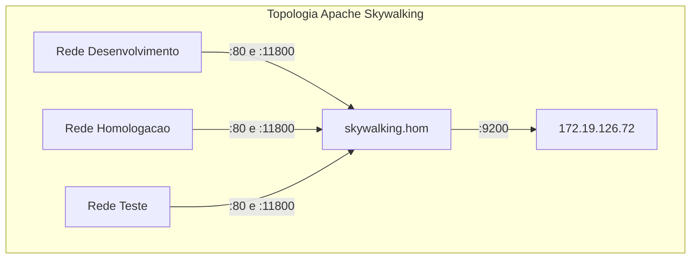
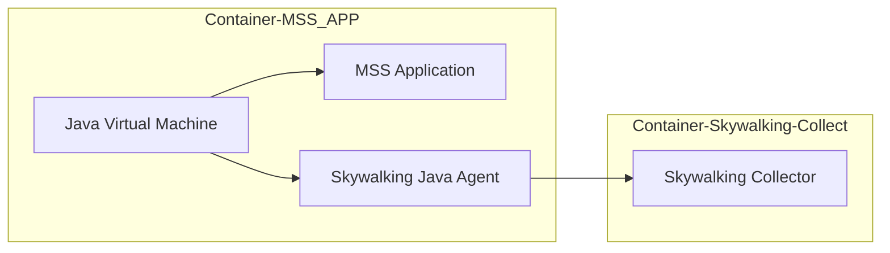
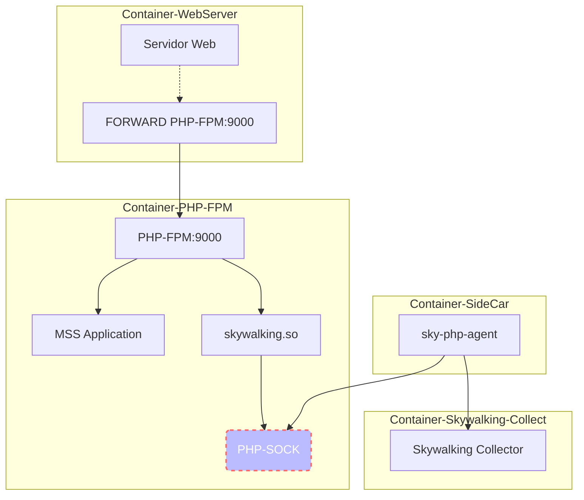
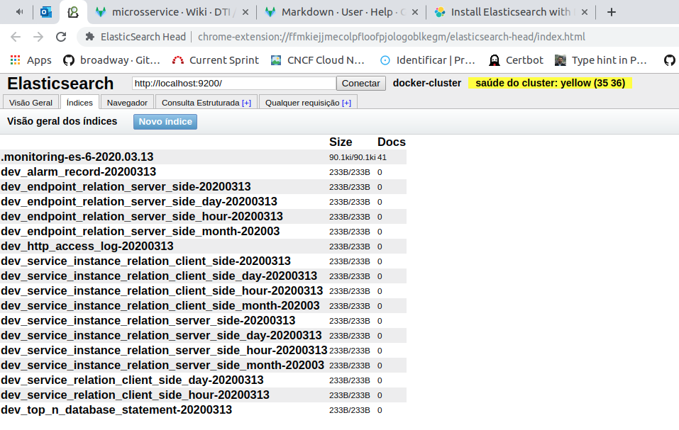
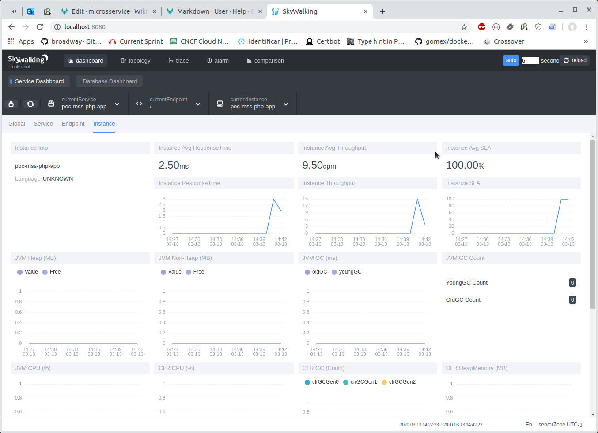

[[_TOC_]]

#Em construção#

# Microsserviço
Esta seção objetiva centralizar a documentação sob aspecto arquitetural sobre Microsserviço(MSS).

# Visão geral
Segundo Martin Fowler, Arquitetura de Microsserviço *(MSA)* é o termo usado para descrever uma arquitetura de software como um conjunto de serviços implementáveis de forma **independente**.[^1] Frente a várias definições para descrever *MSA*, o consenso é o de que na *MSA* existem certas características comuns: **implantação automatizada** - CI/CD, ***endpoints* inteligentes**, descentralização **de linguagem de programação** e **de dados**.

Definir o tamanho de um microsserviço se mostrou algo muito relativo e isso é um ponto pacífico entre os que falam sobre o assunto. Assim, neste documento, adotaremos o apontamento de *Fowler*[^1] e adotaremos como regra de ouro para definição do tamanho de um MSS a seguinte premissa:

> *unidade de software que pode ser substituída ou atualizada de forma independente pensando e codificado para ser resiliente a falhas e ser especialista em um domínio de negócio.*

Com essa premissa em mente, ao projetar um *MSS*, deve-se buscar atender aos seguintes requisitos:
  - Exteriorizar funcionalidades por API Rest;
  - Atualizar não gera incompatibilidade com versões anteriores - caso em que não altere o Major Version[^2];
  - Receber dados descontextualizada de seu proprietário;
  - Adequar linguagem de programação ao problema a ser resolvido;
  - Melhorar constantemente seu código;
  - Recuperar-se de erros;
  - Não referenciar, em código, outros MSS explicitamente;
  - Escalar processamento

A visão buscada ao se projetar um *MSS* é a mesma adotada pela filosofia Unix[^3]:
> - *Escreva programas que façam apenas uma coisa, mas que a façam bem feita.*
> - *Escreva programas que trabalhem juntos.*
> - *Escreva programas que manipulem streams de texto, pois esta é uma interface universal.*

# Ferramentas
Um ponto importante, no processo de adoção de *MSA*, é saber identificar a ferramenta apropriada para o prósito certo.

> Para auxiliar nesta tarefa, a *Cloud Native Interactive Landscape* (CNCF)[^4] dispõe em seu site uma coleção de ferramentas agrupadas em:
> - [App Definition and Development](https://landscape.cncf.io/category=app-definition-and-development&format=card-mode&grouping=category)
> - [Orchestration & Management](https://landscape.cncf.io/category=orchestration-management&format=card-mode&grouping=category)
> - [Runtime](https://landscape.cncf.io/category=runtime&format=card-mode&grouping=category)
> - [Provisioning](https://landscape.cncf.io/category=provisioning&format=card-mode&grouping=category)
> - [Special](https://landscape.cncf.io/category=special&format=card-mode&grouping=category)

## API Gateway
Responsável por:
  - Unificar porta de entrada para as diversas APIs
  - Filtrar o tráfego de diferentes tipos de *Client* e direcionar ao *endpoint* mais apropriado
  - Gerenciar o limite de acesso às APIs
  - Validar token de acesso
  - Segregar APIs:
    - Público
    - Privado
    - Parceiro

## Discovery
## Pipeline
Este assunto foi exaustivamente abordado pela equipe DevOps e a documentação está disponível em [CI/CD](devops/orientacoes-tecnicas/ci-cd.md).


## Message Broker (RabbitMQ)

O ***Message Broker*** tem por objetivo criar uma ponte assíncrona entre aplicações.

Este ferramenta permite que um MSS enderece uma atividade a outro e não precise esperar que o *Outro* termine seu trabalho para o *Um* continuar seu fluxo.

O ambiente "DHT" é formado por um conjunto instâncias que formam um cluster único. Dentro do cluster existem áreas para cada ambiente (desenvolvimento, homologação e testes).

Atualmente, o cluster DHT é composto por 3 nós:
- V-RABBITMQHA01-H (172.19.126.96)
- V-RABBITMQHA02-H (172.19.126.97)
- V-RABBITMQHA03-H (172.19.126.98)

Para cada um dos nós que fazem parte do cluster, execute os seguintes passos:

Pelo funcionamento do próprio RabbitMQ, ao configurar o *Cluster*, um master/nó principal, é selecionado de forma automática e involuntária.

Passos necessários para ambos os cenários: primeiro nó do cluster e demais *nṍs*:

- DNS - Garantir que cada um dos nós consiga acesso a outro por nome.
Originalmente, a solução adotada foi acrescentar o nome dos *nós* no `/etc/hosts` de cada um dos nós:
```vim
172.19.126.96	V-RABBITMQHA01-H.capes.gov.br V-RABBITMQHA01-H
172.19.126.97   V-RABBITMQHA02-H.capes.gov.br V-RABBITMQHA02-H
172.19.126.98   V-RABBITMQHA03-H.capes.gov.br V-RABBITMQHA03-H
```
- vIP - Registro do IP do nó do vIP
Todo novo nó precisa ser registrado no vIP criado para responder ao DNS do RabbitMQ (rabbitmq.capes.gov.br). Este passo deve ser realizado abrindo um chamado para a Infra.
No chamado, informe:
  - *"Favor, incluir o IP x.y.w.z do nó (**informe o nome do novo nó**) ao vIP (**informar qual IP do vIP desejado**)"*
    - vIP DHT: 172.19.204.102                 - Que deverá apontar para rabbitmq.hom.capes.br
    - vIP PRD: `0.0.0.0 (ainda será criado)`  - Que deverá apontar para rabbitmq.capes.br

- Instalar pacotes
```shell
 $ yum update -y
 $ curl -s https://packagecloud.io/install/repositories/rabbitmq/erlang/script.rpm.sh | sudo bash
 $ curl -s https://packagecloud.io/install/repositories/rabbitmq/rabbitmq-server/script.rpm.sh | sudo bash
 $ yum -y install rabbitmq-server
 $ yum -y install nfs-utils
 ```

- Iniciar RabbitMQ standalone
Iniciar o RabbitMQ fora do cluster (*Standalone*) é necessário para inicializar o Erlang e por consequência, criar o `/var/lib/rabbitmq/.erlang.cookie`.

```shell
$ rabbitmq-server -detached
```

- habilitar plugins
   - JMS                        - Necessário para que o RabbitMQ tratate Java Message Service
   - Auth LDAP                  - Necessário para que o RabbitMQ se integrar ao LDAP
   - Interface de gerenciamento - Necessário para que o RabbitMQ habilitar UI Admin

```shell
$ rabbitmq-plugins enable rabbitmq_jms_topic_exchange
$ rabbitmq-plugins enable rabbitmq_auth_backend_ldap
$ rabbitmq-plugins enable rabbitmq_management
```

- Parar o RabbitMQ
Uma vez inicializado e tendo habilitado os plugins, parece o RabbitMQ que encontra-se em modo Standload .

```shell
$ rabbitmqctl stop_app
```

- configurar rabbitmq.conf

Criar/editar o arquivo `/etc/rabbitmq/rabbitmq.conf` e adicionar o seguinte conteúdo:

```vim
cluster_formation.peer_discovery_backend = classic_config

# lista dos nós no cluster
# para cada novo nó, relacione-o abaixo
cluster_formation.classic_config.nodes.1 = rabbit@V-RABBITMQHA01-H
cluster_formation.classic_config.nodes.2 = rabbit@V-RABBITMQHA02-H
cluster_formation.classic_config.nodes.3 = rabbit@V-RABBITMQHA03-H

cluster_formation.discovery_retry_limit = 10
cluster_formation.discovery_retry_interval = 500

# configuração do LDAP
auth_backends.1.authn             = ldap
auth_backends.1.authz             = internal
auth_backends.2                   = internal
auth_ldap.servers.1               = fc.capes.gov.br
auth_ldap.port                    = 389
auth_ldap.timeout                 = 15000
auth_ldap.connection_pool_size    = 256
auth_ldap.dn_lookup_attribute     = sAMAccountName
auth_ldap.dn_lookup_base          = OU=_Usuarios da CAPES,DC=fc,DC=capes,DC=gov,DC=br

# informar a senha do usuário usado para fazer bind com ldap: svc_habbitmq_hom
auth_ldap.dn_lookup_bind.user_dn  = cn=svc_habbitmq_hom,ou=_Contas de Servicos,dc=fc,DC=capes,dc=gov,dc=br
auth_ldap.dn_lookup_bind.password = **********

auth_ldap.use_ssl = false
auth_ldap.log = false
```
> Nota 1: Não esquecer de incluir o nó na relação do membros do cluster `cluster_formation.classic_config.nodes.X`. Uma vez que um novo nó entre no cluster, será necessário registrá-lo em todos os `rabbitmq.conf`. Uma solução mais eficiente para isso seria compartilhar este arquivos entre todos os nós.

> Nota 2: Não esquecer de informar a senha correta em `auth_ldap.dn_lookup_bind.password`.

- Criar usuário
  - **Service Account**     - Usado pelo RabbitMQ para logar no LDAP
    - Apenas em GMUDs: Solicite à Infra a criação de um usuário (*service account*) para ser usado pelo RabbitMQ
  - **Application Account** - Usado pelas aplicações logar no RabbitMQ
    - Sempre que nova aplicação for fazer uso do RabbitMQ, solicite à Infra a criação de application account para a aplicação possa usar em sua comunicação com o RabbitMQ
  - **User Account** - Usdao por usuários logar no RabbitMQ
    - Solicite à Infra que o usuário seja incluido ao grupo com permissão de acesso ao RabbitMQ
    - Vá à UI Admin do RabbitMQ, na aba Admin, adicione o mesmo usuário e atribua a permissão necessária a este usuário.

- Registro do novo nó no *cluster*
> **Nota 1:** Teoricamente, esse passo só faz sentido para o segundo nó em diante, visto que o primeiro será usado usado como âncora para todos os demais.

> **Nota 2:** No exemplo a seguir, foi assumido que o nó âncor (o primeiro que foi levantando) oi o `rabbit@V-RABBITMQHA01-H`. Case tenha usado outro nó, faça o ajuste do nome.


> NOTA: O processo de ingresso de um *nó* no cluster se faz por uso de um cookie do `erlang`. Este fica no arquivo `/var/lib/rabbitmq/.erlang.cookie`. **CERTIFIQUE-SE DE QUE TODOS OS NÓS COMPARTILHE O MESMO COOKIE**.

- Vá à máquina de algum dos nós que já esteja no cluster e copie o conteúdo do arquivo `/var/lib/rabbitmq/.erlang.cookie`
- Na máquina do novo nó, edite o arquivo `/var/lib/rabbitmq/.erlang.cookie` para conter o mesmo valor do cookie copiado.

```shell
$ rabbitmqctl reset
$ rabbitmqctl join_cluster rabbit@V-RABBITMQHA01-H
$ rabbitmqctl start_app
```

- Verificar status do cluster

```shell
$ rabbitmqctl cluster_status
```

A saída do status deverá ser algo como:

```shell
Cluster status of node rabbit@V-RABBITMQHA01-H ...
Basics

Cluster name: rabbit@V-RABBITMQHA01-H.capes.gov.br

Disk Nodes

rabbit@V-RABBITMQHA01-H
rabbit@V-RABBITMQHA02-H
rabbit@V-RABBITMQHA03-H

Running Nodes

rabbit@V-RABBITMQHA01-H

Versions

rabbit@V-RABBITMQHA01-H: RabbitMQ 3.8.7 on Erlang 23.0.3

Alarms

(none)

Network Partitions

(none)

Listeners

Node: rabbit@V-RABBITMQHA01-H, interface: [::], port: 15672, protocol: http, purpose: HTTP API
Node: rabbit@V-RABBITMQHA01-H, interface: [::], port: 25672, protocol: clustering, purpose: inter-node and CLI tool communication
Node: rabbit@V-RABBITMQHA01-H, interface: [::], port: 5672, protocol: amqp, purpose: AMQP 0-9-1 and AMQP 1.0

Feature flags

Flag: drop_unroutable_metric, state: enabled
Flag: empty_basic_get_metric, state: enabled
Flag: implicit_default_bindings, state: enabled
Flag: quorum_queue, state: enabled
Flag: virtual_host_metadata, state: enabled
```

## APM
*Apache SkyWalking*[^5], em sua página inicial, é definido como *ferramenta de monitoramente para sistemas distribuídos, especialmente, projetado para arquitetura de microsserviço, "cloud native" e baseado em container (Docker, K8s, Mesus)*.

### Topologia
#### DHT


### Arquitetura
Sua arquitetura consiste em quatro partes: Probes, Platform backend, Storage and UI
  - **Probes**: Cliente que coleta dados da aplicação que se deseja monitorar e os enviam para *Platform backend*. Há um tipo de Probe para cada linguagem de programação suportada pelo Skaywalking.
  - **Platform backend**: realiza o processamento dos dados enviados pelas sondas (Probes) instaladas na máquina em que executa a apllicação monitorada.
  - **Storage**: armazena os dados coletados. Elasticsearch, MySQL, TiDB, H2 são opões de uso como meio de armazenamento.
  - **UI**: Interface gráfica para o usuário final do skywalking.


### Instalação
Na página oficial do *Skaywalking*, na seção [download](http://skywalking.apache.org/downloads/), pode ser baixado todo o código mencionado a seguir.

Esta documentação usará o **Apache Skywalking 6.6.0 para Linux Centos com Elasticsearch 7**.

  - Pacote nome: *Binary Distribution for ElasticSearch 7 (Linux)*
  - Pacote url:  *https://www.apache.org/dyn/closer.cgi/skywalking/6.6.0/apache-skywalking-apm-es7-6.6.0.tar.gz*
  - Pacote sha512:
    ```vim
    3a9f8c3645b4e7e60e84eaf4a95126c9abafe88ec9262c3d102c8ade20888d96d56fe6781628d3f3e7f4f09f45d9e8134f2964cf82bfdbd79ea48c5af3650e95  apache-skywalking-apm-es7-6.6.0.tar.gz
    ```
  - Package asc:
    ```vim
    -----BEGIN PGP SIGNATURE-----
    Version: GnuPG v2.0.22 (GNU/Linux)

    iQIcBAABCgAGBQJeAbD5AAoJEOhgiTjbJeBruMQP/3/i3kKSV4vOyJvcuJ2YMFtv
    Bvp2nDgH0oBhVVJKbRtSdKPQHdjpDIVq3Q8rP2oHwEmVPf1zqv7LkzV317Plr5Fa
    UuLS1KSmwPssk6myU+SHMHyhgtk2IYx0CMQBpASp7oa5CJzg0lvWY8M39eBAPwGA
    RAu3ziRgHwaRNCR5rCGSQ6w1vax/96Fyq30K4bUoM5/1J/WhN1/OsGQfjvQ1V8aU
    JagCLqYD+EcVOsH/mqqzooXcvcM6EPgPVRodCowiJ/Pxf5+DcM3uL1Eh4EHQf5dP
    FHuH2kgirTFPaQBhXdJFAdCqsjSoMAm/I5zFeIZQWvKYH/iXRaQUqZvATGih/s00
    WUuqobTahY3KT51HhdjUPW6Lp7bZFdEd6wEC5Yizxs0A0/JzoncVv7XEXKrfEst8
    Lw1cpigCbSGR/rNKFJyPNiH3cY+2kx/Hadazkq+jjzTtA2HvgOG1thxxfx/jS0h5
    kWeBPM3iGYlfLafRuZHLrZ0sdc0uwOahcEtbYI0TgleiKpetw7FRQmUAZHVSZHFb
    fdvKfw+xqNq6AtD5DkLASJmCY/Fdy269+WoA1TRfIfLB1SsxGPfAX9DonClhSOwa
    nQEaYZizIN+vSBudHoI5ThYTBinSXFUCvNcnAlR8P2ED5sA8+h0jDo3kPobIelju
    IJjm2aRoHLX887ZOYKL0
    =3TDB
    -----END PGP SIGNATURE-----
    ```

* Faça download do pacote [apache-skywalking-apm-es7-6.6.0.tar.gz](https://www.apache.org/dyn/closer.cgi/skywalking/6.6.0/apache-skywalking-apm-es7-6.6.0.tar.gz).
* Para realizar verificação da integridade do arquivo baixado, siga [estas instruções](https://www.apache.org/dyn/closer.cgi#verify).
* Descompacte o arquivo: `tar xvf apache-skywalking-apm-es7-6.6.0.tar.gz`
* A estrutura de pastas criadas será denominada, deste ponto em diante, de SKYWALKING_HOME, que tem sua estrutura:
    - agent/
    - bin/
    - config/
    - oap-libs/
    - webapp/

#### Probe
##### Java

A comunicação entre o Java e Apache Skywalking se dá conforme ilustrado no esquema a seguir:



Na máquina do microsserviço/aplicação, crie uma pasta para armazenar o `Skywalking Agent Java`, o qual será referenciado como: `SKYWALKING_PROBE_JAVA`.
```shell
$ sudo mkdir -p /skywalking-probe/config
```

- cp **SKYWALKING_HOME**/agent/skywalking-agent.jar **SKYWALKING_PROBE_JAVA**/
- cp **SKYWALKING_HOME**/agent/config/agent.config  **SKYWALKING_PROBE_JAVA**/config/agent.config

- Configurar `SKYWALKING_PROBE_JAVA/config/agent.config`:
```vim
  1  # Licensed to the Apache Software Foundation (ASF) under one
  2  # or more contributor license agreements.  See the NOTICE file
  3  # distributed with this work for additional information
  4  # regarding copyright ownership.  The ASF licenses this file
  5  # to you under the Apache License, Version 2.0 (the
  6  # "License"); you may not use this file except in compliance
  7  # with the License.  You may obtain a copy of the License at
  8  #
  9  #     http://www.apache.org/licenses/LICENSE-2.0
 10  #
 11  # Unless required by applicable law or agreed to in writing, software
 12  # distributed under the License is distributed on an "AS IS" BASIS,
 13  # WITHOUT WARRANTIES OR CONDITIONS OF ANY KIND, either express or implied.
 14  # See the License for the specific language governing permissions and
 15  # limitations under the License.
 16
 17  # The agent namespace
 18  # agent.namespace=${SW_AGENT_NAMESPACE:default-namespace}
 19
 20  # The service name in UI
 21  agent.service_name=${SW_AGENT_NAME:Your_ApplicationName}
 22
 23  # The number of sampled traces per 3 seconds
 24  # Negative number means sample traces as many as possible, most likely 100%
 25  # agent.sample_n_per_3_secs=${SW_AGENT_SAMPLE:-1}
 26
 27  # Authentication active is based on backend setting, see application.yml for more details.
 28  # agent.authentication = ${SW_AGENT_AUTHENTICATION:xxxx}
 29
 30  # The max amount of spans in a single segment.
 31  # Through this config item, SkyWalking keep your application memory cost estimated.
 32  # agent.span_limit_per_segment=${SW_AGENT_SPAN_LIMIT:300}
 33
 34  # Ignore the segments if their operation names end with these suffix.
 35  # agent.ignore_suffix=${SW_AGENT_IGNORE_SUFFIX:.jpg,.jpeg,.js,.css,.png,.bmp,.gif,.ico,.mp3,.mp4,.html,.svg}
 36
 37  # If true, SkyWalking agent will save all instrumented classes files in `/debugging` folder.
 38  # SkyWalking team may ask for these files in order to resolve compatible problem.
 39  # agent.is_open_debugging_class = ${SW_AGENT_OPEN_DEBUG:true}
 40
 41  # The operationName max length
 42  # agent.operation_name_threshold=${SW_AGENT_OPERATION_NAME_THRESHOLD:500}
 43
 44  # Backend service addresses.
 45  collector.backend_service=${SW_AGENT_COLLECTOR_BACKEND_SERVICES:127.0.0.1:11800}
 46
 47  # Logging file_name
 48  logging.file_name=${SW_LOGGING_FILE_NAME:skywalking-api.log}
 49
 50  # Logging level
 51  logging.level=${SW_LOGGING_LEVEL:DEBUG}
 52
 53  # Logging dir
 54  # logging.dir=${SW_LOGGING_DIR:""}
 55
 56  # Logging max_file_size, default: 300 * 1024 * 1024 = 314572800
 57  # logging.max_file_size=${SW_LOGGING_MAX_FILE_SIZE:314572800}
 58
 59  # The max history log files. When rollover happened, if log files exceed this number,
 60  # then the oldest file will be delete. Negative or zero means off, by default.
 61  # logging.max_history_files=${SW_LOGGING_MAX_HISTORY_FILES:-1}
 62
 63  # mysql plugin configuration
 64  # plugin.mysql.trace_sql_parameters=${SW_MYSQL_TRACE_SQL_PARAMETERS:false}
```

* Define o nome do *MSS/endpoint*
  - de:
  ```vim
  21  agent.service_name=${SW_AGENT_NAME:Your_ApplicationName}
  ```
  - para, exemplo:
  ```vim
  21  agent.service_name=${SW_AGENT_NAME:pessoa}
  ```

* Configura qual servidor Apache Skywalking (backend)
  - de:
  ```vim
  45  collector.backend_service=${SW_AGENT_COLLECTOR_BACKEND_SERVICES:127.0.0.1:11800}
  ```
  - para, por exemplo:
  ```vim
  45  collector.backend_service=${SW_AGENT_COLLECTOR_BACKEND_SERVICES:10.10.10.10:11800}
  ```

>
> **NOTA**: Todas as demais propriedades do arquivo `agent.config` podem ser encontradas no [site ofical](https://github.com/apache/skywalking/blob/master/docs/en/setup/service-agent/java-agent/README.md#table-of-agent-configuration-properties).
>

Estabelece comunicação entre a `sonda` e `Skywalking backend`.
```shell
JAVA_OPTS="-javaagent:SKYWALKING_PROBE_JAVA/skywalking-agent.jar" /application-folder/application.jar
```

##### PHP

A comunicação entre o PHP e Apache Skywalking se dá conforme ilustrado no esquema a seguir:


> **NOTA1**: Para o PHP, a sonda deve ser compilada considerando o sistema operacional que será usado.

> **NOTA2**: A máquina/container que executar a compulação deverá contém o ***php-dev*** instalado.

> **NOTA3**: **PHP_INI_DIR** - Deverá apontar para a pasta com arquivos de configuração do PHP.

> **NOTA4**: **PHP_MODULE_DIR** - Deverá apontar para a pasta com arquivos de módulos do PHP.

###### Debian-like
Todos os comandos abaixo foram executados em um container com php 7.4:
```shell
$ docker run --rm -ti -v /tmp:/skywalking-libs php:7.4-fpm /bin/bash
```

Compilando o PHP Module Skywalking (skywalking.so)

```shell
$ apt update
$ apt install -y wget git libcurl4-openssl-dev
$ git clone https://github.com/SkyAPM/SkyAPM-php-sdk.git
$ cd SkyAPM-php-sdk
$ phpize && ./configure && make && make install
$ cd .. && rm -rf SkyAPM-php-sdk
```
O processo de compilação acima gera o arquivo `$PHP_MODULE_DIR/skywalking.so`.

Compilando o Skywalking PHP Agent (sky-php-agent)
```shell
$ apt update
$ apt install -y wget
$ wget https://dl.google.com/go/go1.13.7.linux-amd64.tar.gz
$ tar -C /usr/local -xzvf go1.13.7.linux-amd64.tar.gz
$ export GOROOT=/usr/local/go
$ export PATH=$GOROOT/bin:$PATH
$ rm -rf go1.13.7.linux-amd64.tar.gz
$ wget https://github.com/SkyAPM/SkyAPM-php-sdk/archive/3.2.4.tar.gz -O sky-php-agent.tar.gz
$ tar xzvf skywalking-apm-agent-php.tar.gz
$ cd SkyAPM-php-sdk-3.2.4/src
$ go build -o sky-php-agent agent/cmd/main.go
$ chmod +x sky-php-agent
```
Ao final o processo, será criado o `sky-php-agent` já com permissão de execução. Mova-o para um diretório no PATH de execução do *SO*.


###### Centos

Instalanção dos pacotes básicos

```shell
$ yum install epel-release yum-utils
$ yum install -y http://rpms.remirepo.net/enterprise/remi-release-7.rpm
$ yum-config-manager --enable remi-php73
$ yum install -y php php-common php-opcache php-mcrypt php-cli php-gd php-curl
$ yum install -y git wget glibc-langpack-en make php-devel php-pear php-json curl-devel protobuf-devel cmake
$ git clone https://github.com/grpc/grpc.git
$ make run_dep_checks
$ git submodule update --init
$ make && sudo make install
$ cd third_party/protobuf
$ make && sudo make install
```

Compilando o skywalking.so

```shell
$ git clone https://github.com/skyAPM/SkyAPM-php-sdk.git
$ cd SkyAPM-php-sdk
$ phpize && ./configure && make && make install
```
No Centos, o arquivo será criado em `/usr/lib64/php/modules/skywalking.so`.


Compilando o `sky-php-agent`

```shell
$ wget https://dl.google.com/go/go1.13.7.linux-amd64.tar.gz
$ tar -C /usr/local -xzvf go1.13.7.linux-amd64.tar.gz
$ export GOROOT=/usr/local/go
$ export PATH=$GOROOT/bin:$PATH
$ chmod +x build-sky-php-agent.sh
$ ./build-sky-php-agent.sh
$ mv sky-php-agent-linux-x64 sky-php-agent
```

Para configurar a comunicação entre o `Módulo PHP` e o `Agent Skywalking`, seja no Ubuntu seja no Centos, crie o arquivo `$PHP_INI_DIR/50-sky-php-agent.ini` com o seguinte conteúdo:

```vim
# $PHP_INI_DIR/50-sky-php-agent.ini

1 [skywalking]
2 extension=skywalking.so
3 skywalking.app_code = __APP_PHP_NAME__
4 skywalking.enable = 1
5 skywalking.version = 6
6 skywalking.sock_path = /var/run/sky-agent.sock
```

* Define o nome do *MSS/endpoint*
  - de:
  ```vim
  3  skywalking.app_code = __APP_PHP_NAME__
  ```
  - para, exemplo:
  ```vim
  3  skywalking.app_code = books
  ```
###### Estabelece comunicação entre a *PHP*/*Skywalking*

O formato geral do comando `sky-php-agent --grpc [Collect-address]:Port`

```shell
$ sky-php-agent --grpc 10.10.10.10:11800
```

#### Platform backend

> **NOTA1**: **SKYWALKING_DIR** - Deverá apontar para a pasta principal com Skywalking.

Principais subpastas em **SKYWALKING_DIR**.
```bash
agent
bin
config
logs
oap-libs
webapp
```

- `$SKYWALKING_DIR/agent`    - armazena o agente Java, *Probe Java*, e os arquivos para configurá-lo.
- `$SKYWALKING_DIR/bin`      - armazena scripts de inicialização do Skywalking.
- `$SKYWALKING_DIR/config`   - armazena os arquivos de configuração do Skywalking.
- `$SKYWALKING_DIR/logs`     - pasta usada pelo Skywalking para armazenamento de seus logs.
- `$SKYWALKING_DIR/oap-libs` - armazena as libs usadas pelo Skywalking.
- `$SKYWALKING_DIR/webapp`   - armazena Skywalking webapp.


Configurando o Apache Skywalking com o ElasticSearch (*elasticsearch:6.0.1*).

`$SKYWALKING_DIR/config/application.yml`
```yaml
...
 16
 17  cluster:
 18    standalone:
...
 49  core:
 50    default:
 51      # Mixed: Receive agent data, Level 1 aggregate, Level 2 aggregate
 52      # Receiver: Receive agent data, Level 1 aggregate
 53      # Aggregator: Level 2 aggregate
 54      role:            ${SW_CORE_ROLE:Mixed} # Mixed/Receiver/Aggregator
 55      restHost:        ${SW_CORE_REST_HOST:0.0.0.0}
 56      restPort:        ${SW_CORE_REST_PORT:12800}
 57      restContextPath: ${SW_CORE_REST_CONTEXT_PATH:/}
 58      gRPCHost:        ${SW_CORE_GRPC_HOST:0.0.0.0}
 59      gRPCPort:        ${SW_CORE_GRPC_PORT:11800}
 60      downsampling:
 61        - Hour
 62        - Day
 63        - Month
 64      # Set a timeout on metrics data. After the timeout has expired, the metrics data will automatically be deleted.
 65      enableDataKeeperExecutor: ${SW_CORE_ENABLE_DATA_KEEPER_EXECUTOR:true} # Turn it off then automatically metrics data delete will be close.
 66      dataKeeperExecutePeriod: ${SW_CORE_DATA_KEEPER_EXECUTE_PERIOD:5} # How often the data keeper executor runs periodically, unit is minute
 67      recordDataTTL: ${SW_CORE_RECORD_DATA_TTL:90} # Unit is minute
 68      minuteMetricsDataTTL: ${SW_CORE_MINUTE_METRIC_DATA_TTL:90} # Unit is minute
 69      hourMetricsDataTTL: ${SW_CORE_HOUR_METRIC_DATA_TTL:36} # Unit is hour
 70      dayMetricsDataTTL: ${SW_CORE_DAY_METRIC_DATA_TTL:45} # Unit is day
 71      monthMetricsDataTTL: ${SW_CORE_MONTH_METRIC_DATA_TTL:18} # Unit is month
 72      # Cache metric data for 1 minute to reduce database queries, and if the OAP cluster changes within that minute,
 73      # the metrics may not be accurate within that minute.
 74      enableDatabaseSession: ${SW_CORE_ENABLE_DATABASE_SESSION:true}
 75      topNReportPeriod: ${SW_CORE_TOPN_REPORT_PERIOD:10} # top_n record worker report cycle, unit is minute
 76  storage:
 77   elasticsearch:
 78     nameSpace: ${SW_NAMESPACE:""}
 79     clusterNodes: ${SW_STORAGE_ES_CLUSTER_NODES:localhost:9200}
 80     protocol: ${SW_STORAGE_ES_HTTP_PROTOCOL:"http"}
 81     trustStorePath: ${SW_SW_STORAGE_ES_SSL_JKS_PATH:"../es_keystore.jks"}
 82     trustStorePass: ${SW_SW_STORAGE_ES_SSL_JKS_PASS:""}
 83     user: ${SW_ES_USER:""}
 84     password: ${SW_ES_PASSWORD:""}
 85     indexShardsNumber: ${SW_STORAGE_ES_INDEX_SHARDS_NUMBER:2}
 86     indexReplicasNumber: ${SW_STORAGE_ES_INDEX_REPLICAS_NUMBER:0}
 87     # Those data TTL settings will override the same settings in core module.
 88     recordDataTTL: ${SW_STORAGE_ES_RECORD_DATA_TTL:7} # Unit is day
 89     otherMetricsDataTTL: ${SW_STORAGE_ES_OTHER_METRIC_DATA_TTL:45} # Unit is day
 90     monthMetricsDataTTL: ${SW_STORAGE_ES_MONTH_METRIC_DATA_TTL:18} # Unit is month
 91     # Batch process setting, refer to https://www.elastic.co/guide/en/elasticsearch/client/java-api/5.5/java-docs-bulk-processor.html
 92     bulkActions: ${SW_STORAGE_ES_BULK_ACTIONS:1000} # Execute the bulk every 1000 requests
 93     flushInterval: ${SW_STORAGE_ES_FLUSH_INTERVAL:10} # flush the bulk every 10 seconds whatever the number of requests
 94     concurrentRequests: ${SW_STORAGE_ES_CONCURRENT_REQUESTS:2} # the number of concurrent requests
 95     resultWindowMaxSize: ${SW_STORAGE_ES_QUERY_MAX_WINDOW_SIZE:10000}
 96     metadataQueryMaxSize: ${SW_STORAGE_ES_QUERY_MAX_SIZE:5000}
 97     segmentQueryMaxSize: ${SW_STORAGE_ES_QUERY_SEGMENT_SIZE:200}
...
 134  receiver-sharing-server:
 135    default:
 136  receiver-register:
 137    default:
 138  receiver-trace:
 139    default:
 140      bufferPath: ${SW_RECEIVER_BUFFER_PATH:../trace-buffer/}  # Path to trace buffer files, suggest to use absolute path
 141      bufferOffsetMaxFileSize: ${SW_RECEIVER_BUFFER_OFFSET_MAX_FILE_SIZE:100} # Unit is MB
 142      bufferDataMaxFileSize: ${SW_RECEIVER_BUFFER_DATA_MAX_FILE_SIZE:500} # Unit is MB
 143      bufferFileCleanWhenRestart: ${SW_RECEIVER_BUFFER_FILE_CLEAN_WHEN_RESTART:false}
 144      sampleRate: ${SW_TRACE_SAMPLE_RATE:10000} # The sample rate precision is 1/10000. 10000 means 100% sample in default.
 145      slowDBAccessThreshold: ${SW_SLOW_DB_THRESHOLD:default:200,mongodb:100} # The slow database access thresholds. Unit ms.
 146  receiver-jvm:
 147    default:
 148  receiver-clr:
 149    default:
 150  service-mesh:
 151    default:
 152      bufferPath: ${SW_SERVICE_MESH_BUFFER_PATH:../mesh-buffer/}  # Path to trace buffer files, suggest to use absolute path
 153      bufferOffsetMaxFileSize: ${SW_SERVICE_MESH_OFFSET_MAX_FILE_SIZE:100} # Unit is MB
 154      bufferDataMaxFileSize: ${SW_SERVICE_MESH_BUFFER_DATA_MAX_FILE_SIZE:500} # Unit is MB
 155      bufferFileCleanWhenRestart: ${SW_SERVICE_MESH_BUFFER_FILE_CLEAN_WHEN_RESTART:false}
 156  istio-telemetry:
 157    default:
 158  envoy-metric:
 159    default:
...
 166  query:
 167    graphql:
 168      path: ${SW_QUERY_GRAPHQL_PATH:/graphql}
 169  alarm:
 170    default:
 171  telemetry:
 172    none:
 173  configuration:
 174    none:
...
```

A diretriz `${SW_NAMESPACE:""}` pode ser configurada para definir diferentes instâncias que o Skywalking usará para armazenar seus dados. Ùtil para usar bancos(SGDB)/Indices(ElasticSearch) por ambiente de execução (dev, homologação, produção) do Skywalking.

Ajustando o valor para usar o `Indice`-dev
- de:
  ```yawl
  78     nameSpace: ${SW_NAMESPACE:""}
  ```
- para
  ```yawl
  78     nameSpace: ${SW_NAMESPACE:"dev"}
  ```

Esta configuração resultará na prefixação dos índices criados pelo Skywalking no Elasticsearch:




```shell
$ $SKYWALKING_DIR/bin/startup.sh`
```

Caso haja algum serviço rodando e configurado para se comunicar com o Skywalking, a coleta será iniciada de forma automática.



#### Storage

Assumindo que o ambiente de armazenando usado pelo Skywalking deverá está pronto para uso, a configuração necessária para o Skywalking faça uso do storage é feito no arquivo `$SKYWALKING_DIR/config/application.yml`, na seção: `cluster.storage`.

##### Elasticsearch

> versão suportada: 6

```yaml
...
storage:
 elasticsearch:
   nameSpace: ${SW_NAMESPACE:""}
   clusterNodes: ${SW_STORAGE_ES_CLUSTER_NODES:localhost:9200}
   protocol: ${SW_STORAGE_ES_HTTP_PROTOCOL:"http"}
   trustStorePath: ${SW_SW_STORAGE_ES_SSL_JKS_PATH:"../es_keystore.jks"}
   trustStorePass: ${SW_SW_STORAGE_ES_SSL_JKS_PASS:""}
   user: ${SW_ES_USER:""}
   password: ${SW_ES_PASSWORD:""}
   indexShardsNumber: ${SW_STORAGE_ES_INDEX_SHARDS_NUMBER:2}
   indexReplicasNumber: ${SW_STORAGE_ES_INDEX_REPLICAS_NUMBER:0}
   # Those data TTL settings will override the same settings in core module.
   recordDataTTL: ${SW_STORAGE_ES_RECORD_DATA_TTL:7} # Unit is day
   otherMetricsDataTTL: ${SW_STORAGE_ES_OTHER_METRIC_DATA_TTL:45} # Unit is day
   monthMetricsDataTTL: ${SW_STORAGE_ES_MONTH_METRIC_DATA_TTL:18} # Unit is month
   # Batch process setting, refer to https://www.elastic.co/guide/en/elasticsearch/client/java-api/5.5/java-docs-bulk-processor.html
   bulkActions: ${SW_STORAGE_ES_BULK_ACTIONS:1000} # Execute the bulk every 1000 requests
   flushInterval: ${SW_STORAGE_ES_FLUSH_INTERVAL:10} # flush the bulk every 10 seconds whatever the number of requests
   concurrentRequests: ${SW_STORAGE_ES_CONCURRENT_REQUESTS:2} # the number of concurrent requests
   resultWindowMaxSize: ${SW_STORAGE_ES_QUERY_MAX_WINDOW_SIZE:10000}
   metadataQueryMaxSize: ${SW_STORAGE_ES_QUERY_MAX_SIZE:5000}
   segmentQueryMaxSize: ${SW_STORAGE_ES_QUERY_SEGMENT_SIZE:200}
...
```

Configura namespace (`dev`) para segregar vários índices em um servidor ES:
- de:
  ```yaml
  nameSpace: ${SW_NAMESPACE:""}
  ```
- para:
  ```yaml
  nameSpace: ${SW_NAMESPACE:"dev"}
  ```

Configura o servidor que será utilizado
- de:
  ```yaml
  clusterNodes: ${SW_STORAGE_ES_CLUSTER_NODES:localhost:9200}
  ```
- para:
  ```yaml
  clusterNodes: ${SW_STORAGE_ES_CLUSTER_NODES:es-hosts:9200}
  ```

  Após realizar alterações, [inicie o Skywalking](#platform-backend).

##### H2
Para usar a versão embarcada do H2 no Skywalking ou uma existente, configure a seção:

```yaml
...
storage:
...
  h2:
    driver: ${SW_STORAGE_H2_DRIVER:org.h2.jdbcx.JdbcDataSource}
    url: ${SW_STORAGE_H2_URL:jdbc:h2:mem:skywalking-oap-db}
    user: ${SW_STORAGE_H2_USER:sa}
    metadataQueryMaxSize: ${SW_STORAGE_H2_QUERY_MAX_SIZE:5000}
...
```

Após realizar alterações, [inicie o Skywalking](#platform-backend).

##### MySQL

Para usar o Skywalking com MySQL, configure a seção:

```yaml
storage
...
 mysql:
   properties:
     jdbcUrl: ${SW_JDBC_URL:"jdbc:mysql://localhost:3306/swtest"}
     dataSource.user: ${SW_DATA_SOURCE_USER:root}
     dataSource.password: ${SW_DATA_SOURCE_PASSWORD:root@1234}
     dataSource.cachePrepStmts: ${SW_DATA_SOURCE_CACHE_PREP_STMTS:true}
     dataSource.prepStmtCacheSize: ${SW_DATA_SOURCE_PREP_STMT_CACHE_SQL_SIZE:250}
     dataSource.prepStmtCacheSqlLimit: ${SW_DATA_SOURCE_PREP_STMT_CACHE_SQL_LIMIT:2048}
     dataSource.useServerPrepStmts: ${SW_DATA_SOURCE_USE_SERVER_PREP_STMTS:true}
   metadataQueryMaxSize: ${SW_STORAGE_MYSQL_QUERY_MAX_SIZE:5000}
```

Após realizar alterações, [inicie o Skywalking](#platform-backend).

#### UI

A configuração da interface do Skywalking é feita no arquivo `$SKYWALKING_DIR/webapp/webapp.yml`:

```yaml
...
 17  server:
 18    port: 8080
 19
 20  collector:
 21    path: /graphql
 22    ribbon:
 23      ReadTimeout: 10000
 24      # Point to all backend's restHost:restPort, split by ,
 25      listOfServers: 127.0.0.1:12800
...
```

Por padrão, o Skywalking UI roda sob a porta 8080 `18    port: 8080`, caso deseje definir outra porta, por exemplo 80, altere:
- de:
  ```yaml
  18    port: 8080
  ```
- para:
  ```yaml
  18    port: 80
  ```
Após realizar alterações, [inicie o Skywalking](#platform-backend).

## Contêineres Docker

Em outros lugares do Guia já são feitas ou indicadas algumas recomendações e boas práticas:

- [DevOps / Ferramentas & Serviços / Docker](devops/ferramentas-servicos/docker.md)
- [Criando imagens Openshift](https://docs.openshift.com/container-platform/3.11/creating_images/guidelines.html)
- [Melhores Práticas Dockerfile](https://docs.docker.com/develop/develop-images/dockerfile_best-practices/)

Algumas recomendações práticas mais específicas que consideramos mais especificamente para o contexto de aplicações da CAPES:
- [Recomendações e Boas Práticas para estruturar e executar contêineres de imagens de aplicações da CAPES](arquitetura/arquitetura/microsservice/conteineres/recomendacoes-e-boas-praticas.md)

# Referência
[^1]: **MSA** - Arquitetura de Microsserviço - disponível em: [martinfowler.com](https://martinfowler.com/), acessado em: 10/03/2020.
[^2]: Versionamento Semântico - disponível em: [https://semver.org/](https://semver.org/), acessado em: 09/03/2020.
[^3]: **Filosofia Unix** - disponível em: [pt.wikipedia.org](https://pt.wikipedia.org/wiki/Filosofia_Unix), acessado em: 10/03/2020.
[^4]: **CNCF - CNCF Cloud Native Interactive Landscape** - disponível em: [landscape.cncf.io](https://landscape.cncf.io/), acessado em: 09/03/2020.
[^5]: **Apache SkyWalking** - disponível em: [skywalking.apache.org](https://skywalking.apache.org/), acessado em: 11/03/2020.
