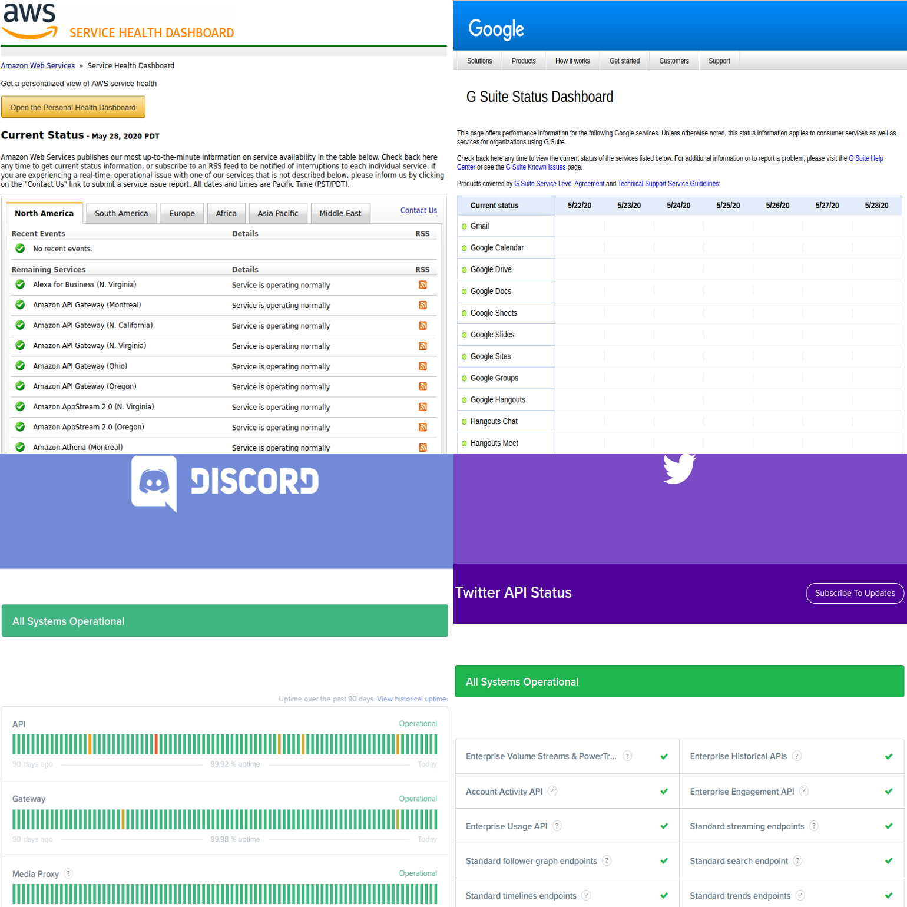
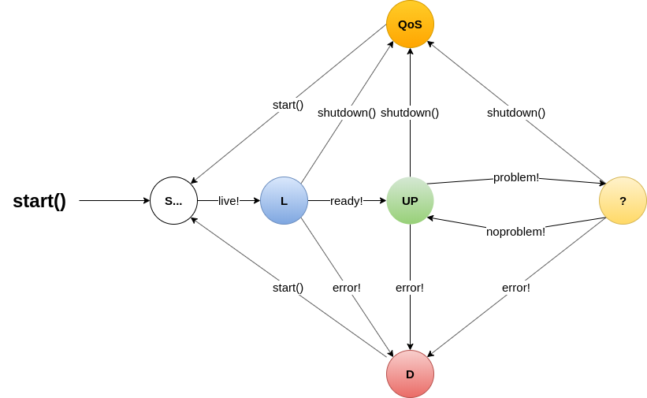

# Motivações & Objetivos

Existem categorias de software projetado para receber informações de outros sistemas, processá-las e disponibilizá-las para o consumo por outros sistemas. Tais informações podem ser utilizadas para monitorar a saúde do sistema monitorado.

Monitorar as aplicações é um processo essencial para que se possa sinalizar possíveis indisponibilidades em um sistema ou em sua integração com outros.

Eventualmente, os sistemas podem apresentar erros ou indisponibilidade. Quando isso ocorre, ter o sistema sendo monitorado, facilita a correção proativa.

## Requisitos de Monitoramento

1. Listar o estado de todas as aplicações que se tem interesse
2. Diagnosticar que partes da aplicação teriam deteriorado
3. Alertar as pessoas interessadas quando determinados estados de deterioramento forem atingidos

Como exemplo do que é requisitado para **1** há diversos exemplos praticados:
- AWS - https://status.aws.amazon.com/
- Google - https://www.google.com/appsstatus
- Twitter - https://api.twitterstat.us/
- Discord - https://status.discord.com/



O exemplo de **2** pode ser mais evasivo, mas há representações bem gráficas para exibir esses diagnósticos com metáforas de cores para estados (verde OK, vermelho PROBLEMA), linhas de ligação para expressar a interdependência existentes.

O item **3** normalmente envove a utilização de tecnologias como e-mail, SMS, notificações PUSH em aparelhos móveis (ex.: smartphones).

# Conceitualização

Vamos listar e definir uma série de conceitos a serem conhecidos para o efetivo entendimento dessa especificação e das recomendações associadas.

- **Monitor** (**M**): software utilizado para monitorar o estado de outro(s)
- **Aplicação** (**A**): um determinado software, nesse contexto, um software que se deseja monitorar
- **Recurso** (**R**): vamos chamar de recurso algo externo a uma aplicação, mas que acrescenta capacidades a ela [^1]
- **Diagnóstico** (**D**): um descritivo da saúde de uma Aplicação
- **Status** (**S**): estado resumido de saúde de um determinado elemento (_Aplicação_/_Recurso_)
- **Probe** [^2] (**P**): capacidade de um software de realizar alguma forma de exame a algum outro elemento
- **Liveness**: estado de vivacidade da aplicação. Indicativo se a instância da aplicação está rodando ou está num estado que implica reinicialização
- **Readiness**: estado de disponibilidade da aplicação. Indicativo se uma determinada instância da aplicação pode receber e processar requisição

# Discussão

## Status

O propósito de um Status é sintetizar o estado de deteriorização de uma aplicação. Na sua forma mais simples ele pode ser expresso com 01 bit: _saudável_ vs _não saudável_, _ok_ vs _não ok_, _up_ ou _não up_. Renomeando _não up_ como _down_ temos uma dicotomia bem familiar: **UP** & **DOWN**.

Essa abordagem de apenas 01 bit obviamente limita a informação transmitida a sua menor unidade. O framework Spring Boot convenciona 4 status:
- **UP**
- **DOWN**
- **UNKNOWN**
- **OUT_OF_SERVICE**

O objetivo de estender para 02 bits é conseguir representar situações mais nebulosas (como o que pode ser expresso por _UNKNOWN_), e conseguir trabalhar efetivamente com o **Requisito 3**, de modo a sinalizar que a aplicação está num estado em que foi desalocada, mas não é necessário avisar os interessados de que a instância da aplicação não está recebendo e processando requisições.

## Probes

Um probe pode fazer uma chamada REST (HTTP), pode abrir um socket para uma porta, pode procurar a existência de um arquivo, pode procurar um determinado conteúdo num arquivo de log, e por aí vai.

Podemos dizer que Probe tem a capacidade de realizar um determinado tipo de exame ou obter um diagnóstico de alguma forma (REST, TCP socket, arquivo de log, etc.)

O **Status** é a parte mais fundamental de um **Diagnóstico**. A questão é como **M** vai concluir esse status. Em geral a interpretação no contexto de _Programação Orientada a Objetos_ é que **A<sub>1</sub>** é quem deve saber qual sua saúde. Mas mesmo que **A<sub>1</sub>** seja capaz de produzir um diagnóstico de autoexame, **M** tem de ter acesso a isso. A parte de **M** que obtém o resultado do autoexame de **A<sub>1</sub>** é uma **Probe**. Pode ser que a sonda obtenha algum outro dado, não necessariamente um autoexame, e nada impede que haja vária sondas para a mesma aplicação, sondando diferentes aspectos.
Então dado que **M** monitora a aplicação **A<sub>1</sub>** através dos probes **P<sub>1</sub>**, **P<sub>1</sub><sup>’</sup>**, **P<sub>1</sub><sup>’’</sup>**, e assim por diante. **M** consolida conjunto de resultados das sondas num diagnóstico **D<sub>1</sub>** (sintetizado por um status **s<sub>1</sub>**).

### Liveness & Readiness

Existem probes que vão checar a _Liveness_ e _Readiness_ da aplicação. Considerando que _Liveness_ e _Readiness_ são informados através de um _Diagnóstico_ **D**, um _Probe_ **P<sub>L</sub>** que verifica a _Liveness_ da _Aplicação_ **A** pode ser utilizado para decidir de maneira automátizada e autônoma se instância de **A** deve ser reinicializada. Enquanto isso um _Probe_ **P<sub>R</sub>** pode ser utilizado por um mecanismo de balanceamento para distribuir as requisições entre as diferentes instâncias de **A** que tem condições de processar tais respostas.

## Ciclo de vida de uma aplicação em execução

Considerando não apenas natural, mas provalvemente inevitável o processo de deterioramento de aplicações é bom modelar uma _Máquina de Estados_ que represente esse ciclo de vida:
<!---

-->


Na máquina de estados acima temos os seguintes estados:

- **S...**: (_Starting..._) aplicação está inicializando
- **R**: (_Ready_) aplicação se tornou pronta (_ready_) para receber e processar requisições
- **L**: (_Live_) aplicação está em execução (_live_)
- **Up**: (_UP_) a aplicação está funcional e saudável
- **?**: (_UNKNOWN_) a aplicação está num estado incerto, provalvemente problemático, mas definitivamente não completamente saudável
- **D**: (_DOWN_) a aplicação deteriorou e está indisponível
- **OoS**: (_OUT_OF_SERVICE_) a aplicação ficou (ou foi colocada) fora de serviço

As transições são ações ou eventos:
- Ações:
  - **start()**: inicialicar/reinicializar a aplicação
  - **shutdown()**: desligar a aplicação
- Eventos:
  - **ready!**: a inicialização chegou ao ponto que a aplicação está _pronta_
  - **live!**: evento que ocorre logo que a aplicação fica _pronta_ e está saudável (_UP_)
  - **error!**: aconteceu algum tipo de erro que deteriorou a aplicação ao ponto de não funcionar mais
  - **problem!**: algum porblema deixou a aplicação num estado não completamente saudável, mas a deteriorização não chegou ao ponto de indisponibilizar a aplicação (exigir reinicialização)
  - **no problem!**: o(s) problema(s) que deixavam a aplicação não saudável desapareceram

## Funcionamento do Monitoramento

Vamos considerar um monitor **M** que seja responsável obter e consolidar a saúde de uma diversidade de aplicações. Seja **A<sub>1</sub>** uma aplicação, **A<sub>2</sub>** outra, e assim por diante. Digamos que **A<sub>1</sub>** dependa de um determinado recurso **R<sub>1</sub>**. Um recurso pode ser uma conexão de banco de dados, um determinado espaço de armazenamento em disco, um tópico ou uma fila de mensagens, etc. Há também o caso de uma aplicação **A<sub>1</sub>** depender de alguma capacidade de uma outra aplicação, digamos **A<sub>2</sub>**.

O trabalho de **M** é coletar os diagnósticos necessários e reagir a resultados específicos ou um resultado consolidado. O **Monitor** que disponibiliza o **Requisito 1** pode ser bem diferente de um que reage ao monitoramento de _Liveness_ ou _Readiness_. A mesma máquina de estados, ou o mesmo diagnóstico pode ser interpretado de maneira diferente e válida por diferentes **Monitores**.

# Especificação

Com tudo isso chegamos a especificação em [OpenAPI](OpenAPI-MonitoramentoApps.yaml) de enspoints de **Diagnóstico**. Essa especificação pode ser aberta na ferramenta web [Swagger Editor](https://editor.swagger.io/)

## Formação da URIs

Dado que uma _Aplicação_ **A** tenha como hostname https://app.capes.gov.br. Recomendamos que os endpoints de diagnósticos fiquem em logo após o hostname. Exemplos:
- https://app.capes.gov.br/diagnostics
- https://app.capes.gov.br/diagnostics/readiness
- https://app.capes.gov.br/diagnostics/liveness

### Contextos de aplicação

Historicamente na CAPES é conhecido o hábito de adicionar um primeiro path na URI. Esse Path fundamental da aplicação é normalmente conhecido como contexto. Recomendamos a abolição desses contextos, mas quando não for possível é aceitável formações de URI tais como https://app.capes.gov.br/app/diagnostics

### Porta

As requisições das aplicações chegam numa porta de rede. As URIs no formato https://app.capes.gov.br/diagnostics, ou - http://app.capes.gov.br na verdade tem as formas canônicas utilizando portas https://app.capes.gov.br:443/diagnostics e http://app.capes.gov.br:80/diagnostics respectivamente. Por serem portas reservadas, é comum que a aplicação atenda a requisições em portas altas (ex.: 8080)e essas portas padrões (80 e 443) fiquem disponíveis apenas através de URIs de balanceamento da aplicação.

A recomendação é que os endpoints de diagnósticos estejam disponíveis na mesma porta que a aplicação responde requisições negociais. Apesar de ser reconhecível as facilidades de restrições de firewall que os endpoints de diagnóstico rodarem em uma porta diferente, isso seria um complicador desnecessário para algumas aplicações que utilizam plataformas como a de servidor de aplicação JBoss.

## HTTP Codes

Os códigos de retorno HTTP também foram especificados de modo a serem compatíveis com os probes de readiness e liveness do Openshift. Os códigos de retorno são um mapeamento do **status** do **Diagnóstico**:

**Status**     | **HTTP Code**
---------------|--------------
UP             | 200
UNKNOWN        | 303
DOWN           | 503
OUT_OF_SERVICE | 503

## Endpoints

- Endpoint de autoexame: `/diagnostics`
- Endpoint de Readiness: `/diagnostics/readiness`
- Endpoint de Liveness: `/diagnostics/liveness`

### Endpoint de Autoexame

Esperamos que as aplicações sejam capazes de expor um diagnóstico através de autoexame.

Fazendo uma analogia médica: por que Bob não está de pé/saudável? Porque ele está com dor nas costas. Então o recurso que não está devidamente disponível para Bob é sua coluna. Algumas vezes Alice conseguiria saber que Bob está com um problema nas costas sem perguntar a Bob (imagine que ele esteja com uma faca apunhalada nas costas), mas em diversos casos apenas através da informação de Bob seria possível (uma interjeição de dor pelo toque durante a anamnese) para Alice chegar a um diagnóstico.

#### Autoexame & API Gateway

É possível que a integração entre aplicações passasse por um API Gateway de modo em lugar de um subconjunto de _resources_ do tipo `application` haveria apenas um _resource_, por exemplo de um tipo `apigateway`. Desse modo desde que o _Monitor_ **M** tenha um probe para obter o autoexame da aplicação de _API Gateway_ **A<sub>G</sub>**, a expectativa é que qualquer _Aplicação_ **A<sub>0</sub>** tenha apenas status do resource do API Gateway.

Diferentes aplicações (**A<sub>1</sub>** e  **A<sub>2</sub>**) podem diferir em como diagnosticam como **UP** sua dependência com uma aplicação comum **A<sub>x</sub>**, mas a recomendação é que na presença de um API Gateway os _resources_ dos _Diagnósticos_ **D<sub>1</sub>** e  **D<sub>2</sub>** se restrinjam a examinar a conectividade com **A<sub>G</sub>**.

### Endpoint de Readiness & Liveness

Esses são endpoints opcionais que devem ser implementados com cuidado. O processamento de requisições neles deve ser eficiente e rápido.

## Objetos

A grosso modo há apenas 2 classes de objetos (**Diagnostic** e **Resource**) e uma enummeração (**_Status_**) na especificação. A maior parte das classes descritas são especializações.

### Types

Novamente se inspirando no Sprign Boot, [o Actuator de Health já elenca uma série prováveis tipos de recursos cuja saúde relativa a a aplicação](https://docs.spring.io/spring-boot/docs/1.5.8.RELEASE/reference/html/production-ready-endpoints.html#_auto_configured_healthindicators). Ampliamos com o type _application_, para indicar a dependência e saúde relativa com capacidades em outras aplicações. Outra ampliação diz respeito aos resources de _Liveness_ e _Readiness_.

**Spring Boot HealthIndicator** | **Resource type**
--------------------------------|------------------
CassandraHealthIndicator        | cassandra
DiskSpaceHealthIndicator        | disk
DataSourceHealthIndicator       | db
ElasticsearchHealthIndicator    | elasticsSearch
JmsHealthIndicator              | jms
LdapHealthIndicator             | ldap
MailHealthIndicator             | mail
MongoHealthIndicator            | mongodb
RabbitHealthIndicator           | rabbitmq
RedisHealthIndicator            | redis
SolrHealthIndicator             | solr
"não se aplica"                 | **application**
"não se aplica"                 | _cpu_
"não se aplica"                 | _memory_
"não se aplica"                 | _nodeStatus_
"não se aplica"                 | _livenessProbe_
"não se aplica"                 | _readinessProbe_

# Implementações

## Recomendações

1. NUNCA depender de outro `/diagnostics`

### :warning: 1. NUNCA depender de outro `/diagnostics`
No endpoint de diagnóstico de um serviço **A<sub>1</sub>**, o Probe para avaliação de status do recurso **A<sub>2</sub>** **NUNCA** deve chamar diretamente o endtpoint de diagnóstico do serviço, mas sim outro endpoint disponível. Desta forma, se evita a situação de loops de chamadas de healthcheck.

De forma mais básica o que se quer diagnosticar é a capacidade de **A<sub>1</sub>** fazer suas requisições a **A<sub>2</sub>**. Isso pode ser verificado de diversas formas. Como é suficiente para **A<sub>1</sub>** considerar que sua dependência com **A<sub>2</sub>** está okay é detalhe de implementação de **A<sub>1</sub>**. Ex.:

- **A<sub>1</sub>** fazer um **HTTP OPTIONS** em um ou todos os endpoints que depende de **A<sub>2</sub>**
  - Verificar o HTTP Status Code de resposta foi o esperado (normalmente um 200)
  - Verificar se na lista de verbos retornada está o verbo esperado (GET, POST, PUT, PATCH, DELETE)
- **A<sub>1</sub>** fazer um **HTTP HEAD** em um ou todos os endpoints que depende de **A<sub>2</sub>**
  - Se retorna o HTTP Status Code esperado
  - Se retorna os cabeçalhos esperados
- **A<sub>1</sub>** fazer um **HTTP GET** em um ou todos os endpoints que depende de **A<sub>2</sub>**
  - Se retorna o HTTP Status Code esperado
  - Se retorna algum conteúdo esperado
- **A<sub>1</sub>** fazer um **HTTP POST** em um ou todos os endpoints que depende de **A<sub>2</sub>**
  - Pode ser enviada um corpo com algum tipo de erro
    - Esperar algum HTTP Status Code específico
    - Esperar algum corpo de resposta específico
  - Pode ser enviada um conteúdo especial que **A<sub>2</sub>** trata diferente
    - Esse payload pode sempre retornar a mesma coisa e nunca gerar efeitos colaterais

> Essa escolha de como **A<sub>1</sub>** sonda (_probe_) **A<sub>2</sub>** depende também das capacidades disponibilizadas por **A<sub>2</sub>**

---

## Observações

[Conforme apontado na especificação](OpenAPI-MonitoramentoApps.yaml):

- O atributo `description` de um `Resource` é **opcional**;
- Cada `Resource` na lista `resources` num `Diagnostic` deve ser unicamente identificável pela **chave de negócio** formada por `name` e `type`. Ou seja: não deve existir mais de um recurso na lista com o mesmo nome **e** tipo.

Além disso:

- Se espera que o `type` de um resource seja escrito em _lowerCamelCase_[^dromedary-case];

## Exemplo de JSON final:

```json
{
  "status": "UP",
  "resources": [
    {
      "name": "Oracle",
      "type": "db",
      "status": "UP"
    },
    {
      "name": "infopes",
      "type": "application",
      "status": "UP"
    }
  ]
}
```


# Referências

- OpenAPI: https://swagger.io/docs/specification
- https://www.baeldung.com/openshift-health-checks
- https://developer.mozilla.org/en-US/docs/Web/HTTP/Status/503
- https://tools.ietf.org/html/rfc7231#section-6.4.4
- https://vaadin.com/blog/microservices-fault-tolerance

# Notas
[^1]: Vamos denominar Recurso em vez de Dependência para que a sigla "D" não colidir com a mesma para o conceito de Diagnóstico
[^2]: Sonda (em inglês), escolhida para que a sigla S não colidisse com a mesma para o conceito de Status
[^dromedary-case]: Também conhecico como "dromedary case" - https://en.wikipedia.org/wiki/Camel_case
