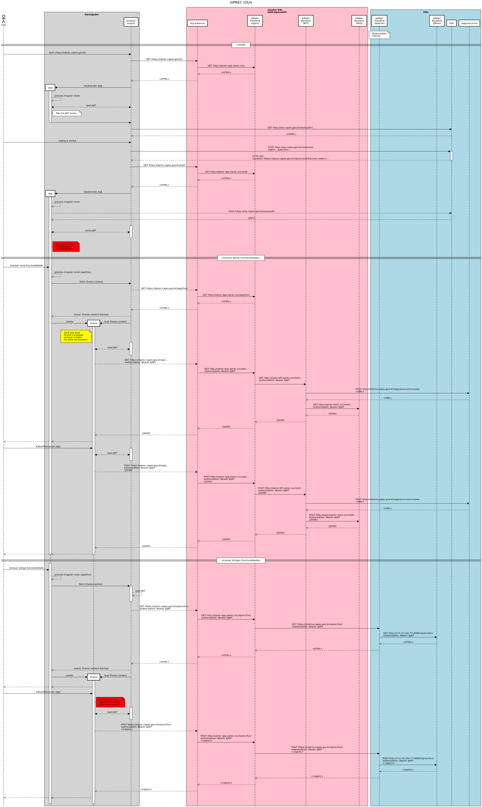

# Repositórios de Código

- Recomendamos a criação de 01 grupo **CGS/CSAB/SIPREC** de respositórios no Gitlab:
  - https://git.capes.gov.br/cgs/csab/siprec
- Recomendamos a criação de 01 repositório git `siprec-web` para o frontend:
  - https://git.capes.gov.br/cgs/csab/siprec/siprec-web
- Recomendamos que o repositório `siprec-web` contenha as aplicações Angular (GUI/`frontend`) e o BFF (`backend`) da aplicação

## Microsserviços

- Recomendamos que os respositórios microsserviços que definam capacidades negociais genéricas sejam colocadas no grupo **CGS/CSAB/CSAB Serviços**[^csab-servicos-ou-subgrupo-1]
  - https://git.capes.gov.br/cgs/csab/servicos
  - Ex.: `comprovantes-pagamentos` -> https://git.capes.gov.br/cgs/csab/servicos/comprovantes-pagamentos [^csab-servicos-ou-subgrupo-2]
- Recomendamos que capacidades específicas ao controle e funcionamento do siprec sejam colocadas no grupo **CGS/CSAB/SIPREC**
  - https://git.capes.gov.br/cgs/csab/siprec
  - Ex.: `siprec-configs` -> - https://git.capes.gov.br/cgs/csab/siprec/siprec-configs

## `siprec-web` (GUI & BFF)

**_Scafolding_ do repositório** `siprec-web`
```
siprec-web
├── devops
│   ├── backend
│   │   ├── siprec-web
│   │   │   ├── Chart.yaml
│   │   │   ├── values-dht.yaml
│   │   │   ├── values-prod.yaml
│   │   │   └── values-review.yaml
│   │   └── Dockerfile
│   ├── frontend
│   │   ├── siprec-web
│   │   │   ├── Chart.yaml
│   │   │   ├── values-dht.yaml
│   │   │   ├── values-prod.yaml
│   │   │   └── values-review.yaml
│   │   └── Dockerfile
│   └── .gitlab-ci.yaml
├── system
│   ├── backend
│   │   ├── src
│   │   └── pom.xml
│   └── frontend
│       ├── moldura
│       │   ├── src
│       │   ├── angular.json
│       │   ├── package.json
│       │   ├── tsconfig.json
│       │   ├── tslint.json
│       │   └── yarn.lock
│       └── telas
│           ├── src
│           ├── angular.json
│           ├── package.json
│           ├── tsconfig.json
│           ├── tslint.json
│           └── yarn.lock
└── README.md
```

# Namespaces do K8s[^k8s]

- Recomendamos a criação de 02 namespaces:
  - `siprec-web-dht`[^dht-ou-hom]: implantação perene para dependências em DHT
  - `siprec-web-prod`: Implantação produtiva

## Namespace DHT

- Recomendamos minimizar os recursos dessa implantação, mantendo apenas 01 _Pod_ de _backend_ e 01 _Pod_ de _frontend_

## Namespace PROD

- Recomendamos **pelo menos** 02 _Pods_ de _backend_ e 02 _Pods_ de _frontend_[^hpa]
  - Os números ideais devem ser obtidos atráves de um estudo de carga
  - Recomendamos uma estratégia de `deployment` do tipo `RollingUpdate`[^k8s-rolling-update]

## Namespaces de Review

- Recomendamos que sejam criados tantos quanto forem necessários
- Recomendamos que eles sejam descartados no mesmo dia
- Recomendamos que conforme necessário eles apontem para devida base de DHT (DESENVOLVIMENTO, TESTE, HOMOLOGAÇÃO, PREPROD)
  - Essa recomendação serve para testar novas integrações, tanto como cliente como servidor de tais integrações

# Integrações

## Um Digrama de Sequência



## URIs & Paths

> Consideremos como _rotas_[^ng-route] o que fica na barra de endereços. Esse conteúdo é resolvido pelo javascript da SPA[^ng-spa] da _Moldura_.

- `/`: Recomendamos que a raiz seja uma _rota_ para a _Moldura_
- `/app/*`: Recomendamos que essas _rotas_ sejam para as _telas_[^rota-telas]
- `/siprec/*`: Recomendamos que essas _rotas_ apontem para as telas antigas do SIPREC no mesmo caminho que elas apontam hoje

> Cada rota resolve, fazendo um transformação na SPA da moldura, criando[^remover-iframe]/atualizando um **HTML** `iframe` cujo src está apontando para um HTML

- Prevemos a necessidade da aplicação _telas_ ter um conjunto de rotas que não colida com as rotas da _Moldura_
- Prevemos que o **nginx** (e provavelmente a aplicação _telas_) deve ser configurado para servir num path bem distinto
  - Recomendamos que _telas_ seja servido no _path_ `/content/*`
    - Ex.: https://siprec.capes.gov.br/content/nova-tela
- Prevemos que uma **terceira** configuração será necessária no **nginx** para que seja feito o forward para as antigas telas JSF
  - Recomendamos que o mapeamento `https://interno.capes.gov.br/siprec/*` seja obtido através do _path_ `/jsf/*`
    - Ex.: https://siprec.capes.gov.br/jsf/siprec/admin/inicio.seam

# Impactos

- Mover o balanceamento do mod_cluster do siprec do balanceador 172.19.150.54 para o balanceador interno.capes.gov.br (172.19.150.117)
- Suspeitamos que seja necessário efetuar configurações para o provisionamento de alguns cabeçalhos e cookies nas requisições (com sorte o **ngnix** consegue lidar com tudo)

## Refatoramentos

- Recomendamos que seja constrúida a moldura e refatorada uma primeira tela no estilo de PoC (_Proof of Concept_ - Prova de Conceito)
  - Recomendamos que essa PoC seja realizada por apenas uma pessoa para que os detalhes técnicos de integração e dificuldades não criem bloqueios. Lembrar do _Mítico Homem-mês_[^man-month-myth]

# Notas e Referências

[^k8s]: Namespaces Kubernetes, são os "Projects" no OKD/Openshift
[^dht-ou-hom]: A alternativa seria `siprec-web-hom`. Toda e qualquer aplicação que depender do siprec-web apontaria para essa implantação. Casos específicos deveriam apontar para implantações _efêmeras_ que sirvam para testes específicos.
[^csab-servicos-ou-subgrupo-1]: Ou num subgrupo (ex.: https://git.capes.gov.br/cgs/csab/servicos/prestacao-contas)
[^csab-servicos-ou-subgrupo-2]: Ou https://git.capes.gov.br/cgs/csab/servicos/prestacao-contas/comprovantes-pagamentos
[^man-month-myth]: Afinal 9 mulheres não reduzem a gestação de um bebê pra 1 mês - https://en.wikipedia.org/wiki/The_Mythical_Man-Month
[^ng-route]: https://angular.io/guide/router
[^rota-telas]: _Rotas_ da aplicação **telas** (`siprec-web/system/frontend/telas`)
[^remover-iframe]: Provavelmente removendo um anterior
[^ng-spa]: Single Page Application - https://angular.io/guide/router-tutorial
[^k8s-rolling-update]: https://kubernetes.io/docs/concepts/workloads/controllers/deployment/#rolling-update-deployment
[^hpa]: O heml chart de aplicaçẽos da CAPES permite configurar os números mínimos e máximo de réplicas, bem como as políticas de controle dessa escala
