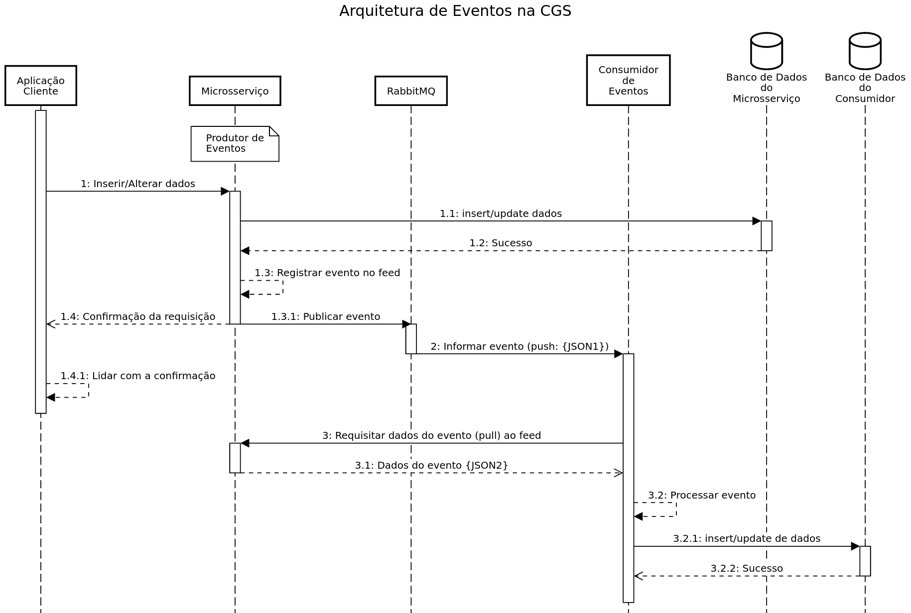

# Leituras Recomendadas

- Versioning in an Event Sourced[^esversioning]
- Architecture Patterns with Python[^cosmicpython-isbn] [^cosmicpython-ebook]

> Embora essa documentação almeje por suficiência, essas foram as leituras principais que inspiraram o conteúdo e recomendamos sua assimilação por serem mais profundas e extensas cobrindo muito mais do que podemos fazer por aqui.

# Introdução

Esse texto documenta conceitos, práticas e recomendações para a implementação de sistemas distribuídos fazendo uso de arquitetura orientada a Eventos.

> Apesar de uma arquitetura realmente orientada da eventos ou baseada em Event Sourcing[^event-sourcing] estabelecer uma caracterização muito mais particular de conceitos, práticas e detalhes de implementação, algumas práticas podem ser observadas para tornar a integração e o funcionamento de aplicações e sistemas distribuídos muito mais robusta e eficiente.

## Evento

Vamos caracterizar um **Evento** como algo que ocorreu em uma determinada aplicação e é de interesse distribúido (outras aplicações estão interessadas em saber e reagir a tal ocorrido).

## Producers[^event-producers], Consumers[^event-consumer] e Message Brokers[^message-broker]

- **Producer**: é a aplicação que teve alguma massa de dados manipulada ou seu estado interno alterado de tal forma que caracteriza algo de interesse de pelo menos alguma outra aplicação
- **Consumer**: é qualquer aplicação que está interessada em receber algum tipo de evento emitido por outra aplicação
- **Message Broker**: é uma ferramenta de software que intermedia a troca de mensagens entre aplicações

## Tecnologias

- **_Advanced Message Queuing Protocol_**[^amqp] (AMQP)
  - RabbitMQ[^rabbitmq] [^rabbitmq-ops]
- **Representacional State Transfer**[^rest] (REST)

# Arquitetura de Eventos

Uma arquitetura, de software em particular, define estilos, práticas e padrões a serem universalizados dentro de um dado contexto. Normalmente uma arquitetura visa atingir algumas características para as aplicações implementadas segundo ela.

**Algumas características desejáveis**:
- Agnostíco a linguagem de programação;
- Adaptável
- Eficiente
- Rápido
- Resiliente

Queremos que a utilização de eventos na arquitetura que estamos propondo seja agonóstica a linguagem de programação dos _producers_, _consumers_ e _message broker_ envolvidos. Mas também queremos que seja uma arquitetura eficiente para a utilização em ampla escala pela CAPES sem onerar os custos de aquisição e propriedade de software. Esperamos que um bom desempenho dessa arquitetura, que os _consumers_ possam reagir o mais imediatamente possível aos eventos lançados pelos _producers_, mas que isso não custe uma porção de recursos computacionais (novamente: eficiência). Também esperamos que essa arquitetura seja resiliente, de modo a lidar com indisponibilidades passageiras de determinados participantes, ou não ser frágil a mudanças, de modo que haja formas efetivas e ágeis de se adaptar a mudanças.

Levando tudo isso em conta é que fizemos algumas escolhas:

- _Push_ de eventos, _pull_ de dados
- Versionamento de eventos
  - Negociação de Conteúdo

## _Push_ de eventos, _pull_ de dados

Desejamos que os _consumers_ possam reagir o mais rápido possível aos eventos, por isso os eventos deveriam ser intermediados por um _message broker_ o mais rápido possível. Por isso o _producer_ emite o evento para o _message broker_ que empurra o evento para o _consumer_. Dessa forma também esperamos que o montante de dados transitado da emissão do evento até o recebimento dele _consumer_ seja reduzido. Muitas vezes para processar o evento, ou mesmo decidir se deve processar o evento o _consumer_ precisa dos dados associados aquele acontecimento. Esperamos que esses dados sejam requisitados ao _producer_ em uma requisição separada. Então para ter os dados que precisa processar o evento, o _consumer_ deve fazer um _pull_ desses dados.

## Versionamento de Eventos

Uma vez que um cliente é implementado para processar um determinado formato de mensagem, algumas mudanças, _incluindo correção de defeitos_, podem tornar o cliente (_consumer_) incompatível com servidor (_producer_).

Seguindo a política de _push_ de eventos, e _pull_ de dados. Vamos modelar os eventos de maneira mais agnóstica e simples possível, mas o problema de integração na hora do consumo dos dados do evento (_pull_ de dados), permanece. Manter a compatibilidade é algo que temos de reconhecer como importante no contexto de desenvolvimento de software da CGS. Por isso ser agnóstico a linguagem pode não ser suficiente, então estamos requisitando que os dados de eventos sejam versionados, de modo que clientes compatíveis com diferentes representações possam continuar funcionando.

### Negociação de Conteúdo[^content-negotiation]

Os servidores de _feeds_ devem ser aptos a receber indicações dos clientes da versão adequada de representação a ser devolvida. Assim a compatibilidade pode ser mantida com uma diversidade de clientes enquanto o formato de representação não for descontinuado[^versionamento-eventos-depreciacao].

> Mesmo após o fim da vida, um cliente robusto que dependa de uma versão descontinuada, não deveria falhar apoteoticamente por erro de decodificação (é deveras arriscado tentar utilizar uma versão incompatível - provavelmente "ever green"), mas falhar por conta de não ter como negociar o conteúdo naquele formato (versão no caso)

## Fluxo

Diante do proposto e desejável até agora, temos o seguinte fluxo geral compatível:



### 1: Inserir/Alterar dados

De certo modo qualquer operação genérica que pudesse resultar em um evento. Mesmo uma requisição de dados poderia gerar algum tipo de evento (ex.: `AcessoIndevido`, `QuotaRequisicoesEsgotada`).

#### 1.1: insert/update dados

É meramente a operação SQL para alteração dos dados.

#### 1.2: Sucesso

Estamos supondo que todo o fluxo é bem sucedido, pois provavelmente só assim haveria o lançamento de algum evento.

> Nem sempre isso precisa ser verdade, um determinado tipo de erro de banco poderia por exemplo lançar um evento (existem outras estratégias de observabilidade para erros de conectividade ou de funcionamento do serviço de banco de dados, mas pode ser que o erro tenha relação negocial).

#### 1.3: Registrar evento no feed

A aplicação deve registrar todos os dados do evento num _feed_ para que seja obtível pelos consumidores dos eventos.

**Um _feed_ é a coleção de eventos que pode ser consultada.**

- Os _feeds_ devem ser externalizados no seu próprio contexto de _path_: `/feeds`
- Cada tipo de evento deveria ter sua própria _Collection_[^esteriotipos-rest] como "_subpath_" do contexto `/feeds`
  - Exemplo: `/feeds/trecos-criados`
- Recomendamos boas práticas de paginação e publicação de _feeds_[^como-atom]
  - Sem detrimento de boas práticas de externalização de _feeds_ destacamos que a formatação recomendada para representação de recursos é em JSON[^padaro-json]

> Apesar da existência desse contexto para os feeds permitir o formato de _pooling_, isso é uma forma alternativa e excepcional de integração e processamento de eventos. É uma alternativa resiliente caso não seja possível integrar/utilizar o _message broker_.

> No momento não vamos estabelecer nenhum _Media Type_, nem _profile_[^rfc6906] para determinar o conteúdo e semântica do que seria obtível no contexto de `/feeds`, mas por se tratar de uma API REST ela deve seguir as recomendações e eventualmente o _Media Type_ consolidado para aplicações REST da CAPES.

##### 1.3.1: Publicar evento

Essa é a ação de integração com o _Message Broker_. Nesse ponto vamos padronizar o formato de **Mensagem de Evento**:

- Utilizar um formato de representação em JSON;
- Cada Mensagem de Evento contém as informações de apenas um evento
- Campos da Mensagem:
  - `id`: alguma forma de identificação da mensagem
  - `links`: dicionário/mapa de _links_[^padrao-links]
    - `links.event`: `Link` para os dados do Evento

Mais formalmente temos a seguinte definição em OpenAPI[^openapi] [^sWagger-editor]:

```yaml
openapi: 3.0.3
info:
  title: Mensagens de Eventos
  description: 'Mensagens que informam o lançamento/publicação de evento para os consumidores daquele evento.'
  contact:
    email: lista.arquitetura@capes.gov.br
  version: 2.0.0
paths: {}
components:
  schemas:
    MensagemEvento:
      description: ""
      properties:
        id:
          type: string
          description: "Uma `ID` que identifique a Mensagem de maneira única."
        links:
          description: "Dicionário de links da Mensagem"
          properties:
            event:
              allOf:
              - $ref: '#/components/schemas/Link'
              description: "Apontamento para uma representação do Evento com os dados dele."


    Rfc8288Link:
      description: |
        As informações fundamentais de um "Web Link" segundo o RFC 8288.
      properties:
        href:
          type: string
          format: uri
          description: "O `target` na especificação (o que fica entre `<` e `>`). Mantivemos a denominação `href` por ser mais usual."
        rel:
          $ref: '#/components/schemas/Rfc8288LinkRelation'
        type:
          $ref: '#/components/schemas/MediaTypeString'
        hreflang:
          description: |
            A linguagem padrão esperada do texto na representação de recurso apontada pelo `href`. È apenas uma "dica", podendo ser sobrescrita se o _endpoint_ aceitar `Accept-Language`.

            **Implementação opcional**
          type: string
        title:
          type: string
        title*:
          type: string
          description: "A especificação estabelece `title*`, mas recomendamos que apenas excepcionalmente esse campo seja utilizado, uma vez que sua desserialização exige tratamentos especiais em diversos casos."
        anchor:
          type: string
          format: uri-reference
        rev:
          description: "A utilização de `rev` é desencorajada pelo próprio RFC."
          type: string
          deprecated: true
        media:
          type: string
      additionalProperties:
        type: string
      required:
      - href
      - rel
      externalDocs:
        description: RFC 8288
        url: https://datatracker.ietf.org/doc/html/rfc8288
    WrmlLink:
      description: |
        `Link` conforme sugerido em WRML (conforme comentado no livro REST API Design Rulebook)
      properties:
        href:
          description: URI (ou URI Template) que identifica o recurso `target`
          type: string
          format: uri
        rel:
          description: "URI que indica o relacionamento com o recurso em `href`"
          type: string
          format: URI
        requestTypes:
          type: array
          items:
            $ref: '#/components/schemas/ParameterizedMediaTypeString'
        responseTypes:
          type: array
          items:
            $ref: '#/components/schemas/ParameterizedMediaTypeString'
        title:
          type: string
      required:
      - href
      - rel
    Link:
      allOf:
      - $ref: '#/components/schemas/WrmlLink'
      - $ref: '#/components/schemas/Rfc8288Link'
      - description: |
          Estamos definindo um Link conforme o RFC 8288, tendo como extensões fundamentais o que foi proposto por WRML. Em alguns casos as duas especificações determinal os mesmos atributos. Onde houver divergências a não ser que explicitamente apontado como desvio do RFC 8288, o RFC tem a prioridade.
    #Campos
    id:
      description: "O campo como valor da `ID` do conceito/entidade."
      oneOf:
      - type: integer
        format: long
      - type: string
        format: uuid
    MediaTypeString:
      description: |
        Uma _string_ que descreve um Media Type, incluindo parâmetros.
        **Exemplos**:
        - `text/plain`
        - `image/jpeg`
        - `application/json`
        - `application/problem+json`
      externalDocs:
        description: IANA
        url: https://www.iana.org/assignments/media-types/media-types.xhtml
      type: string
    ParameterizedMediaTypeString:
      description: |
        Uma _string_ que descreve um Media Type, incluindo parâmetros.
        **Exemplos**:
        - `application/problem+json`
        - `application/vnd.capes.gov.br+json;profile="https://pessoas.capes.gov.br/refs/pessoas/UnidadePessoa"`
        - `application/vnd.capes.gov.br+json;profile="https://pessoas.capes.gov.br/refs/pessoas/UnidadePessoa/desativar"`
      externalDocs:
        description: IANA
        url: https://www.iana.org/assignments/media-types/media-types.xhtml
      type: string
    IanaLinkRelation:
      description: |
        Um _Web Link relation_ cadastrado na IANA
      type: string
      externalDocs:
        description: "IANNA - Link Relations"
        url: https://www.iana.org/assignments/link-relations/link-relations.xhtml
    LinkExtRelType:
      description: |
        URI utilizada para identificar uma _Link Relation_.
      type: string
      format: uri
    Rfc8288LinkRelation:
      description: |
        A lista de relacionamentos do resource no `href`.

        Segundo o RFC um `rel` pode conter multiplos tipos de relacionamento.
      type: array
      items:
        anyOf:
        - $ref: '#/components/schemas/IanaLinkRelation'
        - $ref: '#/components/schemas/LinkExtRelType'
```

Exemplo:

```json
{
  "id": "EmailPrincipalAlterado-1020304",
  "links": {
    "event": {
      "rel": "https://pessoas.capes.gov.br/refs/commons/Event",
      "href": "https://pessoas.capes.gov.br/feeds/emails/1020304",
      "responseTypes": [
        "application/vnd.capes.gov.br+json;profile=https://pessoas.capes.gov.br/refs/feeds/EmailPrincipalAlterado",
        "application/vnd.capes.gov.br+json;profile=https://pessoas.capes.gov.br/refs/feeds/EmailPrincipalAlterado1",
        "application/vnd.capes.gov.br+json;profile=https://pessoas.capes.gov.br/refs/feeds/EmailPrincipalAlterado3",
        "application/json;odata.metadata=none"
      ]
    }
  }
}
```

- A `rel` do _link_ `event` poderia ser algo como `https://pessoas.capes.gov.br/refs/eventos/emails/EmailPrincipalAlterado`, indicando uma relação mais específica que de um Evento genérico
- `responseTypes` é importante para a negociação de conteúdo, de forma que o cliente possa verificar se conhece algumas das representações disponíveis para obter os dados do Evento e processá-lo
  - _**Se a URI de `rel` for um recurso obtível**_ uma consulta com um `Accept` adequado (por exemplo passando `https://rest.capes.gov.br/refs/commons/LinkRelation` no parâmetros `profile`) poderia retornar um `LinkRelation` contendo o `responseTypes` para a negociação de conteúdo

#### 1.4: Confirmação da requisição

É a resposta HTTP retornada para o cliente.

### 2: Informar evento

É o processo pelo qual o _Message  Broker_ entrega a **Mensagem de Evento** para o(s) consumidor(es) daquele Evento.

**É isso que queremos dizer com "_push_ de mensagens".**

### 3: Requisitar dados do evento ao _feed_

Com o _link_ do Evento informado na mensagem o _consumer_ pode solicitar ao _producer_ via HTTP (REST) o conteúdo de dados que representa o Evento.

> Suprimimos a decisão ou a troca de comunicações que pode ser necessária com a negociação de conteúdo.[^mediatype-futuro1]

**É isso que queremos dizer com "_pull_ de dados".**

#### 3.1: Dados do Evento

> Provavelmente em JSON

Os dados do evento chegam ao _consumer_.

#### 3.2: Processar evento

Com o dados do evento numa representação que ele compreende, o _consumer_ pode avaliar e se deve e como deve processar o evento.

##### 3.2.1: insert/update de dados

_Partindo da premissa que esse evento realmente é do interesse do consumer e resulta numa reação dele_, algum efeito colateral na base de dados do _consumer_ é provável, nesse exemplo é uma manipulação em SQL.

##### 3.2.2: Sucesso

Estamos supondo que a interação com o banco de dados foi bem sucedida.

# Notas e Referências

[^esversioning]: Ebook: https://leanpub.com/esversioning/read
[^cosmicpython-isbn]: ISBN: 9781492052203 - https://www.oreilly.com/library/view/architecture-patterns-with/9781492052197/
[^cosmicpython-ebook]: Ebook gratúito: https://www.cosmicpython.com/book/preface.html
[^amqp]: https://www.amqp.org/
[^obs1]: Também fazemos extenso uso de práticas de REST
[^rest]: "Transferência Representacional de Estado"
[^rabbitmq]: https://www.rabbitmq.com/
[^rabbitmq-ops]: https://git.capes.gov.br/dti/orientacoes-gerais/guia/blob/master/arquitetura/microsservices.md#message-broker-rabbitmq
[^event-sourcing]: https://martinfowler.com/eaaDev/EventSourcing.html
[^event-producers]: Produtores de Eventos
[^event-consumer]: Consumidores de Eventos
[^capes-mediatype]: Futuro. Um futuro Media Type da CAPES
[^esteriotipos-rest]: Conforme padronizado para APIs REST: https://git.capes.gov.br/dti/orientacoes-gerais/guia/blob/master/arquitetura/rest-apis.md#arqu%C3%A9tipos-de-recursos
[^como-atom]: Como as que podem ser inspiradas por Atom Feeds - https://datatracker.ietf.org/doc/html/rfc5023
[^padaro-json]: Conforme padronizado para APIs REST: https://git.capes.gov.br/dti/orientacoes-gerais/guia/blob/master/arquitetura/rest-apis.md#desenho-de-representa%C3%A7%C3%A3o
[^padrao-links]: Conforme padronizado para APIs REST: https://git.capes.gov.br/dti/orientacoes-gerais/guia/blob/master/arquitetura/rest-apis.md#desenho-de-representa%C3%A7%C3%A3o
[^versionamento-eventos-depreciacao]: Estamos estudando o melhor formato para manter os clientes informados a respeitos de depreciação e "fim da vida" de determinadas representações numa API REST
[^message-broker]: Apesar de _broker_ ser comumente traduzido para **corretor**, a expressão **corretor de mensagens** pode ficar dispersa, por isso traduzimos como **intermediário de mensagens**
[^mediatype-futuro1]: Futuramente será melhor detalhado numa documentação sobre o _Media Type_ da CAPES
[^content-negotiation]: https://developer.mozilla.org/en-US/docs/Web/HTTP/Content_negotiation
[^rfc6906]: RFC 9606 - https://datatracker.ietf.org/doc/html/rfc6906
[^openapi]: Documentação da especificação de OpenAPI: https://swagger.io/specification/
[^sWagger-editor]: Para visualizar essa documentação formatada (em um formato _live documentation_) é possível utilizar o Swagger Editor: editor.swagger.io/
