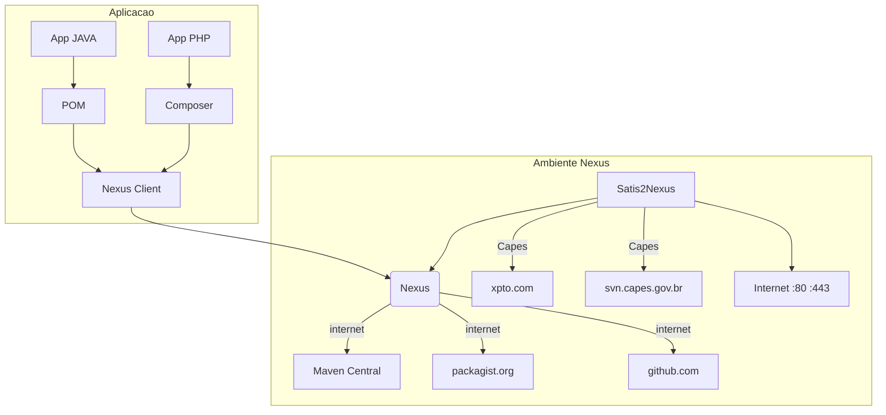

`#Em construção#`

## Visão Geral


#

# Instalação
**NOTA**: O uso do Nexus demanda que haja um planejamento prévio quando ao crescimento do volume de dados por ele demandado.

*  crie usuário **nexus**
*  baixe o pacote com a versão a ser instalada do nexus **nexus-x.y.z-tar.gz** [^1]
*  mova o pacote **nexus-x.y.z-tar.gz** para **/opt**
*  descompacte o pacote **nexus-x.y.z-tar.gz**
   *  altere o dono e grupo da pasta `/opt/nexus-x.y.z` para `nexus`
   *  altere o dono e grupo da pasta `/opt/sonatype-work` para `nexus`
   *  crie um link simbólico da pasta `/opt/nexus-x.y.z` para `/opt/nexus`
*  alterne para o usuário `nexus`
*  inicie o nexus: 
```shell 
$ /opt/nexus/bin/nexus start
```

# Atualização
*  realize backup da pastas `/opt/nexus` e `/opt/sonatype-work`
*  alterne para o usuário **nexus**
*  pare o nexus `/opt/nexus/bin/nexus stop`
*  remova a pasta `/opt/nexus`
*  baixe o pacote com a nova versão do nexus **nexus-x.y.z-tar.gz**
*  mova o pacote **nexus-x.y.z-tar.gz** para `/opt`
*  descompacte o pacote **nexus-x.y.z-tar.gz**
   *  altere o dono e grupo da pasta `/opt/nexus-x.y.z` para `nexus`
   *  altere o dono e grupo da pasta `/opt/sonatype-work` para `nexus`
   *  crie um link simbólico da pasta `/opt/nexus-x.y.z` para `/opt/nexus`
   *  alterne para o usuário `nexus`
*  inicie o nexus: 
```shell 
$ /opt/nexus/bin/nexus start
```
#

# Configuração
## Storage
No Nexus, um **Storage**, ou em sua definição, **Blob Storage**, trata-se de uma alocação de disco para que o Ne possa agrupar os artefatos de um ou mais repositórios.

**REGRA**: Um repositório deverá ser criado para cada repositório.

### Criar store
*  selecione **repository** e, depois, **Blob Stores**
*  selecione **Create blob store**
*  informe
   *  **Type** - selecione o tipo "File"
   *  **Name** - informe o nome(slug) do novo Storage 
   *  **Enable Soft Quota** - mantenha desativado
   *  **Path** - apague o conteúdo sugerido e informe o mesmo identificador preenchido em **Name**(slug)
   *  Clique em **Create blob store**


Figura 1 - Exemplo de preenchimento para criar um **Blob Storage**.

## Repositórios
### Repositório interno Capes

**NOTA1:** Este tipo de repositório deverá ser empregado para armazenar artefatos em VCS internos na capes. (*xpto.com* ou *svn.capes.gov.br*).

**NOTA2:** Este tipo de repostório demanda um Storage, crie-o antes de seguir em frente. [Instruções para criação de storage](#criar-store)

**NOTA3:** Para repositório interno, sempre selecionar a variação do **Recipe** com sufixo **(hosted)**.

*  selecione **repository** e, depois, **repositories**
*  selecione **Create repository**
*  na listagem apresentada, selecione o tipo de repositório a ser criado, por exemplo, **composer (hosted)**
*  informe
   *  **Name** - o nome do repositório(slug)
   *  **Online** - deixe-o maracado
   *  **Blob store** - selecione o storage criado para o repositório
   *  **Strict Content Type Validation** - deixe-o marco
   *  **Deployment policy:** - selecione "Allow redeploy"


Figura 2 - Selecionando a criação de repositório


Figura 3 - Selecionando o tipo de repositório hosted


Figura 4 - Exemplo de preenchimento para criar um **Repositório hosted**.


### Repositório proxy
**NOTA1:** Este tipo de repositório deverá ser empregado para o Nexus prover respositórios externos, por exemplo **packagist.org**.

[..to be continue]

# Aplicação
## Java
## PHP

#
[^1]: **nexus-x.y.z-tar.gz**, disponível em: https://help.sonatype.com/repomanager3/download, acessado em: 15/04/2020.