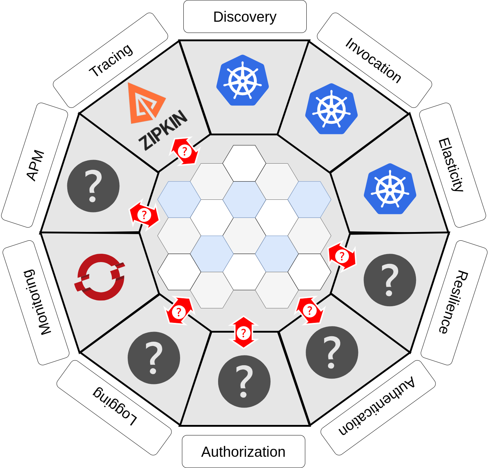
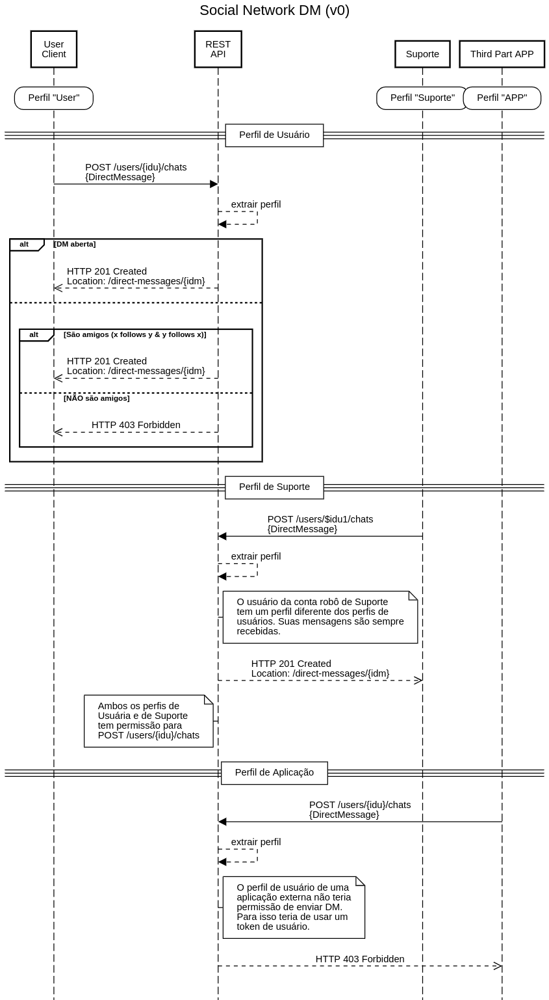
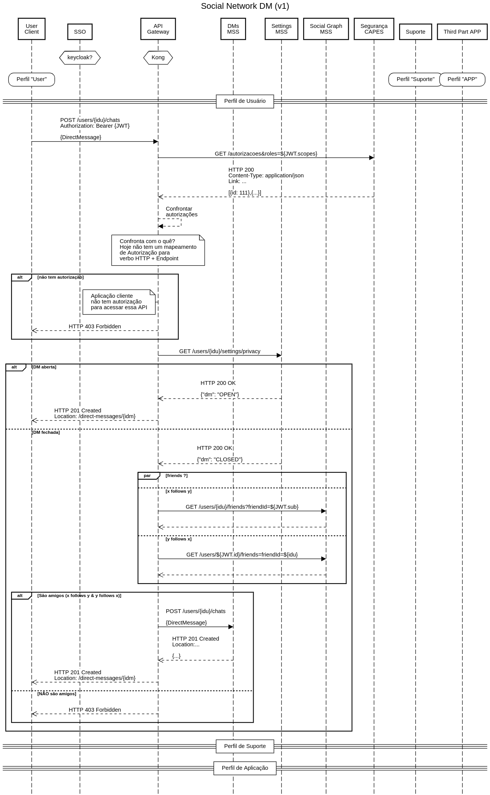
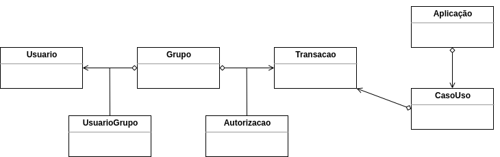
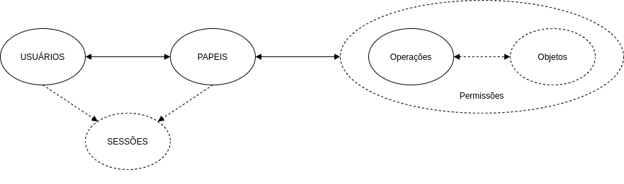

# Permissionamento & Segurança nas Aplicações de _Backend_ na Arquitetura de Referência da CGS

A intenção desse texto é discorrer sobre o contexto de Permissionamento e Segurança no contexto de aplicações desenvolvidas pela CGS aderindo a Arquitetura de Referência[^arq-ref]. Estamos querendo justificar algumas decisões e posições que tomamos.

Temos de levar em consideração alguns aspectos e conceitualizações, bem como alguns dos objetivos arquiteturais.

Nossa arquitetura poligonal prevê que determinadas responsabilidades sejam distribuidas em outras camadas e ferramentas separadas do _runtime_ da aplicação.

Figura 1 - Arquitetura Poligonal

O foco de aplicações de _backend_ deve ser prover uma API REST que manipule um determinado contexto negocial. A ideia é que esses contextos tenham escopos específicos e reduzidos. Além das vantagens abstratas de coesão e especialidade que esse tipo de abordagem aspira, também há ganhos no aproveitamento de recursos. Enxugar o _runtime_ das aplicações permite otimizar a distribuição de recursos como memória, processamento e até armazenamento. Em vez de replicar um _footprint_ com uma determinada responsabilidade ortogonal em 100 aplicações, pode ser que mesmo numa camada separada com uma ferramenta especializada clusterizada com, digamos, 10 instâncias, seja mais otimizado em termos de utilização total de memória e CPU.

O que viemos a perceber é que Permissionamento e Segurança podem não ser exatamente ortogonais, mas "diagonais".
Para ilustrar isso concebemos um pequeno caso de estudo. A ideia é composta de um pequeno conjunto de _User Stories_ que descreve um subconjunto funcional de uma especulativa plataforma de rede social (digamos que a CAPES fosse establecer sua própria por alguma razão).

## _User Stories_

Não vamos entrar em muita minúcia, pois cremos que o entendimento e uso de plataformas de rede social é universal o sufiente. O aspecto negocial que vamos usar para ilustrar é o de _Direct Messages_ (DM - Mensagens Diretas).

- **US 1**: Como usuário da plataforma quero receber mensagens diretas (DMs) de qualquer outra pessoa que tenha perfil na plataforma, para interagir com qualquer pessoa da plataforma.
- **US 2**: Como usuário da plataforma quero receber mensagens diretas (DMs) apenas das pessoas que sigo reciprocamente na plataforma, para que minha privacidade seja mantida.
- **US 3**: Como robô de suporte da plataforma quero poder enviar mensagens diretas (DMs) para qualquer participante da aplicação, independente da configuração de privacidade, para informar adequadamente participantes.
- **US 4**: Como usuário de aplicação de terceiros não posso ter permissão de enviar mensagens diretas (DMs) para não importunar participantes da plataforma.

As **US1** e **US2** são antagônicas, mas é fácil notar que são opções de configuração/personalização dessa plataforma. Suprimimos a descrição das _User Stories_ que descreveriam como realizar essas configurações.

## Modelagem

Modelamos em alto nível as iterações:

Figura 2 - Fluxos de DM em alto nível

Quando tentamos desmembrar o participante **REST API** em seus componentes e camadas de modo a aderir a Arquitetura de Referência é que algumas questões emergem. A figura a seguir descreve uma arquitetura em que os aspectos de validação de Permissionamento e Segurança foram concentrados no **API Gateway**.

Figura 3 - Fluxo de DM para US1 e US2

A `Figura 3` demonstra que as responsabilidades de Permissionamento e Segurança estão espalhadas em várias camadas e exigem a interação com diferentes fontes de dados para que os requisitos das _User Stories_ sejam contemplados.

- O `API Gateway` teria de consultar o `Segurança CAPES`;
- O `API Gateway` teria de confrontar os dados do `Segurança CAPES` com algum mapeamento de transações para operações e objetos, no caso de REST verbos HTTP e _endpoints_;
- O `API Gateway` teria de consultar o `Settings MSS` onde seria armazenado (ou exposto) as configurações e personalizações de usuário da plataforma de rede social;
  > - Entendemos que o aspecto específico das configurações de DM poderiam ser responsabilidade de `DMs MSS`, mas o problema geral seria o mesmo, pois exige que o `API Gateway` integrasse com um serviço
- O `API Gateway` também teria de (eventualmente) consultar o `Social Graph MSS` para descobrir se os usuários envolvidos na DM se seguem reciprocamente (_x follows y & y follows x_);

---

## RBAC, REST, OAuth2/OIDC, JWT & SSO

A CAPES utiliza um esquema de Segurança baseado na associação de perfis (na verdade denomina **grupo**) a transações.

Figura 4 - Esquema de Segurança da CAPES

Existe algum mapeamento desse esquema de Segurança para o RBAC

Figura 5 - RBAC básico

A CAPES adotou a ideia de SSO (Single Sign-On) para as aplicações da CGS. A aplicação que provê o SSO foi implementado e é mantido pela própria CGS, visando ser compatível com SAML e OAuth2. A Arquitetura de Referência espera que as aplicações sejam implementadas para utilizar OAuth2 como forma de autenticação (OAuth2 é a base para OIDC - OpenID Connect). A especificação de OAuth2[^rfc-oauth2] não define qual o formato do token e as interações de validação das operações delegadas, mas o SSO da CAPES implementou um dos formatos mais difundidos: JWT[^rfc-JWT].

De RBAC para o mundo REST há um mapeamento natural de **Operações** para _verbos HTTP_ (`GET`, `POST`, `DELETE`, `PATCH`, etc.) e **Objetos** para _endpoints_ (URI). A CAPES adotou uma arquitetura onde os dados do esquema de Segurança são estáticos, e a implementação das aplicações estabelece quais de seus elementos correspondem aqueles dados. É um detalhe de implementação o que corresponde a cada transação.

Sendo a base de código a fonte de verdade para a informação que estabelece o mapeamento que precisa ser utilizado para confrontar contra as permissões disponíveis nos perfis da pessoa autenticada há algumas opções de como lidar com isso:

1. A validação de acesso ficar no _runtime_ da aplicação;
2. A aplicação publicar esses dados para um repositório;
   - a) Quando inicializa; ou
   - b) Através do _Pipeline_ de Ci/CD.
3. Manter um catálogo estático de mapeamentos.

Aqui se observa o dilema de como disponibilizar os dados para confrontar conforme as requisições são processadas. A opção 1 vai na contra-mão de diminuir o _runtime_ das aplicações de backend retirando responsabilidades não negociais. A opção 2a tem pelo menos o problema de imaginarmos que estamos lidando com múltiplas instâncias do serviço sendo inicializadas diversas vezes. A opção 2b evitaria problemas por conta do ciclo de vida de múltiplas instâncias, mas envolve adicionar toda uma parafernalha para fazer isso funcionar (que elemento do pipeline publicaria isso? onde os dados seriam armazenados?). De maneira geral 2, tanto 2a quanto 2b, tem o problema de integração do **API Gateway** com alguma fonte de dados. O custo de personalizar ou estender uma ferramenta de **API Gateway** (como Kong), pode variar desde o trivial, até o proibitivo o que adiciona um considerável risco para essa abordagem (é cabível imaginar que implementar uma ferramenta própria de **API Gateway** seja ainda mais proibitivo de maneira geral, apesar de poder economizar no aspecto de integração). A opção 3 também pode ser desagradável, pois apesar de remover da base de código qualquer aspecto de configuração, cria mais um gargalo de configuração. Separar num cadastro estático pode criar perdas de sincronia que podem ir desde o incômodo ao usuário quanto vetores de ataque que comprometam o funcionamento da aplicação, corrupção de dados, ou violações de privacidade.

> Em algum lugar acessível pelo **API Gateway** seria necessário ter um mapeamento **Verbo HTTP  & _Endpoint_** <-> **Transação no Segurança CAPES** (ex.: `GET /endpoint` <-> `APP0:UC001:TR_XYZ_002`). No caso da opção 3, talvez isso seja no próprio **API Gateway**.

A Arquitetura de Referência foi idealizada para ser mais orientada a DevOps, conteinerização e orquestração de contêineres, então um princípio que faz sentido é elevar o repositório e a base de código como fontes de configuração e verdade.
A opção 3, nesse aspecto parece natimorta já por conta disso. Outro aspecto a se levar em conta é que no momento nem temos implantada uma ferramenta de **API Gateway**. Mesmo que ele seja implantado no futuro, o custo de extensão e migração desencoraja hoje a adotar a opção 3.
O custo de adicionar toda uma infraestrutura para atender a opção 2, também parece descabido.

---

**Diante do que foi discutido até aqui, apesar da premissa de diminuir o _runtime_ das aplicações vamos optar por manter nele mecanismos e integrações para a validação de Permissionamento e Segurança**.
Algumas políticas (como _rate limits_) fazem sentido serem mantidas no **API Gateway**, desde que não exijam extensões e integrações como o que foi ilustrado nas _User Stories_.

---

Agora temos de nos voltar ao que poderia ser feito para lidar ou otimizar as interações com os serviços permeiam os aspectos de Permissionamento e Segurança (vamos manter em mente o caso de estudo da plataforma de rede social).  O SSO da CAPES emite um JWT com JWS[^rfc-JWS] [^JWS-JWT], que permite a todas as partes que tem acesso a chave pública do SSO validar se aquele conteúdo foi emitido realmente pelo SSO. Um JWT é basicamente um objeto JSON, que tem uma lista quase determinada de atributos, chamados de _claims_. Os emissores de JWT podem adicionar _claims_ conforme desejem, mas não devem desrespeitar a semântica dos já estabelecidos. O RFC 7519[^rfc7519] define um registro de _claims_ na IANA[^iana-claims]. Nenhum dos _claims_ registrados tem relação com RBAC.
O JWT é emitido pelo SSO como um token de OAuth2, seguindo o fluxo de autenticação de OAuth2. O que nos leva a discussão de OAuth _Scopes_ vs. RBAC _Roles_:
Não existe uma relação natural de "um pra um" entre os _scopes_ de OAuth e o _roles_ de RBAC. São tecnologias diferentes e não há um padrão de representação para isso. Os _scopes_ por sinal estão associados aos tokens, enquanto os _roles_ (perfis) tem associação com usuários. Lembrando que a visão de _scopes_ é para liberar a terceiros permissões aos recursos de um usuário numa plataforma.

> ### _Scopes_ com permissões que o _role_ de usuário não teria
> Usualmente os scopes mapeiam um subconjunto de permissões de perfil, mas podemos imaginar até que o _scope_ pode até ter permissões que usuário em si não teria.
> Vamos exemplificar imaginando o cenário onde uma pessoa assina um serviço de armazenamento de arquivos. Esse serviço permite que aplicações externas façam backups na conta da pessoa, mas esses arquivos não ficam completamente acessívies pela aplicação do serviço, podem ser apenas acessados através da aplicação que está utilizando o backup. Então a pessoa daria _scope_ de `backup` para a aplicação externa, mas não teria permissão na aplicação do serviço para manipular esses dados. Apesar do recurso (espaço de armazenamento) ser da pessoa, o perfil dela na aplicação não tem acesso aos dados. Isso pode ser feito para impedir que a pessoa corrompa os dados do backup da aplicação externa. Provavelmente o perfil da pessoa teria permissão de limpar (apagar completamente) o backup, mas não teria permissão de editar seu conteúdo.

Algumas implementações de serviços de autenticação como Okta[^okta] e Auth0[^auth0] adicionam _private claims_[^JWT-private-claims] para armazenar os dados de RBAC que podem ser utilizados (no caso `groups` e `permissions`). A ferramenta Keycloak permite determinar o JWT _claim_ que receberá os _roles_ de RBAC. Mas novamente não temos um mapeamento "um pra um" de _roles_ do RBAC para a tecnologia de JWT.
Não há uma necessidade incontornável do JWT emitido pelo SSO da CAPES conter os perfis de RBAC. Também não resolve ou facilita diretamente no que diz respeito a mover a validação de permissão do _runtime_ da aplicação. Existe uma óbvia vantagem: não é preciso consultar a base de conhecimento de permissões para verificar quais os perfis que o usuário tem. Num caso mais extremo poderiamos emitir o token já com todas as transações que o perfil contém.

> ### Estatísticas para adicionar dados de RBAC no JWT
> Existem pelo menos 3 formas de incluir as permissões RBAC do Segurança no JWT emitido pelo SSO:
> 1. Lista com os grupos (_roles_);
> 2. Lista com todas as transações (_transactions_);
> 3. Dicionário com mapeando cada grupo (_role_), para sua lista de transações (_transactions_).
>
> Um resultado natural disso é o incremento do total de bytes que tem de ser enviado pelo cliente para o serviço a cada requisição. Também devemos levar em conta que o JWT é tramitado entre alguns saltos dentro do ecossistema de cluster e aplicações da CGS.
> Fizemos uma consulta na base de dados para ter uma noção do estado atual e do incremeto de bytes trafegados. Nesse levantamento optamos por utilizar os nomes dos grupos, siglas de aplicação, códigos de casos de uso e códigos das transações.
> Podemos sintetizar que para 90% dos usuários hoje (cerca de 610 mil) cadastrados na CAPES, o aumento médio seria de até 33, 176 ou 194 bytes (ou 5.67%, 30.24% e 33.33%) no JWT para as opções 1, 2 ou 3 respectivamente.
> > Levantando essas estatísticas notei que há uma duplicação de usuários grupos (cerca de 79 mil pelas minhas contas).

O problema de adotar a validação de _roles_ ou mesmo de _transactions_ do conteúdo do JWT é que exige que o token seja emitido com essa informação. Isso no cenário de hoje exigiria mudar a implementação no SSO da CAPES, ou trocar a ferramenta por um SSO de mercado.

---

A conclusão que chegamos é que criar impactos de modificação na infraestrutura de emissão do JWT é inaceitável. **Vamos tentar antecipar a otimização e implementar um _claim_ que quando disponível, evita a chamada dos serviços de segurança para inspeção dos roles e transacions da pessoa autenticada com o token JWT.**

> Para o caso de Java vamos tentar remover a utilização de anotações específicas e tentar criar um mecanismo aderente a tecnologia do Spring Security.

---

# Notas & Referências
[^rfc-oauth2]: RFC 6749 - The OAuth 2.0 Authorization Framework - https://datatracker.ietf.org/doc/html/rfc6749
[^rfc-JWT]: RFC 7519 - JSON Web Token (JWT) - https://datatracker.ietf.org/doc/html/rfc7519
[^rfc-JWS]: RFC 7515 - JSON Web Signature (JWS) - https://datatracker.ietf.org/doc/html/rfc7515
[^JWS-JWT]: Json Web Signature (JWS) - https://www.brunobrito.net.br/jose-jwt-jws-jwe-jwa-jwk-jwks/
[^iana-claims]: JSON Web Token (JWT) - https://www.iana.org/assignments/jwt/jwt.xhtml
[^rfc7519]: JSON Web Token (JWT) - https://www.rfc-editor.org/rfc/rfc7519.html
[^JWT-private-claims]: Private Claim Names - https://www.rfc-editor.org/rfc/rfc7519.html#section-4.3
[^arq-ref]: Documentação da Arquitetura de Referência na Intranet - https://intranet.capes.gov.br/diretoria-de-tecnologia-da-informacao-dti/mais/procedimentos-e-normas/item/download/174_3004d8de7d62295b09dc06c4080d9188
[^okta]: okta - https://www.okta.com/
[^auth0]: auth0 - https://auth0.com/
