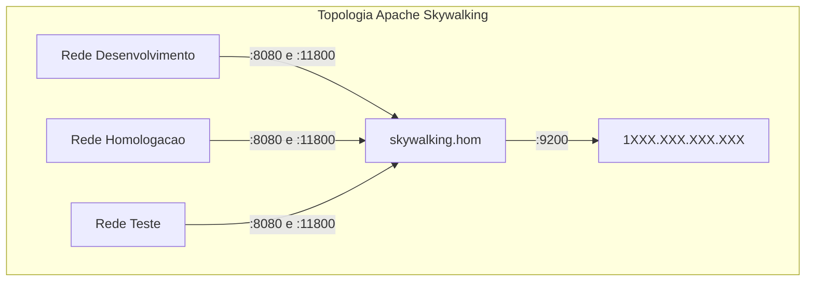
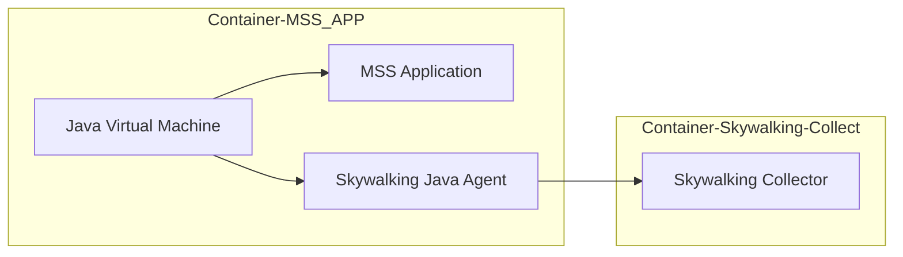
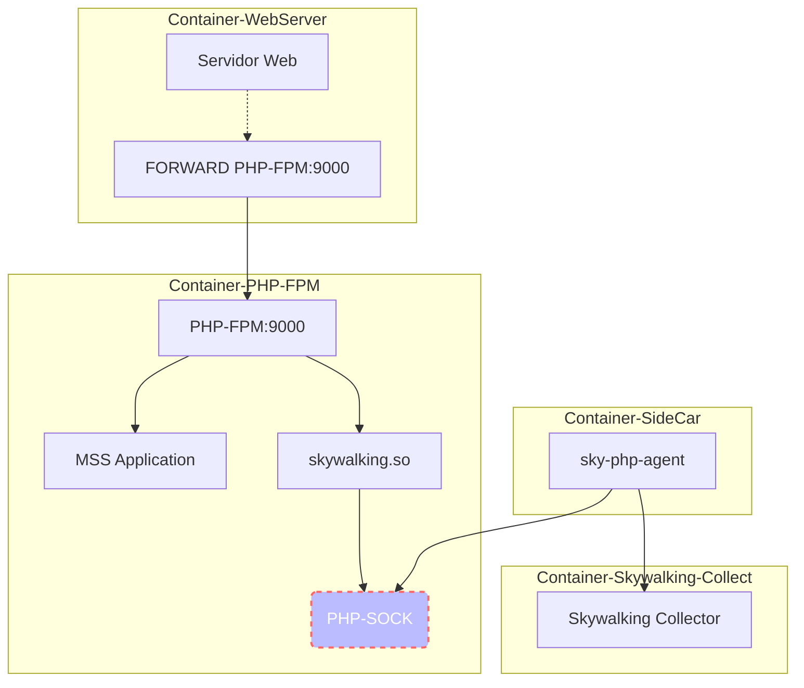

#Em construção#

# Microsserviço
Esta seção objetiva centralizar a documentação sob aspecto arquitetural sobre Microsserviço(MSS).

# Visão geral
Segundo Martin Fowler, Arquitetura de Microsserviço *(MSA)* é o termo usado para descrever uma arquitetura de software como um conjunto de serviços implementáveis de forma **independente**.[^1] Frente a várias definições para descrever *MSA*, o consenso é o de que na *MSA* existem certas características comuns: **implantação automatizada** - CI/CD, ***endpoints* inteligentes**, descentralização **de linguagem de programação** e **de dados**.

Definir o tamanho de um microsserviço se mostrou algo muito relativo e isso é um ponto pacífico entre os que falam sobre o assunto. Assim, neste documento, adotaremos o apontamento de *Fowler*[^1] e adotaremos como regra de ouro para definição do tamanho de um MSS a seguinte premissa:

> *unidade de software que pode ser substituída ou atualizada de forma independente pensando e codificado para ser resiliente a falhas e ser especialista em um domínio de negócio.*

Com essa premissa em mente, ao projetar um *MSS*, deve-se buscar atender aos seguintes requisitos:
  - Exteriorizar funcionalidades por API Rest;
  - Atualizar não gera incompatibilidade com versões anteriores - caso em que não altere o Major Version[^2];
  - Receber dados descontextualizada de seu proprietário;
  - Adequar linguagem de programação ao problema a ser resolvido;
  - Melhorar constantemente seu código;
  - Recuperar-se de erros;
  - Não referenciar, em código, outros MSS explicitamente;
  - Escalar processamento

A visão buscada ao se projetar um *MSS* é a mesma adotada pela filosofia Unix[^3]:
> - *Escreva programas que façam apenas uma coisa, mas que a façam bem feita.*
> - *Escreva programas que trabalhem juntos.*
> - *Escreva programas que manipulem streams de texto, pois esta é uma interface universal.*

# Ferramentas
Um ponto importante, no processo de adoção de *MSA*, é saber identificar a ferramenta apropriada para o prósito certo.

> Para auxiliar nesta tarefa, a *Cloud Native Interactive Landscape* (CNCF)[^4] dispõe em seu site uma coleção de ferramentas agrupadas em:
> - [App Definition and Development](https://landscape.cncf.io/category=app-definition-and-development&format=card-mode&grouping=category)
> - [Orchestration & Management](https://landscape.cncf.io/category=orchestration-management&format=card-mode&grouping=category)
> - [Runtime](https://landscape.cncf.io/category=runtime&format=card-mode&grouping=category)
> - [Provisioning](https://landscape.cncf.io/category=provisioning&format=card-mode&grouping=category)
> - [Special](https://landscape.cncf.io/category=special&format=card-mode&grouping=category)

## API Gateway
Responsável por:
  - Unificar porta de entrada para as diversas APIs
  - Filtrar o tráfego de diferentes tipos de *Client* e direcionar ao *endpoint* mais apropriado
  - Gerenciar o limite de acesso às APIs
  - Validar token de acesso
  - Segregar APIs:
    - Público
    - Privado
    - Parceiro

## Discovery
## Pipeline
Este assunto foi exaustivamente abordado pela equipe DevOps e a documentação está disponível em [CI/CD](devops/orientacoes-tecnicas/ci-cd.md).


## Message Broker (RabbitMQ)

O ***Message Broker*** tem por objetivo criar uma ponte assíncrona entre aplicações.

Este ferramenta permite que um MSS enderece uma atividade a outro e não precise esperar que o *Outro* termine seu trabalho para o *Um* continuar seu fluxo.

O ambiente "DHT" é formado por um conjunto instâncias que formam um cluster único. Dentro do cluster existem áreas para cada ambiente (desenvolvimento, homologação e testes).

Atualmente, o cluster DHT é composto por 3 nós:
- V-RABBITMQHA01-H (XXX.XXX.XXX.XXX)
- V-RABBITMQHA02-H (XXX.XXX.XXX.XXX)
- V-RABBITMQHA03-H (XXX.XXX.XXX.XXX)

Para cada um dos nós que fazem parte do cluster, execute os seguintes passos:

Pelo funcionamento do próprio RabbitMQ, ao configurar o *Cluster*, um master/nó principal, é selecionado de forma automática e involuntária.

Passos necessários para ambos os cenários: primeiro nó do cluster e demais *nṍs*:

- DNS - Garantir que cada um dos nós consiga acesso a outro por nome.
Originalmente, a solução adotada foi acrescentar o nome dos *nós* no `/etc/hosts` de cada um dos nós:
```vim
XXX.XXX.XXX.XXX	V-RABBITMQHA01-H.capes.gov.br V-RABBITMQHA01-H
XXX.XXX.XXX.XXX   V-RABBITMQHA02-H.capes.gov.br V-RABBITMQHA02-H
XXX.XXX.XXX.XXX   V-RABBITMQHA03-H.capes.gov.br V-RABBITMQHA03-H
```
- vIP - Registro do IP do nó do vIP
Todo novo nó precisa ser registrado no vIP criado para responder ao DNS do RabbitMQ (rabbitmq.capes.gov.br). Este passo deve ser realizado abrindo um chamado para a Infra.
No chamado, informe:
  - *"Favor, incluir o IP x.y.w.z do nó (**informe o nome do novo nó**) ao vIP (**informar qual IP do vIP desejado**)"*
    - vIP DHT: XXX.XXX.XXX.XXX                - Que deverá apontar para rabbitmq.hom.capes.br
    - vIP PRD: `0.0.0.0 (ainda será criado)`  - Que deverá apontar para rabbitmq.capes.br

- Instalar pacotes
```shell
 $ yum update -y
 $ curl -s https://packagecloud.io/install/repositories/rabbitmq/erlang/script.rpm.sh | sudo bash
 $ curl -s https://packagecloud.io/install/repositories/rabbitmq/rabbitmq-server/script.rpm.sh | sudo bash
 $ yum -y install rabbitmq-server
 $ yum -y install nfs-utils
 ```

- Iniciar RabbitMQ standalone
Iniciar o RabbitMQ fora do cluster (*Standalone*) é necessário para inicializar o Erlang e por consequência, criar o `/var/lib/rabbitmq/.erlang.cookie`.

```shell
$ rabbitmq-server -detached
```

- habilitar plugins
   - JMS                        - Necessário para que o RabbitMQ tratate Java Message Service
   - Auth LDAP                  - Necessário para que o RabbitMQ se integrar ao LDAP
   - Interface de gerenciamento - Necessário para que o RabbitMQ habilitar UI Admin

```shell
$ rabbitmq-plugins enable rabbitmq_jms_topic_exchange
$ rabbitmq-plugins enable rabbitmq_auth_backend_ldap
$ rabbitmq-plugins enable rabbitmq_management
```

- Parar o RabbitMQ
Uma vez inicializado e tendo habilitado os plugins, parece o RabbitMQ que encontra-se em modo Standload .

```shell
$ rabbitmqctl stop_app
```

- configurar rabbitmq.conf

Criar/editar o arquivo `/etc/rabbitmq/rabbitmq.conf` e adicionar o seguinte conteúdo:

```vim
cluster_formation.peer_discovery_backend = classic_config

# lista dos nós no cluster
# para cada novo nó, relacione-o abaixo
cluster_formation.classic_config.nodes.1 = rabbit@V-RABBITMQHA01-H
cluster_formation.classic_config.nodes.2 = rabbit@V-RABBITMQHA02-H
cluster_formation.classic_config.nodes.3 = rabbit@V-RABBITMQHA03-H

cluster_formation.discovery_retry_limit = 10
cluster_formation.discovery_retry_interval = 500

# configuração do LDAP
auth_backends.1.authn             = ldap
auth_backends.1.authz             = internal
auth_backends.2                   = internal
auth_ldap.servers.1               = fc.capes.gov.br
auth_ldap.port                    = 389
auth_ldap.timeout                 = 15000
auth_ldap.connection_pool_size    = 256
auth_ldap.dn_lookup_attribute     = sAMAccountName
auth_ldap.dn_lookup_base          = OU=_Usuarios da CAPES,DC=fc,DC=capes,DC=gov,DC=br

# informar a senha do usuário usado para fazer bind com ldap: svc_habbitmq_hom
auth_ldap.dn_lookup_bind.user_dn  = cn=svc_habbitmq_hom,ou=_Contas de Servicos,dc=fc,DC=capes,dc=gov,dc=br
auth_ldap.dn_lookup_bind.password = **********

auth_ldap.use_ssl = false
auth_ldap.log = false
```
> Nota 1: Não esquecer de incluir o nó na relação do membros do cluster `cluster_formation.classic_config.nodes.X`. Uma vez que um novo nó entre no cluster, será necessário registrá-lo em todos os `rabbitmq.conf`. Uma solução mais eficiente para isso seria compartilhar este arquivos entre todos os nós.

> Nota 2: Não esquecer de informar a senha correta em `auth_ldap.dn_lookup_bind.password`.

- Criar usuário
  - **Service Account**     - Usado pelo RabbitMQ para logar no LDAP
    - Apenas em GMUDs: Solicite à Infra a criação de um usuário (*service account*) para ser usado pelo RabbitMQ
  - **Application Account** - Usado pelas aplicações logar no RabbitMQ
    - Sempre que nova aplicação for fazer uso do RabbitMQ, solicite à Infra a criação de application account para a aplicação possa usar em sua comunicação com o RabbitMQ
  - **User Account** - Usdao por usuários logar no RabbitMQ
    - Solicite à Infra que o usuário seja incluido ao grupo com permissão de acesso ao RabbitMQ
    - Vá à UI Admin do RabbitMQ, na aba Admin, adicione o mesmo usuário e atribua a permissão necessária a este usuário.

- Registro do novo nó no *cluster*
> **Nota 1:** Teoricamente, esse passo só faz sentido para o segundo nó em diante, visto que o primeiro será usado usado como âncora para todos os demais.

> **Nota 2:** No exemplo a seguir, foi assumido que o nó âncor (o primeiro que foi levantando) oi o `rabbit@V-RABBITMQHA01-H`. Case tenha usado outro nó, faça o ajuste do nome.


> NOTA: O processo de ingresso de um *nó* no cluster se faz por uso de um cookie do `erlang`. Este fica no arquivo `/var/lib/rabbitmq/.erlang.cookie`. **CERTIFIQUE-SE DE QUE TODOS OS NÓS COMPARTILHE O MESMO COOKIE**.

- Vá à máquina de algum dos nós que já esteja no cluster e copie o conteúdo do arquivo `/var/lib/rabbitmq/.erlang.cookie`
- Na máquina do novo nó, edite o arquivo `/var/lib/rabbitmq/.erlang.cookie` para conter o mesmo valor do cookie copiado.

```shell
$ rabbitmqctl reset
$ rabbitmqctl join_cluster rabbit@V-RABBITMQHA01-H
$ rabbitmqctl start_app
```

- Verificar status do cluster

```shell
$ rabbitmqctl cluster_status
```

A saída do status deverá ser algo como:

```shell
Cluster status of node rabbit@V-RABBITMQHA01-H ...
Basics

Cluster name: rabbit@V-RABBITMQHA01-H.capes.gov.br

Disk Nodes

rabbit@V-RABBITMQHA01-H
rabbit@V-RABBITMQHA02-H
rabbit@V-RABBITMQHA03-H

Running Nodes

rabbit@V-RABBITMQHA01-H

Versions

rabbit@V-RABBITMQHA01-H: RabbitMQ 3.8.7 on Erlang 23.0.3

Alarms

(none)

Network Partitions

(none)

Listeners

Node: rabbit@V-RABBITMQHA01-H, interface: [::], port: 15672, protocol: http, purpose: HTTP API
Node: rabbit@V-RABBITMQHA01-H, interface: [::], port: 25672, protocol: clustering, purpose: inter-node and CLI tool communication
Node: rabbit@V-RABBITMQHA01-H, interface: [::], port: 5672, protocol: amqp, purpose: AMQP 0-9-1 and AMQP 1.0

Feature flags

Flag: drop_unroutable_metric, state: enabled
Flag: empty_basic_get_metric, state: enabled
Flag: implicit_default_bindings, state: enabled
Flag: quorum_queue, state: enabled
Flag: virtual_host_metadata, state: enabled
```

## APM
*Apache SkyWalking*[^5], em sua página inicial, é definido como *ferramenta de monitoramente para sistemas distribuídos, especialmente, projetado para arquitetura de microsserviço, "cloud native" e baseado em container (Docker, K8s, Mesus)*.

### Topologia

#### DHT



### Arquitetura
Sua arquitetura consiste em quatro partes: Probes, Platform backend, Storage and UI
  - **Probes**: Cliente que coleta dados da aplicação que se deseja monitorar e os enviam para *Platform backend*. Há um tipo de Probe para cada linguagem de programação suportada pelo Skaywalking.
  - **Platform backend (AOP)**: realiza o processamento dos dados enviados pelas sondas (Probes) instaladas na máquina em que executa a apllicação monitorada.
  - **Storage**: armazena os dados coletados. Elasticsearch, MySQL, TiDB, **H2** são opões de uso como meio de armazenamento.
  - **UI**: Interface gráfica para o usuário final do skywalking.


### Instalação

A instalação da ferramenta está definida como "Infraestrutura como Código", utilizando o Ansible. Para mais informações da instalação veja as documentações no [respositório da ferramenta](https://git.capes.gov.br/cgs/narq/skywalking).

#### Probes

##### Java

A comunicação entre o Java e Apache Skywalking se dá conforme ilustrado no esquema a seguir:



[A versão 2.x da Pilha Java para a Arquitetura de Referência](java/pilha-arq-ref/v2/APM.md), já é predisposta a integração com a ferramenta.

##### PHP

A comunicação entre o PHP e Apache Skywalking se dá conforme ilustrado no esquema a seguir:


> **NOTA1**: Para o PHP, a sonda deve ser compilada considerando o sistema operacional que será usado.

> **NOTA2**: A máquina/container que executar a compulação deverá contém o ***php-dev*** instalado.

> **NOTA3**: **PHP_INI_DIR** - Deverá apontar para a pasta com arquivos de configuração do PHP.

> **NOTA4**: **PHP_MODULE_DIR** - Deverá apontar para a pasta com arquivos de módulos do PHP.

###### Debian-like
Todos os comandos abaixo foram executados em um container com php 7.4:
```shell
$ docker run --rm -ti -v /tmp:/skywalking-libs php:7.4-fpm /bin/bash
```

Compilando o PHP Module Skywalking (skywalking.so)

```shell
$ apt update
$ apt install -y wget git libcurl4-openssl-dev
$ git clone https://github.com/SkyAPM/SkyAPM-php-sdk.git
$ cd SkyAPM-php-sdk
$ phpize && ./configure && make && make install
$ cd .. && rm -rf SkyAPM-php-sdk
```
O processo de compilação acima gera o arquivo `$PHP_MODULE_DIR/skywalking.so`.

Compilando o Skywalking PHP Agent (sky-php-agent)
```shell
$ apt update
$ apt install -y wget
$ wget https://dl.google.com/go/go1.13.7.linux-amd64.tar.gz
$ tar -C /usr/local -xzvf go1.13.7.linux-amd64.tar.gz
$ export GOROOT=/usr/local/go
$ export PATH=$GOROOT/bin:$PATH
$ rm -rf go1.13.7.linux-amd64.tar.gz
$ wget https://github.com/SkyAPM/SkyAPM-php-sdk/archive/3.2.4.tar.gz -O sky-php-agent.tar.gz
$ tar xzvf skywalking-apm-agent-php.tar.gz
$ cd SkyAPM-php-sdk-3.2.4/src
$ go build -o sky-php-agent agent/cmd/main.go
$ chmod +x sky-php-agent
```
Ao final o processo, será criado o `sky-php-agent` já com permissão de execução. Mova-o para um diretório no PATH de execução do *SO*.


###### Centos

Instalanção dos pacotes básicos

```shell
$ yum install epel-release yum-utils
$ yum install -y http://rpms.remirepo.net/enterprise/remi-release-7.rpm
$ yum-config-manager --enable remi-php73
$ yum install -y php php-common php-opcache php-mcrypt php-cli php-gd php-curl
$ yum install -y git wget glibc-langpack-en make php-devel php-pear php-json curl-devel protobuf-devel cmake
$ git clone https://github.com/grpc/grpc.git
$ make run_dep_checks
$ git submodule update --init
$ make && sudo make install
$ cd third_party/protobuf
$ make && sudo make install
```

Compilando o skywalking.so

```shell
$ git clone https://github.com/skyAPM/SkyAPM-php-sdk.git
$ cd SkyAPM-php-sdk
$ phpize && ./configure && make && make install
```
No Centos, o arquivo será criado em `/usr/lib64/php/modules/skywalking.so`.


Compilando o `sky-php-agent`

```shell
$ wget https://dl.google.com/go/go1.13.7.linux-amd64.tar.gz
$ tar -C /usr/local -xzvf go1.13.7.linux-amd64.tar.gz
$ export GOROOT=/usr/local/go
$ export PATH=$GOROOT/bin:$PATH
$ chmod +x build-sky-php-agent.sh
$ ./build-sky-php-agent.sh
$ mv sky-php-agent-linux-x64 sky-php-agent
```

Para configurar a comunicação entre o `Módulo PHP` e o `Agent Skywalking`, seja no Ubuntu seja no Centos, crie o arquivo `$PHP_INI_DIR/50-sky-php-agent.ini` com o seguinte conteúdo:

```vim
# $PHP_INI_DIR/50-sky-php-agent.ini

1 [skywalking]
2 extension=skywalking.so
3 skywalking.app_code = __APP_PHP_NAME__
4 skywalking.enable = 1
5 skywalking.version = 6
6 skywalking.sock_path = /var/run/sky-agent.sock
```

* Define o nome do *MSS/endpoint*
  - de:
  ```vim
  3  skywalking.app_code = __APP_PHP_NAME__
  ```
  - para, exemplo:
  ```vim
  3  skywalking.app_code = books
  ```
###### Estabelece comunicação entre a *PHP*/*Skywalking*

O formato geral do comando `sky-php-agent --grpc [Collect-address]:Port`

```shell
$ sky-php-agent --grpc XXX.XXX.XXX.XXX:11800
```

## Contêineres Docker

Em outros lugares do Guia já são feitas ou indicadas algumas recomendações e boas práticas:

- [DevOps / Ferramentas & Serviços / Docker](devops/ferramentas-servicos/docker.md)
- [Criando imagens Openshift](https://docs.openshift.com/container-platform/3.11/creating_images/guidelines.html)
- [Melhores Práticas Dockerfile](https://docs.docker.com/develop/develop-images/dockerfile_best-practices/)

Algumas recomendações práticas mais específicas que consideramos mais especificamente para o contexto de aplicações da CAPES:
- [Recomendações e Boas Práticas para estruturar e executar contêineres de imagens de aplicações da CAPES](arquitetura/arquitetura/microsservice/conteineres/recomendacoes-e-boas-praticas.md)

# Referência
[^1]: **MSA** - Arquitetura de Microsserviço - disponível em: [martinfowler.com](https://martinfowler.com/), acessado em: 10/03/2020.
[^2]: Versionamento Semântico - disponível em: [https://semver.org/](https://semver.org/), acessado em: 09/03/2020.
[^3]: **Filosofia Unix** - disponível em: [pt.wikipedia.org](https://pt.wikipedia.org/wiki/Filosofia_Unix), acessado em: 10/03/2020.
[^4]: **CNCF - CNCF Cloud Native Interactive Landscape** - disponível em: [landscape.cncf.io](https://landscape.cncf.io/), acessado em: 09/03/2020.
[^5]: **Apache SkyWalking** - disponível em: [skywalking.apache.org](https://skywalking.apache.org/), acessado em: 11/03/2020.
