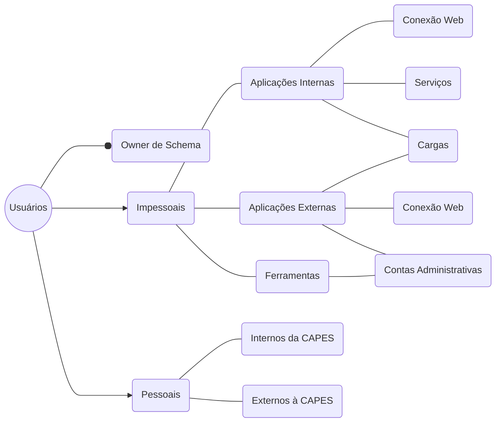

**Índice**

# Padrão de Nomenclatura e Acessos nos Banco de Dados
Este documento define um padrão de nomenclatura na criação de usuários de banco de dados a partir do levantamento das ocorrências dos 5 bancos: Oracle, Postgres, Sybase, Sqlserver e Mysql, em todos os ambientes e propor uma adequação dos nomes dos recursos (resources) do cofre de senhas às normas determinadas pela CGII.

# Tipos de Usuários
No geral, os grupos de usuários (contas) são classificados em:

Com base nessa estrutura, duas regras básicas devem ser seguidas:
1.	A criação de usuários dos bancos – Oracle, Postgres, Sybase, Sqlserver e Mysql deve estar devidamente registrada na ferramenta de chamados (CATI);

1.	A criação de contas ditas “**Usuários Internos**” e “**Usuários Externos**”, nos ambientes de **PRODUÇÃO** e **DATAGUARD**, devem ser devidamente autorizadas pelo Coordenador-Geral de Sistemas (CGS) no BD transacional e pelo Responsável pelo Núcleo de Disseminação da Informação (NDI) no BD dimensional.

 

# Nomemclatura
## Usuário de esquema (*Schema*)
Tem a ver com o negócio ao qual se destina o schema. Há a recomendação expressa para que esteja no singular, atendendo uma das regras gerais para nomenclatura de objetos da Administração de Dados da DTI.  
> **Exemplos**: AGENDAMENTO_LOG, AJUSTE_IES, ASSINADOR, premiocapes, projeto_fomento.

  

## Usuário de aplicação da CAPES (Impessoais)
* **CONEXÃO WEB** - Iniciado pelos seguintes prefixos `web_`, `web`, `usr`, `usr_ + <Nome_da_aplicacao> + <Nome da funcionalidade>`. Onde o prefixo e o nome da aplicação têm sido obrigatórios.  
> **Exemplos**: webajuste_ies, webfreire_parametro_edital, usr_biblivre.

  

* **CARGA** - Iniciado pelos seguintes prefixos `carga_` ou `carga + <Nome_da_aplicacao> + <Nome da funcionalidade>`. Onde o prefixo tem sido obrigatório.  
> **Exemplos**: carga_concessao_bolsa, carga_ies, carga_dm_base_integradora, carga_painel_linha_direta.

  

* **SERVIÇOS E MICRO SERVIÇOS** - Iniciado pelos seguintes prefixos `srv_` ou `srv + <Nome_da_aplicacao> + <Nome da funcionalidade>`. Onde o prefixo e o nome da aplicação ou funcionalidade têm sido utilizados. 
> **Exemplos**: srv_arquitetura, srv_corporativo, srv_scba_configs, svc_mcafee_csr,  svc_portalestrategia.

  

## Usuário de aplicações externas (Impessoais)
* **CONEXÃO WEB** - Segue os padrões das aplicações internas da CAPES com exceções.
* **CARGA** - Segue os padrões das aplicações internas da CAPES com exceções.
* **ADMINISTRATIVOS** - Sem padrão, segue-se a sugestão da aplicação.

  

## Ferramentas (Impessoais)
Usuários criados pelas próprias ferramentas no processo de instalação.

  

## Usuário Interno (Pessoais)
Há uma recomendação para que os usuários internos (servidores, terceirizados) sejam os mesmos logins de rede. 
> **Exemplos**: ADRIANAN, AGMONS, AIDAR, ALANAA, ALANP, ALBERTINOO, ALBERTON.

## Usuário externo (Pessoais)
Iniciado pelo prefixo `E + <CPF_do_usuario_externo>`. Onde ambos são obrigatórios.
> **Exemplos**: E05456900483, E05707198440, E06467242408, E07208730458, E08593258492.

  

## Padronização
### Adoção dos seguintes prefixos para criação das contas

| **Tipo de Conta** | **Padrão** |
| ------------------ | ---------- |
| Esquema (schema)   			                 | sem prefixo definido |
| Aplicação da Capes – conexão web  		     | WEB_Nome_do_Projeto |
| Aplicação da Capes                             | USR_Nome_do_Projeto |
| Aplicação da Capes – cargas 		             | CRG_Nome_do_Projeto |
| Aplicação da Capes – serviços e micro serviços | SRV_Nome_do_Projeto |
| Aplicação Externas – conexão web               | WEB_ |
| Aplicação Externas                    	     | USR_ |
| Aplicação Externas – cargas                    | CRG_ |
| Aplicação Externas – contas administrativas    | sem prefixo definido |
| Ferramentas		                             | sem prefixo definido |
| Usuários internos	                             | sem prefixo definido |
| Usuários externos                              | E |

:bluenote: 
* O Nome do Projeto empregado na denominação dos usuários (WEB_, CRG_, SRV_, USR_) deve ser idêntico ao definido pela equipe de sistemas no GIT ou outra ferramenta que venha substituí-lo.
* A senha deve estar aderente às normas definidas pela Área de Segurança da DTI  , sendo exigido, atualmente, letras maiúsculas, letras minúsculas, números e pelo menos 2 caracteres especiais.
* O usuário de esquema deverá ser criado bloqueado, os acessos aos objetos deste esquema, sempre, se darão pelos usuários pessoais e/ou impessoais que possuírem os privilégios necessários.
* Caso a aplicação necessite de mais de 1 usuário de aplicação, carga ou serviço, evitar colocar sequencias no nome (..._1, ..._2). Complemente o nome com a funcionalidade da aplicação que demanda este novo usuário (ex.: SRV_CSAB_AUXPE, SRV_CSAB_PAGAMENTO, SRV_CSAB_DOCUMENTO).
* Usuários de conexão e carga de aplicações externas devem manter o mesmo padrão de nomenclatura utilizado para as aplicações da Capes. Para as contas administrativas que por acaso necessite criar, não temos um prefixo definido.
* Para esquemas de Ferramentas, evitar repassar a senha do owner, sempre que possível criar um usuário de conexão com os privilégios necessários para acesso aos seus objetos. Hoje temos as seguintes exceções em que a ferramenta precisa utilizar o próprio owner: MicroStrategy e PowerCenter.
* Para usuários pessoais internos e externos que precisarem de acesso a qualquer banco de produção ou o espelho da produção, sempre deverá ser precedido da autorização do Coordenador.

###	Renomear os ACCOUNTS que estejam fora do padrão, aplicando-se as seguintes regras:

* a.	Renomear, nos bancos e no cofre, os usuários de aplicações da CAPES, substituindo-se o prefixo WEB, USR e USR_ pelo prefixo WEB_
* b.	Renomear, nos bancos e no cofre, os usuários de carga, substituindo-se o prefixo CARGA_ e CARGA por CRG_
* c.	Renomear, nos bancos e no cofre, os usuários de serviços e micro serviços srv pelo prefixo srv_

# Utilização do Cofre de Senhas
REVER (Mover para Orientações do Cofre de Senhas)