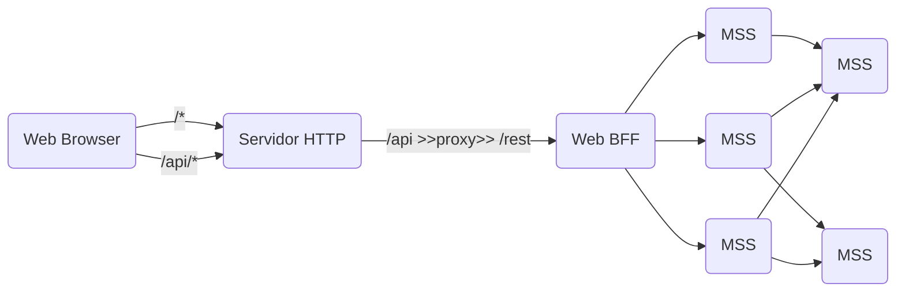
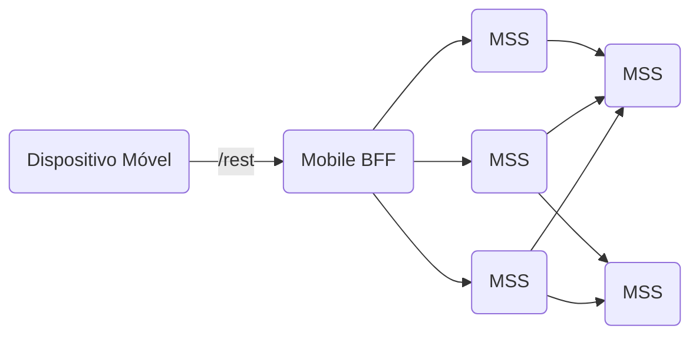

# Visão Geral

A CGS espera que as aplicações sejam desenvolvidas de acordo com a Arquitetura de Referência da CAPES[^arq-referencia-intranet]. Em linhas gerais essa Arquitetura de Referência determina que as aplicações sejam segmentadas em duas camadas: _Frontend_ e _Backend_. A camada de _Frontend_ ou é uma aplicação Web (HTML/CSS/JavaScript), ou um aplicativo para dispositvos móveis (Android aplicativo ou iOS). A camada de _Backend_ deve ser composta por BFFs[^bff] e Microsserviços (MSS) que expõem uma API Web em REST[^rest]. A abordagem REST é agnóstica a linguagem de programação e plataforma, o que permite que as aplicações sejam formadas de serviços em diferentes tecnologias.

As aplicações (**frontends** Web, ou **backends**) devem ser desenvolvidas observando a abordagens como _Cloud Native_[^cloud-native] e _The Twelve-Factor APP_[^ref-12-factors]. Tais aplicações executarão em _Containers_[^ref-container] implantados num cluster Kubernetes (K8s)[^ref-K8s-guia] como solução de orquestração e utilizando "Infraestrutura como Código"[^infra-as-code]. A CAPES adotou o Openshift, solução da Red Hat, como implementação do Kubernetes tendo no momento 02 cluster: um OKD (openshift.capes.gov.br) e um OCP (ocp.capes.gov.br).

As aplicações devem ser desenvolvidas seguindo as práticas de DevOps. A DTI adotou o GitLab (em https://git.capes.gov.br) como plataforma de DevOps, tanto como reposítorio das bases de código, como para definir os Pipeline[^ref-pipeline] de implantação das aplicações.

A Arquitetura de Referência tem especializações para cada pilha tecnologica adotada (Java, PHP), baseada em arquétipos que definem módulos que selecionam frameworks, bibliotecas e configurações para cada plataforma.

Aplicações da CGS devem seguir um Pipeline padrão ([Gitlab Pipeline](https://git.capes.gov.br/cgs/DEVOPS/automations/gitlab-pipeline)). Esse pipeline faz uso de Helm Charts para gerenciar a orquestração das aplicações, sendo o [chart-capes-aplic](https://git.capes.gov.br/cgs/DEVOPS/helm/chart-capes-aplic) provavelmente o mais importante. Cada _stage_ (`des`, `test` ou `hom` para **DHT**, ou `prod` para **Produção**), tem seu respectivo `Namespace` no cluster Openshift.

Os reposítorios de aplicações tem uma estrutura padrão, que prevê **até** 2 camadas (_frontend_ e _backend_). Em geral a GUI (Angular para Web) vai ficar no _frontend_ e o BFF no backend; cada MSS deveria ficar num reposítorio separado que contém apenas a camada de _backend_.

**Arquitetura para Aplciações Web**

**Arquitetura para Aplicações Móveis**

---

# Tópicos Importantes

- GitLab/Repositório
  - Estrutura
    - Pastas (camadas, pasta devops, pasta system)
    - Branches & Tags
      - master
      - develop
      - feature/*
  - Pipeline
- Helm Charts
  - `capes-aplic`
    - Conceitos
      - Montagem nos pods
    - Objetos??
      - Deployment
        - start pods
      - Services
      - Routes
      - HPA
      - Probes (liveness & readness)
      - Storage
        - PV
        - PVC
  - `cofresenha`
  - `cronjob`
- Stages
  - _Stages são as implatanções da aplicação_
    - Estáticas
      - `prod`
      - DHT
        - `des`
        - `hom`
    - Efêmeras
      - `feature-*`

# Notas e Referências

[^arq-referencia-intranet]: Arquitetura de Referência - https://intranet.capes.gov.br/diretoria-de-tecnologia-da-informacao-dti/mais/procedimentos-e-normas/item/download/174_3004d8de7d62295b09dc06c4080d9188
[^bff]: Pattern: Backends For Frontends - https://samnewman.io/patterns/architectural/bff/
[^rest]: Definições para construção de API REST - https://git.capes.gov.br/dti/orientacoes-gerais/guia/blob/master/arquitetura/rest-apis.md
[^ref-K8s-guia]: Kubernetes - https://git.capes.gov.br/dti/orientacoes-gerais/guia/blob/master/devops/primeiros-passos/materiais.md#kubernetes
[^infra-as-code]: What is Infrastructure as Code (IaC)? - https://www.redhat.com/en/topics/automation/what-is-infrastructure-as-code-iac
[^cloud-native]: CNCF Cloud Native Definition -- https://github.com/cncf/toc/blob/main/DEFINITION.md
[^ref-container]: Docker e _Container_ - https://git.capes.gov.br/dti/orientacoes-gerais/guia/blob/master/devops/primeiros-passos/materiais.md#docker-e-container
[^ref-pipeline]: Pipeline - https://git.capes.gov.br/dti/orientacoes-gerais/guia/blob/master/devops/orientacoes-tecnicas/ci-cd.md#pipeline
[^ref-12-factors]: The twelve-factor app - https://git.capes.gov.br/dti/orientacoes-gerais/guia/blob/master/devops/primeiros-passos/12factor.md
