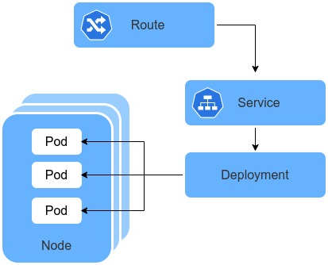
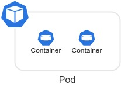
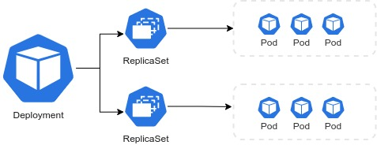
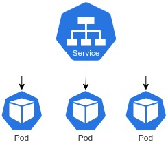
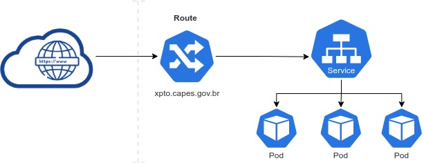
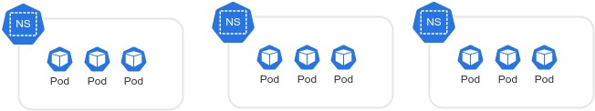

# Openshift 

## Principais Componentes

Dentre os diversos componentes do Openshift/Kubernetes, os principais utilizados na Capes são:

### Pods

Os Pods são as menores unidades computacionais de implantação ​​que você pode ser criado e gerenciado no Openshift.

Um Pod é um grupo de um ou mais contêineres, com armazenamento compartilhado e recursos de rede e uma especificação de como executar os contêineres.

[Documentação Oficial](https://kubernetes.io/docs/concepts/workloads/pods/)

### Deployments

Um Deployment descreve um estado desejável de um Pod, ou seja, a quantidade de réplicas, as configurações de atualizações.

[Documentação Oficial](https://kubernetes.io/docs/concepts/workloads/controllers/deployment/)

### Service

Um service é uma maneira abstrata de expor as aplicações em execução. Tendo um conjunto de pods, um service define a lógica e as políticas de como acessá-los.

[Documentação Oficial](https://kubernetes.io/docs/concepts/services-networking/service/)

### Route

Um componente exclusivo do Openshift, um route é a abstração responsável por gerenciar o acesso externo aos serviços em um cluster openshift, normalmente HTTP.

[Documentação Oficial](https://docs.openshift.com/container-platform/4.6/networking/routes/route-configuration.html)

### Namespaces

No Kubernetes/Openshift, namespaces disponibilizam um mecanismo para isolar grupos de recursos dentro de um cluster. Os namespaces são utilizados para separar os objetos de uma mesma aplicação ou projeto.

[Documentação Oficial](https://kubernetes.io/docs/concepts/overview/working-with-objects/namespaces/)

### Projects

Um componente exclusivo do Openshift, um projeto é uma abstração que permite que uma time organize e gerencie seu conteúdo isoladamente de outras times.

[Documentação Oficial](https://docs.openshift.com/container-platform/4.6/applications/projects/working-with-projects.html)