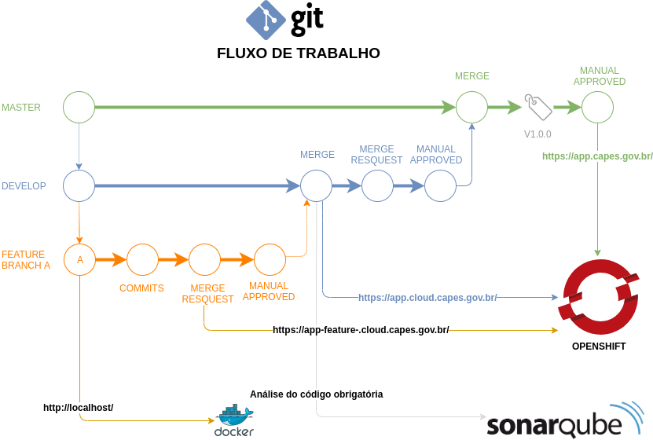

# Branchs & Tags

## Branch

Branch é a duplicação de um objeto sob controle de versão, para que modificações possam ocorrer em paralelo ao longo de várias branches. Existem duas branchs fixas no fluxo de trabalho da Capes, a `Master` e a `Develop`, e as branchs dinâmicas ou efêmeras, as branchs de `feature`.

- **Master**: A branch master é a última versão do código estável.
- **Develop**: Representa a branch mais atualizada, que contém o código que está sendo validado para ir para produção.
- **Feature**: São as branchs criadas pelo desenvolvedor que representam a construção de alguma funcionalidade. Devem seguir o padrão de nome `feature/<nome-feature>`.

## Tag

Como a a maioria das ferramentas VCSs, o Git tem a habilidade de marcar pontos específicos na história como sendo importantes, chamados de tag. No fluxo de trabalho, uma tag descreve uma versão estável da aplicação, pronta para ir a produção, representado por um número em [versionamento semântico](https://semver.org/spec/v2.0.0.html).

Versionamento semântico = MAJOR.MINOR.PATCH

- **Major**: quando fizer mudanças incompatíveis na API
- **Minor**: quando adicionar funcionalidades mantendo compatibilidade
- **Patch**: quando corrigir falhas mantendo compatibilidade.

> Exemplo: 1.0.0, 1.3.2 ou 2.0.5

## Quem faz o quê?

| |Desenvolvedor/Developer|Analista de Qualidade/Developer|Gerente/Mantainer|
|:---|:---|:---|:---|
|Cria _feature branch_| :white_check_mark: | :white_check_mark: | :eyes: |
|Escreve código| :white_check_mark: | :red_circle: | :eyes: |
|Escreve testes| :white_check_mark: | :white_check_mark: | :eyes: |
|Realiza testes| :white_check_mark: | :white_check_mark: | :eyes: |
|Realiza _commits_| :white_check_mark: | :white_check_mark: | :eyes: |
|Abre Merge Request _feature/develop_| :white_check_mark: | :eyes: | :eyes: |
|Realiza Revisão de código| :white_check_mark: | :white_check_mark: | :eyes: |
|Aprova Merge Request| :eyes: | :eyes: | :white_check_mark: |
|Abre Merge Request _develop/master_| :red_circle: | :red_circle: | :white_check_mark: |
|Criar _Tags_| :red_circle: | :red_circle: | :white_check_mark: |
|Deploy em Produção| :red_circle: | :red_circle: | :white_check_mark: |
|Acompanha os Logs| :white_check_mark: | :white_check_mark: | :eyes: |