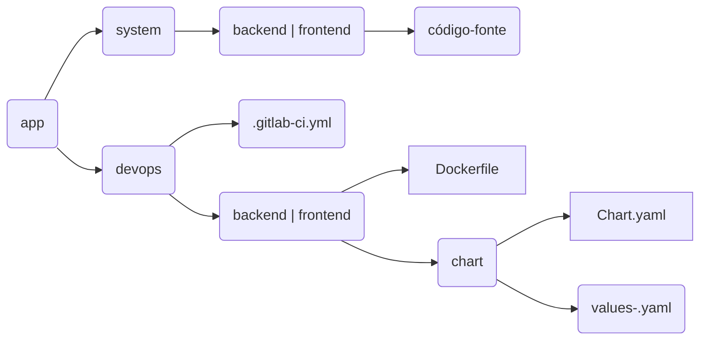

# Estrutura de Pastas

Organização de diretórios e principais arquivos.



Exemplo de estrutura de pastas de uma aplicação `xpto-api`.

```
└── xpto-api/
    └── devops/
        ├── .gitlab-ci.yml
        └── backend/
            ├── Dockerfile
            └── xpto-api/
                ├── Chart.yaml
                ├── values-des.yaml
                ├── values-prod.yaml
        └── frontend
            ├── Dockerfile
            └── xpto-api/
                ├── Chart.yaml
                ├── values.yam
                ├── values-prod.yaml
    └── system/
        └── backend/
            ├── composer.json
            ├── index.php
        └── frontend/
            ├── index.html
            └── css/
            └── js/
```


## Pasta `devops`

A pasta `devops` é responsável por contém as configurações de pipeline, a instrução de build da aplicação (Dockerfile) e todos os arquivos que contém as configurações de release e deploy.

