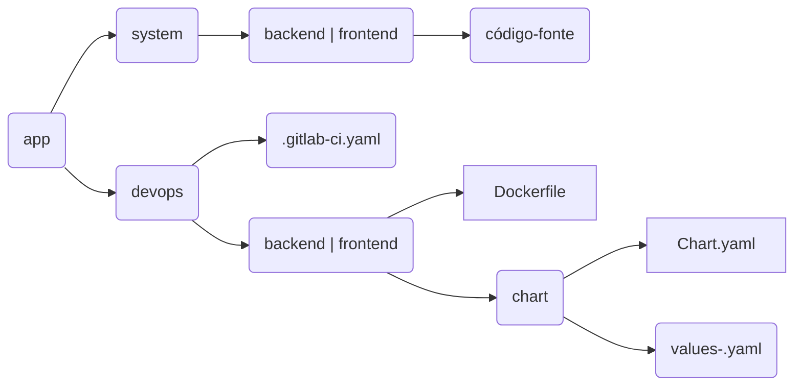

# Estrutura de Pastas

Organização de diretórios e principais arquivos.



Por padrão, todos os projetos de aplicação devem seguir a estrutura acima, com duas pastas principais, `system/` e `devops/`, sendo cada pasta com objetivos específicos, descritos logo abaixo. Por sua vez, cada pasta é separada por mais duas pastas, as camadas de aplicação, sendo estas a camada  `frontend/` e `backend/`. Como o próprio nome diz, o `frontend` se refere a camada de front, de interface com o usuário e o `backend` a camada de servidor, podendo ser uma camada de api ou um bff.

Não é obrigatório existirem sempre as duas pastas das camadas, se uma aplicação é somente frontend, ela terá somente esta a pasta `frontend/` e vice-versa.

Exemplo de estrutura de pastas de uma aplicação `xpto-api`.

```
└── xpto-api/
    └── devops/
        ├── .gitlab-ci.yaml
        └── backend/
            ├── Dockerfile
            └── xpto-api/
                ├── Chart.yaml
                ├── values-des.yaml
                ├── values-prod.yaml
        └── frontend
            ├── Dockerfile
            └── xpto-api/
                ├── Chart.yaml
                ├── values.yam
                ├── values-prod.yaml
    └── system/
        └── backend/
            ├── composer.json
            ├── index.php
        └── frontend/
            ├── index.html
            └── css/
            └── js/
```


## Pasta `devops`

A pasta `devops` é responsável por conter as configurações de pipeline, a instrução de build da aplicação (Dockerfile) e todos os arquivos que contém as configurações de release e deploy da aplicação, os charts das camadas de `backend` e `frontend`.

O arquivo `devops/.gitlab-ci.yaml` é o arquivo de manifesto da pipeline da aplicação. O fluxo de pipeline é padrão para qualquer tipo de aplicação e esse arquivo não deve ser mexido ou alterado.


## Pasta `system`

@todo