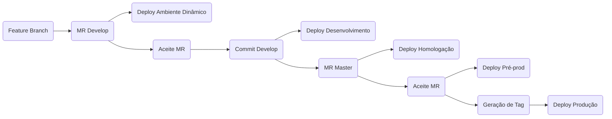

# Pipeline

A pipeline e seus componentes, Jobs e Stages, são definidos no arquivo `.gitlab-ci.yml`.


Na estrutura da Capes, o `.gitlab-ci.yml` deverá estar localizado no diretório `devops/`. Por padrão esse é um arquivo bloqueado e as informações contidas nele são as mesmas para todos os projetos.


`devops/.gitlab-ci.yml`

```
# Inclui os jobs
include:
  - project: 'cgs/DEVOPS/automations/gitlab-pipeline'
    file: '.gitlab-ci.yaml'
    ref: ocp
  - project: 'cgs/DEVOPS/automations/gitlab-pipeline'
    file: 'build.gitlab-ci.yaml'
    ref: ocp
  - project: 'cgs/DEVOPS/automations/gitlab-pipeline'
    file: 'deploy.gitlab-ci.yaml'
    ref: ocp
  - project: 'cgs/DEVOPS/automations/gitlab-pipeline'
    file: 'review.gitlab-ci.yaml'
    ref: ocp
  - project: 'cgs/DEVOPS/automations/gitlab-pipeline'
    file: 'tag.gitlab-ci.yaml'
    ref: ocp
```

### Eventos

