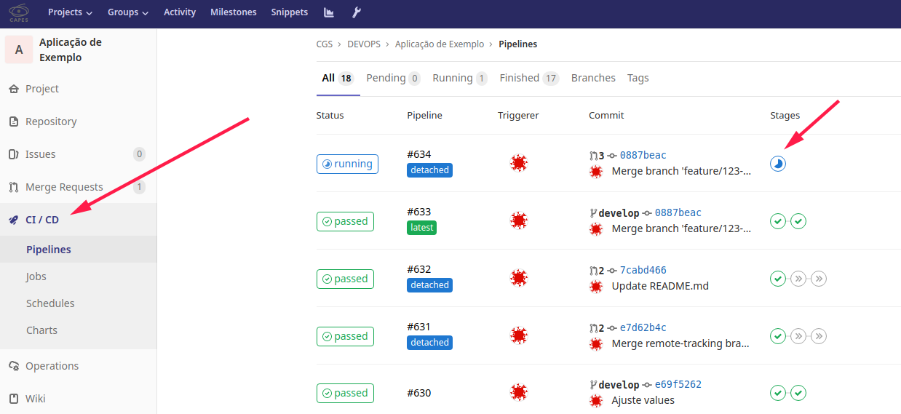

# Pipeline

A pipeline e seus componentes, Jobs e Stages, são definidos no arquivo `.gitlab-ci.yml`.


Na estrutura da Capes, o `.gitlab-ci.yml` deverá estar localizado no diretório `devops/`. Por padrão esse é um arquivo bloqueado e as informações contidas nele são as mesmas para todos os projetos.


`devops/.gitlab-ci.yml`

```
# Inclui os jobs
include:
  - project: 'cgs/DEVOPS/automations/gitlab-pipeline'
    file: '.gitlab-ci.yaml'
    ref: ocp
  - project: 'cgs/DEVOPS/automations/gitlab-pipeline'
    file: 'build.gitlab-ci.yaml'
    ref: ocp
  - project: 'cgs/DEVOPS/automations/gitlab-pipeline'
    file: 'deploy.gitlab-ci.yaml'
    ref: ocp
  - project: 'cgs/DEVOPS/automations/gitlab-pipeline'
    file: 'review.gitlab-ci.yaml'
    ref: ocp
  - project: 'cgs/DEVOPS/automations/gitlab-pipeline'
    file: 'tag.gitlab-ci.yaml'
    ref: ocp
```

### Fluxo de Eventos


#### Feature Branch
- `Commits` nessa `branch` **NÃO** acarretam nenhum evento de pipeline.
- Solicitação de `MERGE REQUEST` para a branch ```develop``` executará a criação de ambiente dinâmico.

#### Develop
- A aceitação de ```MERGE REQUEST``` ou a execução de algum `commit` na branch ```develop```, executará a pipeline para `deploy` no ambiente de `teste` e `desevolvimento`

#### Master
- Solicitação de ```MERGE REQUEST``` ao ```master``` servirá de gatilho para pipeline.
- A aceitação de ```MERGE REQUEST``` ao ```master```, servirá de gatilho para pipeline.

#### Tag
- A criação de tag servirá de gatilho para pipeline que atualizará o produção.


### Acompanhar Pipelines

As pipelines de um projeto git podem ser acompanhadas pelo menu `CI/CD >> Pipelines`

