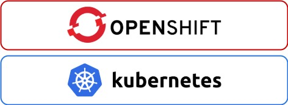
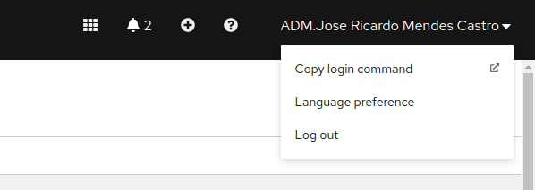
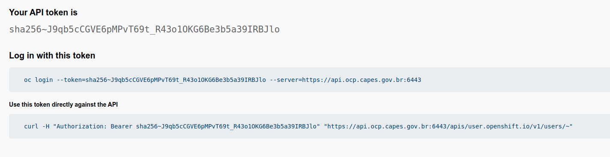
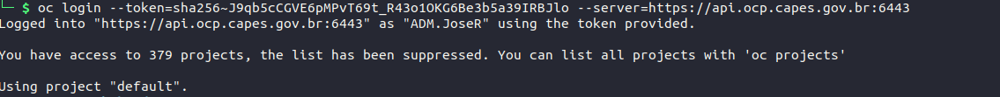

# Openshift

## O que é Openshift?

O Red Hat® OpenShift® é uma plataforma Kubernetes para gerenciamento de containers. Ele é uma distribuição suportada do Kubernetes usando CRI-O (Container Runtime) e ferramentas DevOps para desenvolvimento acelerado de aplicações.

## Openshift na Capes

Na Capes, utiliza-se a versão Red Hat® OpenShift® OCP 4.7.42, com acesso a console no link [https://console-openshift-console.apps.ocp.capes.gov.br/](https://console-openshift-console.apps.ocp.capes.gov.br/).

É possível, e recomendável, o acesso ao Openshift via linha de comando, através do CLI `oc` (padrão Openshift) ou do `kubectl` (command line padrão do kubernetes).

- [Instalação Openshift CLI](https://docs.openshift.com/container-platform/4.7/cli_reference/openshift_cli/getting-started-cli.html#cli-about-cli_cli-developer-commands)
- [Instalação kubectl](https://kubernetes.io/docs/tasks/tools/#kubectl)
- [Comandos kubectl](https://kubernetes.io/docs/reference/kubectl/)

### Logando via CLI

Acessar a [console do OCP](https://console-openshift-console.apps.ocp.capes.gov.br/);

No canto superior direito, copiar o comando de login;

Logar novamente em clicar em `Display Token` para copiar o comando de login e ter acesso ao clustes Openshift via linha de comando.

Tendo instalado o command line `oc`, basta copiar a linha de `Log in with this token` no terminal ou prompt de comandos. 

## Links de referência
- [Implantação de Aplicação no OpenShift](../../devops/tutoriais/implantacao.md)
- [Migração de Aplicação para o OCP](../../devops/tutoriais/migracao-app-ocp.md)
- [Alteração de Recursos](../../devops/tutoriais/alteracao-recurso.md)
- [Cursos Openshift](../../devops/primeiros-passos/materiais.md#openshift)
