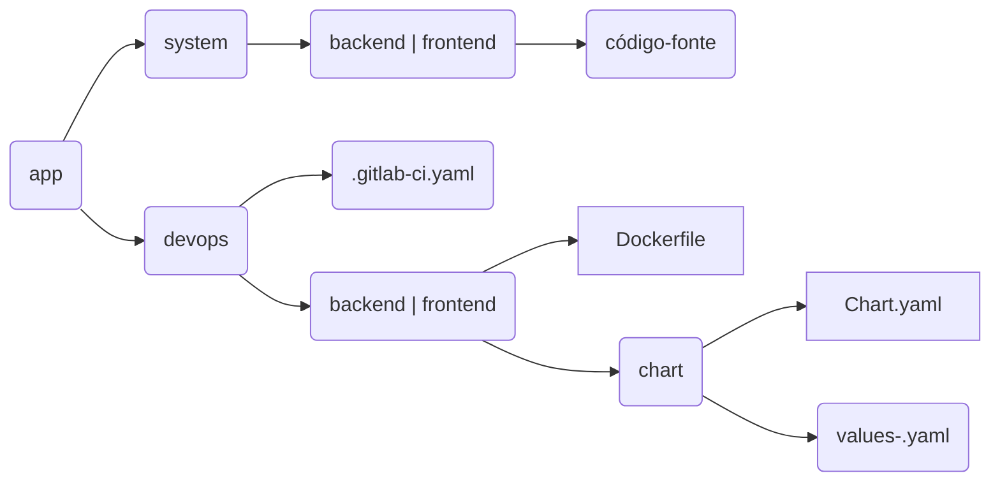

# Estrutura de Pastas

Organização de diretórios e principais arquivos.



Por padrão, todos os projetos de aplicação devem seguir a estrutura acima, com duas pastas principais, `system/` e `devops/`, sendo cada pasta com objetivos específicos, descritos logo abaixo. Por sua vez, cada pasta é separada por mais duas pastas, as camadas da aplicação, sendo estas as camadas de `frontend/` e `backend/`. Como o próprio nome diz, o `frontend` se refere a camada de front, de interface com o usuário e o `backend` a camada de servidor, podendo ser uma camada de api ou um bff.

Não é obrigatório existirem sempre as duas pastas das camadas, se uma aplicação é somente frontend, ela terá somente esta a pasta `frontend/` e vice-versa.

Exemplo de estrutura de pastas de uma aplicação `xpto`.

```
└── xpto/
    └── devops/
        ├── .gitlab-ci.yaml
        └── backend/
            ├── Dockerfile
            └── xpto/
                ├── Chart.yaml
                ├── values-des.yaml
                ├── values-prod.yaml
        └── frontend
            ├── Dockerfile
            └── xpto/
                ├── Chart.yaml
                ├── values.yam
                ├── values-prod.yaml
    └── system/
        └── backend/
            ├── composer.json
            ├── index.php
        └── frontend/
            ├── index.html
            └── css/
            └── js/
```


## Pasta `devops`

A pasta `devops` é responsável por conter as configurações de pipeline, a instrução de build da aplicação (Dockerfile) e todos os arquivos que contém as configurações de release e deploy da aplicação, os charts das camadas de `backend` e `frontend`.

O arquivo `devops/.gitlab-ci.yaml` é o arquivo de manifesto da pipeline da aplicação. O fluxo de pipeline é padrão para qualquer tipo de aplicação e esse arquivo não deve ser mexido ou alterado. Para mais informações acesso o tópico de [pipeline](./pipeline.md).

Na raiz das pastas das camas, existe o arquivo `backend|frontend/Dockerfile`. Este é o arquivo com as instruções de build das aplicações, tanto para a camada de backend, quanto para o frontend. É o documento que contém todos os comandos necessários para montar construir a imagem Docker da aplicação.

Para mais informações sobre Dockerfile:
- [Manual de referência](https://docs.docker.com/engine/reference/builder/)
- [Melhores práticas](https://docs.docker.com/develop/develop-images/dockerfile_best-practices/)


Além dos arquivos acima citados, existe, em cada camada, a pastas de configuração de release/deploy da aplicação. Esta pasta, que deve ser nomeada com o nome do projeto e contém o chart da aplicação com as configurações de release de cada ambiente. Para mais informações sobre charts, acesse a [Visão Geral sobre charts](../helm-charts/visao-geral.md).

## Pasta `system`

Também separada em camadas por pastas (`backend/` e `frontend/`). Esta é a pasta que contém o código-fonte da aplicação.

As pastas devem seguir a estrutura recomendada pela ferramenta de gerenciamento de pacotes e construção da respectiva linguagem/pilha definida pela CGG/CAPES:

Linguagem | Pilha Capes | Gerenciador de Pacote
--------- | ------ | ---------------------
Angular   |        | [Yarn](https://yarnpkg.com/)
Java      |        | [Maven](https://maven.apache.org/)
PHP       | [Laravel](https://git.capes.gov.br/cgs/narq/frameworks/php/capes-arquitetura-laravel) | [Composer](https://getcomposer.org/)
Python    |        | [Pip](https://pypi.org/project/pip/)