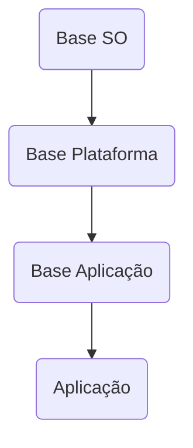
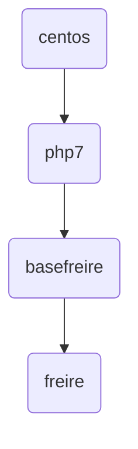

## Introdução

Docker é um software contêiner da empresa Docker, Inc, que fornece uma
camada de abstração e automação para virtualização de sistema
operacional no Windows e no Linux, usando isolamento de recurso do
núcleo do Linux como cgroups e espaços de nomes do núcleo, e um sistema
de arquivos com recursos de união, como OverlayFS criando contêineres
independentes para executar dentro de uma única instância do sistema
operacional, evitando a sobrecarga de manter máquinas virtuais (VM).

O suporte para espaços de nomes do núcleo do Linux na maioria das
vezes isola uma visão da aplicação do ambiente operacional, incluindo
árvores de processo, rede, IDs de usuário e sistemas de arquivos
montados, uma vez que os cgroups do núcleo fornecem limitação de
recursos, incluindo a UCP, memória, bloco de E/S e rede. Desde a versão
0.9, o Docker inclui a biblioteca libcontainer como seu próprio
mecanismo de usar diretamente os recursos de virtualização fornecidos
pelo núcleo do Linux, além de usar interfaces de virtualização abstrata
via libvirt, LXC (Linux Containers) e systemd-nspawn.

## Instalação

> Vide: [Instalação do Docker](https://docs.docker.com/install/)

## Política de Uso

### Regras e Normas

#### Nome da Imagem

Formação:​ `<registry>/<nome do projeto>/nome da imagem:<tag>​`

1. Registry​: `registry.capes.gov.br​`
1. Nome do projeto​: sicapes, sap, freire, scba, sisuab​
1. Nome da imagem​: php-fpm-7.3-alpine, jboss-5.2.0-java-6, nginx-1.14-alpine​
1. Tag​: 1.0.0, 1.2.3, 2.5.0​

Exemplo​: `registry.capes.gov.br/freire/php-fpm-7.3-alpine:1.01​`

#### Builder no cluster

O kaniko é uma ferramenta para criar imagens de contêiner a partir de um
Dockerfile, dentro de um contêiner ou cluster do Kubernetes.​

O Kaniko será utilizado no pipeline​

## Build de Imagens Docker

### Hierarquia

A instrução FROM inicializa um novo estágio de construção e define a
imagem base para instruções subsequentes.​

Deverá sempre indicar o repositório privado da CAPES iniciado por
`registry.capes.gov.br​`

Caso não existe imagem base, a mesma deverá ser criada​.

Mesmo Dockerfile poderá haver mais de uma instrução FROM (multi-stage builds)​



Exemplo



### Catálogo de imagens

> Vide: [Catálogo de imagens](devops/catalogo-imagens/catalogo-imagens.md)

### Camadas

Cada instrução como, `FROM`, `RUN`, `CMD`, `EXPOSE`, `ENV`, etc..., gera
uma camada de armazenamento na Imagem​

A instrução seguinte não pode afetar a camada anterior, ou seja, nada
pode ser removido ou alterado​

O comando `docker history <imagem>` mostra as camadas de uma imagem
junto com o seu id e tamanho​

### Processos

Uma imagem docker é a base de construção de containers, ou seja, a
partir de uma imagem podemos rodar vários containers​

Um container deverá ter uma única responsabilidade, ou seja, deve rodar
apenas um processo​

Não haverá processo em background​

### Composição

Nossas imagens de aplicação deverão ter tudo que é necessário para a
aplicação rodar​

Deverá ter o runtime (php-fpm, python, node, jdk)​

Código fonte da aplicação(linguagens interpretadas)​

Binários(linguagens compiladas)​

Exposição de uma porta​

Bibliotecas e/ou libs​


### Contrução vs Execução​

Neste tópico abortaremos sobre a diferença entre imagens de construção
(Build) e imagens de Execução(Runtime)

#### Construção​

Imagens de construção são feitas para converter código do repositório em
pacote executável. Nesse processo se obtém as dependências, compila-se o
binário e os ativos do código

Exemplos de Imagens de contrução:
- maven
- yarn
- composer
- pip
- kaniko

#### Execução​
Imagens de execução inicia a execução do lançamento (aplicação +
configuração daquele ambiente), com base nas configurações específicas
do ambiente requerido.

Exemplos de Imagens de imagens de execução
- php-fpm
- jboss
- jdk
- node
- python


### Usuário de Execução

> :warning: Atenção
> 
> O container não deverá ser executado como root​

O Openshift por padrão não permite que containers sejam executados com
usuários privilegiados​, ele executa contêineres usando um ID do usuário
designado arbitrariamente. Isso fornece segurança adicional contra
processos que escapam do contêiner devido a uma vulnerabilidade do
mecanismo de contêiner e, assim, obtêm permissões escaladas no nó host.

Para que uma imagem suporte a execução como um usuário arbitrário, os
diretórios e arquivos que podem ser gravados por processos na imagem
devem pertencer ao grupo raiz e ser lidos / graváveis ​​por esse grupo.
Os arquivos a serem executados também devem ter permissões de execução
de grupo.

Adicionar o seguinte ao Dockerfile define as permissões de diretório e
arquivo para permitir que os usuários do grupo raiz os acessem na imagem
criada:

```dockerfile
RUN chgrp -R 0 /diretorio && \
    chmod -R g=u /diretorio
```

### Boas práticas​

- Use o .dockerignore​
- Não instale pacotes desnecessários​
- Construa o minimo de camadas possíveis​
- Use tags​
- Limpe o cache na mesma camada​
- Ordene as camadas de forma que o que é mais alterado fique por último​
- Crie contêineres efêmeros​
- Utilize multi-stage builds​
- Separe argumentos em várias linhas​

### Instruções

- `LABEL`: Pode ser usado para adicionar metadados à imagem (autor, versão, descrição).​
- `FROM`: Especifica qual imagem será usada como base.​
- `RUN`: Executa comandos dentro da imagem.​
- `ADD`/COPY: Adiciona arquivos/diretórios dentro da imagem.​
- `EXPOSE`: Especifica quais serviços de rede serão expostos.​
- `USER`: Determina qual o usuário será usado para execução dos comandos.​
- `CMD`: Especifica qual o comando que será executado por padrão na nova imagem.​

### Como criar imagem?

Todo container é iniciado a partir de uma imagem, dessa
forma podemos concluir que nunca teremos uma imagem em
execução.

Um container só pode ser iniciado a partir de uma única imagem. Caso
deseje um comportamento diferente, será necessário customizar a imagem.

Há várias formas de se criar uma imagem, neste documento iremos mostrar
sempre a criação a partir de um Dockerfile.

Quando se utiliza Dockerfile para gerar uma imagem, basicamente, é
apresentada uma lista de instruções que serão aplicadas em determinada
imagem para que outra imagem seja gerada com base nas modificações.

Podemos resumir que o arquivo Dockerfile, na verdade, representa a exata
diferença entre uma determinada imagem, que aqui chamamos de base, e a
imagem que se deseja criar. Nesse modelo temos total rastreabilidade
sobre o que será modificado na nova imagem


#### Configurando o Proxy
Configure o proxy da CAPES no seguinte arquivo: `~/.docker/config.json​`

```json
{​
  "proxies":​{​
     "default":​ {​
       "httpProxy": "http://127.0.0.1:3001",​
       "httpsProxy": "http://127.0.0.1:3001",​
       "noProxy": "*.test.example.com,.example2.com"​
     }​
  }​
}​
```

#### Verificando a versão do Docker

Para verificar a versão do docker basta executar o seguinte comando:​
`docker version​`

A versão utilizada deverá ser >= 19.*​

#### Criando uma imagem

##### Criando uma aplicação de exemplo

Crie o arquivo ./src/app.py

```python
#! /usr/bin/env python​

from flask import Flask​

app = Flask(__name__)​

@app.route('/')​

def hello_world():​
    return "Hello, world!"​

if __name__ == '__main__':​
    app.run(host='0.0.0.0', port=8080)​
```
Crie o arquivo ./src/requirements.txt

```
click==6.7​
Flask==0.12.2​
itsdangerous==0.24​
Jinja2==2.9.6​
MarkupSafe==1.0​
Werkzeug==0.12.2​
```

Crie um arquivo chamado ./Dockerfile

```DOCKERFILE
FROM fedora:27

LABEL maintainer="do-not-reply@redhat.com"
LABEL version="1.0"

RUN mkdir /var/www

ADD src/. /var/www/

RUN pip3 install -r /var/www/requirements.txt

EXPOSE 8080

CMD ["python3", "/var/www/app.py"]
```


##### Construindo a imagem​

O comando `docker build` constroi a imagem 

$ `docker build -t registry.capes.gov.br/capes-api/capes-api:1.0.0
.​`

O comando `docker run` roda o container a partir da imagem criada

$ `docker run –rm –p 8080:8080
registry.capes.gov.br/capes-api/capes-api:1.0.0​`

O Comando `docker images​` lista as imagens

$ `docker images | grep capes-api​`

##### Publicando a imagem

Para publicar a imagem deve-se fazer o acesso ao registry privado da CAPES​

O comando `docker login` faz a solicitação de acesso

$ `docker login registry.capes.gov.br​`

Informar usuário e senha​

$ Username: `<login de rede>​`

$ Password: `*******​`

O comando `docker push` envia a imagem para o registry da capes​

$ `docker push registry.capes.gov.br/capes-api/capes-api:1.0.0`


# Referências
1. [Melhores Práticas Dockerfile](https://docs.docker.com/develop/develop-images/dockerfile_best-practices/)
2. [Criando imagens Openshift](https://docs.openshift.com/container-platform/3.11/creating_images/guidelines.html)
3. [12factor](https://12factor.net/)
4. [Instalação do Docker](https://docs.docker.com/install/)