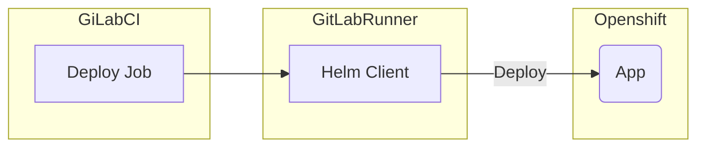
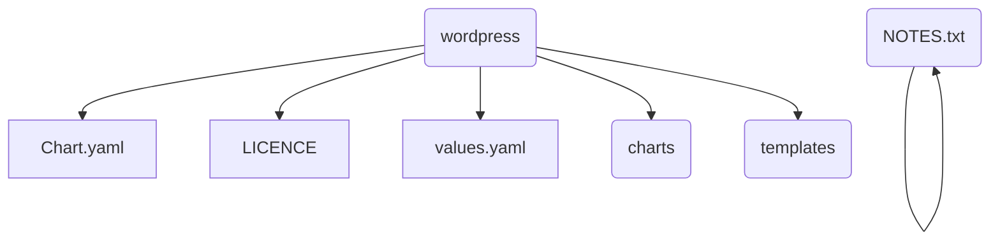
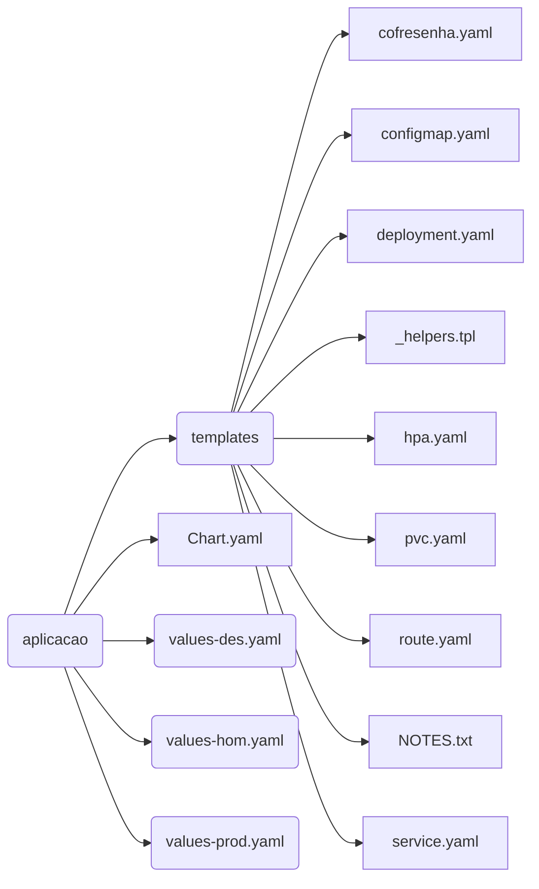

## Introdução

## O que é o Helm?
O Helm ajuda você a gerenciar aplicativos Kubernetes - o Helm Charts
ajuda a definir, instalar e atualizar até o aplicativo Kubernetes mais
complexo.

Os Charts são fáceis de criar, versionar, compartilhar e publicar.

A versão mais recente do Helm é mantida pelo CNCF - em colaboração com
Microsoft , Google , Bitnami e a comunidade de colaboradores do Helm.

> :warning: Nota: Documentação voltada para a versão 2 do Helm

### Conceitos

#### Chart
Um _Chart_ é um pacote Helm. Ele contém todas as definições de recursos
necessárias para executar uma aplicação, ferramenta ou serviço dentro de
um cluster Kubernetes. Pense nisso como o equivalente Kubernetes de uma
fórmula Homebrew, um dpkg Apt ou um arquivo Yum RPM.

#### Repositório
Um Repositório é o local onde os charts podem ser coletados e
compartilhados. É como o arquivo CPAN do Perl ou o Banco de Dados de
Pacotes do Fedora , mas para os pacotes do Kubernetes.

#### Release
Uma Release é uma instância de um _Chart_ em execução em um cluster
Kubernetes. Um _Chart_ geralmente pode ser instalado várias vezes no
mesmo cluster. E cada vez que é instalado, uma nova Release é criada.
Considere um _Chart_ do MySQL. Se você quiser dois bancos de dados em
execução no cluster, poderá instalar esse _Chart_ duas vezes. Cada um
terá sua própria release, que por sua vez terá seu próprio nome de
release.


> Agora que sabemos o que é o Helm, podemos dizer que:
> - O Helm instala charts no Kubernetes.
> - Cria uma nova versão para cada instalação.
> - Helm é usado para:
>   - Fazer _deploys_ configuráveis
>   - Instalar, Atualizar, Deletar e Gerenciar Releases das aplicações
>   - Encontrar novos charts, você pode pesquisar repositórios de charts
>     do Helm.
  
## Componentes do Helm
O Helm possui dois componentes básicos o Helm client e o Tiller Server

### Helm Client
Usado para criar, buscar, pesquisar e validar _Charts_ e instruir o
_tiller_.

O Helm Client é um cliente de linha de comando para usuários finais. O
cliente é responsável pelos seguintes domínios:

- Desenvolvimento de chart local
- Gerenciando repositórios
- Interagindo com o Tiller Server
  -   Enviando charts a serem instalados
  -   Solicitando informações sobre releases
  -   Solicitando atualização ou desinstalação de releases existentes
  
#### Instalação do Helm Client

Para instalar o Helm client siga os seguintes passos: 

1. Faça o download do binário do Helm Client em
  [https://github.com/helm/helm/releases/tag/v3.0.1](https://github.com/helm/helm/releases/tag/v3.0.1).
1. Descompacte o binário do Helm e adicione-o ao seu PATH e você estará
  pronto!


## Diagrama Técnico



## Helm Charts

### Estrutura de Arquivos

Um Chart é organizado como uma coleção de arquivos dentro de um
diretório. O nome do diretório é o nome do chart (sem informações de
versão). Assim, um chart descrevendo o WordPress seria armazenado no
diretório wordpress/.

Dentro deste diretório, o Helm espera uma estrutura que corresponda a isso:

| Arquivo/Diretório   | Descrição                                                                                                               |
|:--------------------|:------------------------------------------------------------------------------------------------------------------------|
| Chart.yaml          | Um Arquivo YAML que contém informações sobre o chart                                                                    |
| LICENSE             | OPCIONAL: Um Arquivo de texto puro que contém informaões de licença para o chart                                        |
| README.md           | OPCIONAL: Um arquivo README legível por humanos                                                                         |
| values.yaml         | Os valores de configuração padrão para este chart                                                                       |
| charts/             | Um diretório que contém quaisquer charts dos quais esse chart depende.                                                  |
| templates/          | Um diretório de templates que, quando combinados com o values.yaml, gerará arquivos de manifesto válidos do Kubernetes. |
| templates/NOTES.txt | OPCIONAL: um arquivo de texto sem formatação que contém breves notas de uso                                             |




### O Arquivo Chart.yaml

O arquivo `Chart.yaml` é necessário para um chart. Ele contém os
seguintes campos:

| Campo         | Descrição                                                                                                                                                                                           |
|:--------------|:----------------------------------------------------------------------------------------------------------------------------------------------------------------------------------------------------|
| apiVersion    | a versão da API do chart, sempre "v1" (obrigatório)                                                                                                                                                 |
| name          | o nome do chart (obrigatório)                                                                                                                                                                       |
| version       | uma versão do SemVer 2 (obrigatório)                                                                                                                                                                |
| kubeVersion   | Uma gama SemVer de versões compatíveis do Kubernetes (opcional)                                                                                                                                     |
| description   | uma descrição de frase única deste projeto (opcional)                                                                                                                                               |
| keywords      | - Uma lista de palavras-chave sobre este projeto (opcional)                                                                                                                                         |
| home          | o URL da página inicial deste projeto (opcional)                                                                                                                                                    |
| sources       | - Uma lista de URLs para o código-fonte deste projeto (opcional)                                                                                                                                    |
| maintainers   | # (opcional) - name o nome do mantenedor (necessário para cada mantenedor) email o email do mantenedor (opcional para cada mantenedor) url um URL para o mantenedor (opcional para cada mantenedor) |
| engine        | gotpl # O nome do mecanismo do modelo (opcional, o padrão é gotpl)                                                                                                                                  |
| icon          | um URL para uma imagem SVG ou PNG a ser usada como ícone (opcional).                                                                                                                                |
| appVersion    | a versão do aplicativo que contém (opcional). Isso não precisa ser o SemVer.                                                                                                                        |
| deprecated    | se este chart está descontinuado (opcional, booleano)                                                                                                                                               |
| dependencies  | Dependencias do chart                                                                               |

> **Nota**: Todo chart deve ter um número de versão. Uma versão deve seguir
> o padrão SemVer2.
 

### Dependências de Chart

No Helm, um chart pode depender de qualquer número de outros charts.
Essas dependências podem ser vinculadas dinamicamente por meio do atributo `dependencies` 
no arquivo Chart.yaml ou trazidas para o diretório charts/ e
gerenciadas manualmente.

### Templates e Values

Os templates de Helm Chart são escritos na linguagem de _Go Template_,
com a adição de mais ou menos 50 funções de template complementares da
biblioteca *Sprig* e algumas outras funções especializadas.

Todos os arquivos de templates são armazenados no diretório templates/
de um chart. Quando o Helm renderiza os charts, ele passa todos os
arquivos desse diretório pela *template engine*.

Os valores para os templates são fornecidos de duas maneiras:

Os desenvolvedores de charts podem fornecer um arquivo chamado
`values.yaml` dentro de um chart. Este arquivo pode conter valores
padrões. Os usuários do chart podem fornecer um arquivo YAML que contém
valores. Isso pode ser fornecido na linha de comando com helm install.
Quando um usuário fornece valores personalizados, esses valores
substituem os valores no `values.yaml` arquivo do chart.

#### Arquivos de Templates

Os arquivos de template seguem os padrões e convenções para escrever Go
Templates (consulte a documentação
[GO Template](https://golang.org/pkg/text/template/) para obter
detalhes)


#### Arquivos Values

Um arquivo `values` é formatado em YAML. Um chart pode incluir um
`values.yaml` arquivo padrão. O comando `Helm install` permite que um
usuário substitua valores fornecendo valores YAML adicionais:

```bash
helm install --values=myvals.yaml wordpress
```

> NOTA: O arquivo de valores padrão incluído dentro de um gráfico deve
> ser nomeado values.yaml. Mas os arquivos especificados na linha de
> comando podem ter qualquer nome.

> NOTA: Se a flag `--set` for usado em `helm install`ou `helm upgrade`,
> esses valores serão simplesmente convertidos em YAML no lado do
> cliente.

> NOTA: Se existirem entradas necessárias no arquivo de valores, elas
> podem ser declaradas conforme necessário no template do chart usando a
> função `required`


##### Escopo, Dependências, e Values

Os arquivos `values` podem declarar valores para o chart de nível
superior, bem como para qualquer um dos charts incluídos no diretório
charts/ desse chart. Ou, para dizer de outra maneira, um arquivo
`values` pode fornecer valores ao chart, bem como a qualquer uma de suas
dependências. Por exemplo, um chart de exemplo tem mysql e apache como
dependências. O arquivo `values` pode fornecer valores para todos esses
componentes:

```yaml
title: "My WordPress Site"

# Variáveis para o MySQL
mysql:
  max_connections: 100
  password: "secret"

# Variáveis para o Apache
apache:
  port: 8080
```
### Criando Charts

#### Criando o chart

Para criar um chart basta executar o seguinte comando dentro do
diretório devops/, lemrando de substituir a variável `nome-da-aplicacao`
pelo nome real da aplicação em questão:

```bash
$ helm create {{nome-da-aplicacao}}
```
O comando acima irá gerar uma estrutura de um chart padrão, portanto
precisamos deixar o nosso chart com a seguinte estrutura




#### Criando os arquivos *values*

Por padrão o comando `helm create` cria penas o arquivo `values.yaml`,
porém precisamos ter um arquivo de `values` para cada ambiente, portanto
devemos criar os arquivos `values-des.yaml`, `values-test.yaml`,
`values-preprod.yaml`, `values-hom.yaml` e `values-prod.yaml`.

#### Criando o arquivo cofresenha.yaml

Para realizar a integração entre o Openshift e o cofre de senhas, é
necessário declarar os CR's do tipo CofreSenha

`devops/chart/templates/cofresenha.yaml`

```yaml
{{- range .Values.cofresenha }}
apiVersion: capes.gov.br/v1alpha1
kind: CofreSenha
metadata:
  name: {{ .name }}
  namespace: {{ template "aplic.namespace" $ }}
  labels:
    app: {{ template "aplic.name" $ }}
    release: {{ template "aplic.releaseName" $ }}
    chart: {{ template "aplic.chart" $ }}
    heritage: {{ template "aplic.service" $ }}
spec:
  cofreSenha:
    accountName: {{ .accountName }}
    environment: {{ .ambiente }}
    sgbd: {{ .sgbd }}
  secretName: {{ .secretName }}
---
{{- end }}
```

No arquivo `values` de cada ambiente deverá conter os valores do cofre
de senha:

`devops/chart/values-prod.yaml`


```yaml
cofresenha:
- name: app-cofresenha
  secretName: database-app-secret
  accountName: WEBAPP
  ambiente: PROD
  sgbd: ORACLE
- name: app-corporativopostgres-cofresenha
  secretName: database-corporativopostgres-secret
  accountName: WEBAPP
  ambiente: PROD
  sgbd: POSTGRES

```

> :warning: **Nota** : Para que a integração funcione corretamente é
> necessário que a equipe de bando de dados crie um *resource* no cofre
> de senha específico para a aplicação. É necessáqui abrir um chamado
> CATI para tal.

#### Criando o arquivo configmap.yaml

Os ConfigMaps permitem dissociar artefatos de configuração do conteúdo
da imagem para manter os aplicativos em contêiner portáveis. Este é um
recurso que permite configurar nossa aplicação corretamente por
ambiente.

`devops/chart/templates/configmap.yaml`

```yaml
{{- if .Values.sso.enable }}
apiVersion: v1
kind: ConfigMap
metadata:
  name: {{ include "aplic.name" . }}-sso-cm
  labels:
    app: {{ include "aplic.name" . }}
    chart: {{ include "aplic.chart" . }}
    release: {{ .Release.Name }}
    heritage: {{ .Release.Service }}

data:
  sso-capes.properties: |+
    arquivoCertificadoIDP=arquivos/app/sso-capes.crt
    response_type=code
    redirect_uri=https://{{ .Values.route.hostname }}{{ .Values.route.path }}/pages/oauth.seam
    idp.oauth.url={{ .Values.sso.url }}/oauth
    url_logout={{ .Values.sso.url }}/slo?RelayState=https://{{ .Values.route.hostname }}
    excludePaths=.*\?wsdl
    client_id=app.capes.gov.br
{{- end -}}
```


`devops/chart/values-prod.yaml`

```yaml
sso:
  enable: true
  url: https://sso.capes.gov.br/sso/
```


#### Criando o arquivo deployment.yaml

Um Deployment fornece atualizações declarativas para Pods e ReplicaSets.

Você descreve um estado desejado em um Deployment e o `Deployment
Controller` altera o estado real para o estado desejado a uma taxa
controlada. Você pode definir Deployments para criar novos ReplicaSets
ou remover Deployments existentes e adotar todos os seus recursos com
novas Deployments.

`devops/chart/templates/deployment.yaml`

```yaml
apiVersion: extensions/v1beta1
kind: Deployment
metadata:
  name: {{ include "aplic.fullname" . }}
  labels:
    app: {{ include "aplic.name" . }}
    chart: {{ include "aplic.chart" . }}
    release: {{ .Release.Name }}
    heritage: {{ .Release.Service }}
spec:
  replicas: {{ .Values.deployment.replicaCount }}
  strategy:
    type: RollingUpdate
    rollingUpdate:
      maxSurge: 1        # how many pods we can add at a time
      maxUnavailable: 0  # maxUnavailable define how many pods can be unavailable during the rolling update
  selector:
    matchLabels:
      app: {{ include "aplic.name" . }}
      release: {{ .Release.Name }}
  template:
    metadata:
      annotations:
        prometheus.io/scrape: "true"
      labels:
        app: {{ include "aplic.name" . }}
        release: {{ .Release.Name }}
    spec:
{{- if .Values.deployment.serviceAccountName }}
      serviceAccountName: {{ .Values.deployment.serviceAccountName }}
{{- end }}
{{- if .Values.deployment.imagePullSecrets }}
      imagePullSecrets:
        - name: {{ .Values.deployment.imagePullSecrets }}
{{- end }}
      containers:
      - name: {{ .Chart.Name }}
        image: {{ .Values.deployment.image }}:{{ .Values.deployment.tag }}
        imagePullPolicy: {{ .Values.deployment.imagePullPolicy }}
{{- if .Values.livenessProbe.enable }}
        livenessProbe:
          tcpSocket:
            port: {{ .Values.livenessProbe.tcpSocket.port }}
          initialDelaySeconds: {{ .Values.livenessProbe.initialDelaySeconds }}
          periodSeconds: {{ .Values.livenessProbe.periodSeconds }}
{{- end }}
{{- if .Values.readinessProbe.enable }}
        readinessProbe:
          tcpSocket:
            port: {{ .Values.readinessProbe.tcpSocket.port }}
          initialDelaySeconds: {{ .Values.readinessProbe.initialDelaySeconds }}
          periodSeconds: {{ .Values.readinessProbe.periodSeconds }}
{{- end }}
{{- if .Values.deployment.resources }}
        resources:
{{ toYaml .Values.deployment.resources | indent 10 }}
{{- end }}
{{- if .Values.deployment.environments }}
        env:
          - name: APP_VERSION
            value: {{ .Values.deployment.versao | quote }}
{{ toYaml .Values.deployment.environments | indent 10 }}
{{- end }}
{{- if .Values.deployment.ports }}
        ports:
{{ toYaml .Values.deployment.ports | indent 10 }}
{{- end }}
{{- if .Values.deployment.volumeMounts }}
        volumeMounts:
{{- if .Values.sso.enable}}
          - mountPath: /opt/jboss-5.2.0-eap/arquivos/app/sso-capes.properties
            name: {{ include "aplic.name" . }}-sso-volume
            subPath: sso-capes.properties
{{- end }}
{{ toYaml .Values.deployment.volumeMounts | indent 10 }}
{{- end }}
{{- if .Values.deployment.volumes }}
      volumes:
{{- if .Values.sso.enable}}
        - name: {{ include "aplic.name" . }}-sso-volume
          configMap:
            name: {{ include "aplic.name" . }}-sso-cm
{{- end }}
{{ toYaml .Values.deployment.volumes | indent 8 }}
{{- end }}
```

`devops/chart/values-prod.yaml`

```yaml
deployment:
  replicaCount: 1
  image: registry.paas.capes.gov.br/app/app
  tag: 1
  imagePullPolicy: Always
  environments:
  - name: DB_APP_CONNECTION_URL
    value: >-
      jdbc:oracle:thin:@//rac-prod.capes.gov.br:1521/Prod
  - name: DB_APP_USERNAME
    value: "WEBAPP"
  - name: DB_APP_PASSWORD
    valueFrom:
      secretKeyRef:
        name: database-app-secret
        key: password
  - name: DB_CORPORATIVO_SERVER_NAME
    value: "postgresql.capes.gov.br"
  - name: DB_CORPORATIVO_PORT
    value: '5432'
  - name: DB_CORPORATIVO_DATABASE_NAME
    value: "producao"
  - name: DB_CORPORATIVO_USERNAME
    value: "WEBAPP"
  - name: DB_CORPORATIVO_PASSWORD
    valueFrom:
      secretKeyRef:
        name: database-corporativopostgres-secret
        key: password
  ports:
    - name: http
      containerPort: 8080
  resources:
    requests:
      memory: "3000Mi"
      cpu: "2"
    limits:
      memory: "3000Mi"
      cpu: "2"
  volumes:
    - name: arquivos-volume
      persistentVolumeClaim:
        claimName: app-prod-arquivos-pvc
    - name: logs-volume
      persistentVolumeClaim:
        claimName: app-prod-log-pvc
    - name: aplweb-volume
      persistentVolumeClaim:
        claimName: app-prod-aplweb-pvc

  volumeMounts:
    - mountPath: /opt/jboss-5.2.0-eap/arquivos/
      name: arquivos-volume
    - mountPath: /opt/jboss-5.2.0-eap/server/default/log/
      name: logs-volume
    - mountPath: /opt/jboss-5.2.0-eap/server/default/lib/
      name: aplweb-volume
      subPath: lib
    - mountPath: /opt/jboss-5.2.0-eap/server/default/deploy/properties-service.xml
      name: aplweb-volume
      subPath: properties-service.xml
    - mountPath: /opt/jboss-5.2.0-eap/server/default/deploy/messaging/
      name: aplweb-volume
      subPath: messaging
```


#### Criando o arquivo hpa.yaml

O Horizontal Pod Autoscaler escala automaticamente o número de pods em
um eplication controller, deployment ou replica set com base na
utilização observada da CPU (ou, com suporte a métricas personalizadas ,
em outras métricas fornecidas pelo aplicativo). Observe que o
Horizontal Pod Autoscaling não se aplica a objetos que
não podem ser dimensionados, por exemplo, DaemonSets.

O Horizontal Pod Autoscaler é implementado como um recurso da API do
Kubernetes e um controller. O recurso determina o comportamento do
controller. O controller ajusta periodicamente o número de réplicas em
um controller ou deployment para corresponder à
utilização média observada da CPU no destino especificado pelo usuário.

`devops/chart/templates/hpa.yaml`

```yaml
{{- if and .Values.hpa.enable -}}
apiVersion: autoscaling/v2beta1
kind: HorizontalPodAutoscaler
metadata:
  name: {{ include "aplic.fullname" . }}-hpa
  namespace: {{ .Release.Namespace }}
spec:
  maxReplicas: {{ .Values.hpa.maxReplicas }}
  minReplicas: {{ .Values.hpa.minReplicas }}
  scaleTargetRef:
    apiVersion: extensions/v1beta1
    kind: Deployment
    name: {{ include "aplic.fullname" . }}
  metrics:
    - type: Resource
      resource:
        name: memory
        targetAverageUtilization: {{ .Values.hpa.memoryTargetUtilization }}
    - type: Resource
      resource:
        name: cpu
        targetAverageUtilization: {{ .Values.hpa.cpuTargetUtilization }}
  {{- end }}
```


`devops/chart/values-prod.yaml`

```yaml
hpa:
  enable: true
  minReplicas: 2
  maxReplicas: 5
  memoryTargetUtilization: 90
  cpuTargetUtilization: 90
```

#### Criando o arquivo pvc.yaml

O gerenciamento de armazenamento é um problema distinto do gerenciamento
de instâncias de computação. O PersistentVolume subsistema fornece uma
API para usuários e administradores que abstrai detalhes de como o
armazenamento é fornecido e como é consumido. Para fazer isso,
apresentamos dois novos recursos de API: PersistentVolumee
PersistentVolumeClaim.

Um PersistentVolume(PV) é uma parte de armazenamento no cluster que foi
provisionada por um administrador ou provisionada dinamicamente usando
Storage Classes. É um recurso no cluster, assim como um nó é
um recurso de cluster. PVs são plug-ins de volume como Volumes, mas têm
um ciclo de vida independente de qualquer Pod individual que usa o PV.
Esse objeto da API captura os detalhes da implementação do
armazenamento, seja NFS, iSCSI ou um sistema de armazenamento específico
do provedor de nuvem.

Um PersistentVolumeClaim(PVC) é uma solicitação de armazenamento por um
usuário. É semelhante a um Pod. Os pods consomem recursos de nó e os
PVCs consomem recursos de PV. Os pods podem solicitar níveis específicos
de recursos (CPU e memória). As reivindicações podem solicitar tamanhos
específicos e modos de acesso (por exemplo, eles podem ser montados uma
vez que sejam de leitura / gravação ou muitas vezes somente leitura).

Embora PersistentVolumeClaims permita que um usuário consuma recursos
abstratos de armazenamento, é comum que os usuários precisem
PersistentVolumes com propriedades variadas, como desempenho, para
problemas diferentes. Os administradores de cluster precisam oferecer
uma variedade de PersistentVolumes maneiras diferentes de modos de
tamanho e acesso, sem expor os usuários aos detalhes de como esses
volumes são implementados. Para essas necessidades, existe o recurso 
StorageClass.


`devops/chart/templates/pvc.yaml`

```yaml
{{- range .Values.persistence }}
kind: PersistentVolumeClaim
apiVersion: v1
metadata:
  name: {{ .name }}-pvc
  labels:
    app: {{ template "aplic.name" $ }}
    release: {{ template "aplic.releaseName" $ }}
    chart: {{ template "aplic.chart" $ }}
    heritage: {{ template "aplic.service" $ }}
spec:
  accessModes:
  - {{ .accessMode }}
  resources:
    requests:
      storage: {{ .size }}
  volumeName: {{ .name }}-pv
  storageClassName: ''
---
{{- end }}
```


`devops/chart/values-prod.yaml`

```yaml
persistence:
- name: app-prod-arquivos
  accessMode: ReadWriteMany
  size: 1Gi
- name: app-prod-log
  accessMode: ReadWriteMany
  size: 1Gi
- name: app-prod-aplweb
  accessMode: ReadWriteMany
  size: 1Gi
```

#### Criando o arquivo route.yaml

Uma rota da OpenShift expõe um serviço em um nome de host, como
www.examplo.com , para que clientes externos possam acessá-lo por nome.

A resolução DNS para um nome de host é tratada separadamente do
roteamento. Seu administrador pode ter configurado uma Wildcard DNS que
será resolvida no nó OpenShift que está executando o roteador OpenShift.
Se você estiver usando um nome de host diferente, pode ser necessário
modificar seus registros DNS independentemente para resolver no nó que
está executando o roteador.

Cada rota consiste em um nome (limitado a 63 caracteres), um seletor de
serviço e uma configuração de segurança opcional.


Um administrador da Plataforma OpenShift pode implantar roteadores nos
nós em um cluster da Plataforma OpenShift, que permite que as
rotas criadas pelos desenvolvedores sejam usadas por clientes externos.

Um roteador usa o seletor de serviço para encontrar o serviço e os
pontos de extremidade que o apóiam. Quando o roteador e o serviço
fornecem balanceamento de carga, o OpenShift usa o
balanceamento de carga do roteador. Um roteador detecta alterações
relevantes nos endereços IP de seus serviços e adapta sua configuração
de acordo. Isso é útil para roteadores personalizados para comunicar
modificações de objetos de API a uma solução de roteamento externo.

Na Capes utilizamos três tipos de router:
- interno = Serviços de produção NÃO expostos externamente
- dht = Serviços de ambientes não produtivos
- prod = Serviços de produção expostos externamente

Eles devem ser adicionados aos labels da rota:

```yaml 
metadata:
  name: minha-rota
  labels: 
    router: dht
```

`devops/chart/templates/route.yaml`

```yaml
{{- if and .Values.route.enable -}}
apiVersion: route.openshift.io/v1
kind: Route
metadata:
  name: {{ include "aplic.fullname" . }}
  labels:
    router: {{ .Values.route.router | quote }}
spec:
  host: {{ .Values.route.hostname | quote }}
  path: {{ .Values.route.path | quote }}
  tls:
    insecureEdgeTerminationPolicy: Redirect
    termination: edge
  port:
    targetPort: {{ .Values.route.servicePort }}
  to:
    kind: Service
    name: {{ include "aplic.fullname" . }}
    weight: 100
    wildcardPolicy: None
{{- end }}

```

`devops/chart/values-prod.yaml`

```yaml
route:
  enable: true
  hostname: app.capes.gov.br
  path: /app
  servicePort: app-jboss-http
  router: prod
```

#### Criando o arquivo service.yaml

Uma maneira abstrata de expor um aplicativo em execução em um conjunto
de Pods como um serviço de rede.

Com Kubernetes você não precisa modificar seu aplicativo para usar um
mecanismo de descoberta de serviço desconhecido. O Kubernetes fornece
aos Pods seus próprios endereços IP e um único nome DNS para um conjunto
de Pods, e pode balancear a carga entre eles.


`devops/chart/templates/service.yaml`

```yaml
apiVersion: v1
kind: Service
metadata:
  name: {{ include "aplic.fullname" . }}
  labels:
    app: {{ include "aplic.name" . }}
    chart: {{ include "aplic.chart" . }}
    release: {{ .Release.Name }}
    heritage: {{ .Release.Service }}
spec:
  type: {{ .Values.service.type }}
  selector:
    app: {{ include "aplic.name" . }}
    release: {{ .Release.Name }}
{{- if .Values.service.ports }}
  ports:
{{ toYaml .Values.service.ports | indent 4 }}
{{- end -}}
```


`devops/chart/values-prod.yaml`

```yaml
service:
  type: ClusterIP
  ports:
    - name: app-jboss-http
      port: 8080
      targetPort: 8080
```

# Referências
1. [Guia de uso Git](ferramentas/git/norma-de-uso/Guia-de-uso-Git.md)
1. [Docs - CI/CD do GitLab](https://docs.gitlab.com/ee/ci/README.html)
1. [Docs - Helm](https://helm.sh/docs/)
1. [Docs - Openshift](https://docs.openshift.com/)
1. [Docs - Kubernetes](https://kubernetes.io/pt/docs/home/)
6. [Docs - GO - Template](https://golang.org/pkg/text/template/)
7. [CNCF](https://www.cncf.io/)
