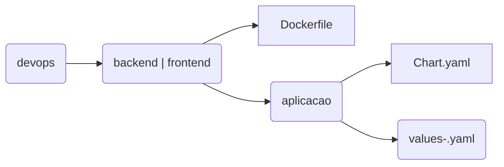

## Introdução

O Capes Aplic é o chart template padrão de aplicações em container da Capes. Funcionando como um paas, ele possui os seguintes elementos kubernetes:
- Ingress
- Routes
- Service
- Deployment 
- Config Maps
- PVC

## Organização

Organização de diretórios



## Configuração
Como o capes-aplic é um chart template, ele deve ser utilizado como dependencia nos chart dummy específicos de cada aplicação. No arquivo `devops/<backend | frontend>/Chart.yaml`, incluir o capes-aplic como dependencia da aplicação.
```yaml
dependencies:
  - name: capes-aplic
    version: "0.6.3"
    alias: app
    repository: "http://charts.capes.gov.br/capes/infra"
```
Já no arquivo `values-[ambiente].yaml` do chart da aplicação, inserir as configurações do capes-aplic, atentando-se para a indentação. As configurações do capes-aplic podem ser copiadas do `values-<ambiente>.yaml` default do chart.
```yaml
app:
    <configurações do chart do capes-aplic>
```

## Exemplo de Values

```yaml
app:

  pvc:
  - pvcname: app-backend-des-log-pvc
    accessMode: ReadWriteMany
    size: 2Gi
    volumeName: app-backend-des-log-pv

  service:
    enable: true
    type: ClusterIP
    ports:
    - name: http
      port: 3000
      targetPort: 3000
  
  deployment:
    enable: true

    # https://kubernetes.io/docs/tasks/run-application/horizontal-pod-autoscale/
    hpa:
      enable: true
      minReplicas: 2
      maxReplicas: 4
      memory:
        averageUtilization: 70
      cpu:
        averageUtilization: 70

    containers:
      image: app/app-backend
      imagePullPolicy: Always
      environments:
      - name: TZ
        value: 'America/Sao_Paulo'
      ports:
      - name: http
        containerPort: 3000
      resources:
        requests:
          cpu: 300m       # Valor em millicores/millicpu (m)
          memory: 256Mi   # Valor em megabyte (MiB)
        limits:
          cpu: 600m       # Valor em millicores/millicpu (m)
          memory: 512Mi   # Valor em megabyte (MiB)
      volumeMounts:
      - name: logs
        mountPath: /sistema/logs

    volumes:
    - name: logs
      persistentVolumeClaim:
        claimName: app-backend-des-log-pvc


  route:
  - name : app
    enable: true
    hostname: app-sample-des.dht.ocp.capes.gov.br
    servicePort: http
    path: /
    tls:
      insecureEdgeTerminationPolicy: Redirect
      termination: edge


```

## Referências
- [Aplicação de Exemplo](https://git.capes.gov.br/cgs/DEVOPS/app-sample)
- [Chart do Capes Aplic](https://git.capes.gov.br/cgs/DEVOPS/helm/chart-capes-aplic)