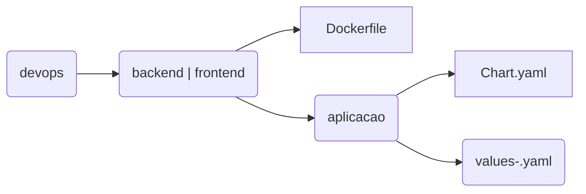

## Introdução

O Capes Aplic é o chart template padrão de aplicações em container da Capes. Funcionando como um paas, ele possui os seguintes elementos kubernetes:
- Ingress
- Routes
- Service
- Deployment 
- Config Maps
- PVC

## Organização

Organização de diretórios



## Configuração
Como o capes-aplic é um chart template, ele deve ser utilizado como dependencia nos chart dummy específicos de cada aplicação. No arquivo `devops/<backend | frontend>/Chart.yaml`, incluir o capes-aplic como dependencia da aplicação.
```yaml
dependencies:
  - name: capes-aplic
    version: "0.3.3"
    alias: app
    repository: "http://charts.paas.capes.gov.br/capes/infra"
```
Já no arquivo `values-[ambiente].yaml` do chart da aplicação, inserir as configurações do capes-aplic, atentando-se para a indentação. As configurações do capes-aplic podem ser copiadas do `values-<ambiente>.yaml` default do chart.
```yaml
app:
    <configurações do chart do capes-aplic>
```

### Service (https://kubernetes.io/docs/concepts/services-networking/service/)

A tabela abaixo lista os parâmetros de configuração do objeto Service e seus valores default.

| Parâmetro                                    | Descrição                                                                                    | Default                                              |
| -------------------------------------------- | -------------------------------------------------------------------------------------------- | ---------------------------------------------------- |
| `service.enable`                             | Habilita a criação do objeto service                                                         | `false`                                              |
| `service.type`                               | Tipo do service (ClusterIP, NodePort, LoadBalancer ou ExternalName)                          | `ClusterIP`                                          |
| `service.ports`                              | Mapeamento de portas para os pods                                                            | `[]`                                                 |


### Service Monitor (https://github.com/coreos/prometheus-operator/blob/master/Documentation/user-guides/getting-started.md)
A tabela abaixo lista os parâmetros de configuração do objeto Service Monitor e seus valores default.

| Parâmetro                                    | Descrição                                                                                    | Default                                              |
| -------------------------------------------- | -------------------------------------------------------------------------------------------- | ---------------------------------------------------- |
| `serviceMonitor.enable`                      | Habilita o objeto service monitor                                                            | `false`                                              |
| `serviceMonitor.monitorNamespace`            | Namespace de monitoração, caso o prometheus esteja fora do namespace da aplicação            | ``                                                   |
| `serviceMonitor.labels`                      | Label que faz a correspondencia entre o prometheus e o service monitor. Ex. sigla: app       | `[]`                                                 |
| `serviceMonitor.endpoints`                   | Endpoints do serviço a ser monitorado                                                        | `[]`                                                 |

### Persistente Volume (https://kubernetes.io/docs/concepts/storage/persistent-volumes/)
A tabela abaixo lista os parâmetros de configuração do objeto Persistence Volume e seus valores default.

| Parâmetro                                    | Descrição                                                                                    | Default                                              |
| -------------------------------------------- | -------------------------------------------------------------------------------------------- | ---------------------------------------------------- |
| `persistenceVolume.enable`                   | Habilita a utilização de volume para o projeto                                               | `false`                                              |
| `persistenceVolume.persistentVolumeClaim`    | Nome do objeto PVC a ser criado                                                              | ``                                                   |
| `persistenceVolume.storageClass`             | Storageclass a ser utilizado para provisionar o volume                                       | ``                                                   |
| `persistenceVolume.storageSize`              | Tamanho do volume a ser criado                                                               | `1Gi`                                                |

### Persistente Volume Claim (https://kubernetes.io/docs/concepts/storage/persistent-volumes/#claims-as-volumes)
A tabela abaixo lista os parâmetros de configuração do objeto Persistence Volume e seus valores default.

| Parâmetro                                    | Descrição                                                                                    | Default                                              |
| -------------------------------------------- | -------------------------------------------------------------------------------------------- | ---------------------------------------------------- |
| `pvc[].pvcname`       | Nome do objeto PVC a ser criado                                                                                     | ``                                                   |
| `pvc[].accessMode`    | Modo de Acesso                                                                                                      | ``                                                   |
| `pvc[].size`          | Tamanho do volume a ser criado                                                                                      | ``                                                   |
| `pvc[].volumeName`    |  Nome do PV                                                                                                         | ``                                                   |


### Ingress (https://kubernetes.io/docs/concepts/services-networking/ingress/)
A tabela abaixo lista os parâmetros de configuração do objeto Ingress e seus valores default.

| Parâmetro                                    | Descrição                                                                                    | Default                                              |
| -------------------------------------------- | -------------------------------------------------------------------------------------------- | ---------------------------------------------------- |
| `ingress.enable`                   		   | Habilita a utilização de ingress                                                             | `false`                                              |
| `ingress.hostname`    					   | DNS a ser utilizado pela aplicação                                                           | ``                                                   |
| `ingress.servicePort`                        | Porta de serviço a ser redirecionada. Deve ser a porta exposta pelo Service                  | `80`                                                 |
| `ingress.annotations`              		   | Anotações de configurações para o ingress                                                    | `kubernetes.io/ingress.class: nginx, nginx.ingress.kubernetes.io/proxy-connect-timeout: "30",  nginx.ingress.kubernetes.io/proxy-read-timeout: "1800", nginx.ingress.kubernetes.io/proxy-send-timeout: "1800"`                                                |
| `ingress.paths`                              | Mapear diferentes paths para a aplicação. Caso não informado, será criado um path único para o service                  | `[]`                                                 |
| `ingress.tls`                                | Incluir configurações para conexão segura HTTPS no ingress, informando uma secret que possuia a chave privada e o certificado                  | `[]`                                                 |


### Deployment (https://kubernetes.io/docs/concepts/workloads/controllers/deployment/)
A tabela abaixo lista os parâmetros de configuração do objeto Deployment e seus valores default.

| Parâmetro                                    | Descrição                                                                                    | Default                                              |
| -------------------------------------------- | -------------------------------------------------------------------------------------------- | ---------------------------------------------------- |
|`deployment.enable`|Habilita a utilização do deployment | ``                                                   |
|`deployment.containers`| Containers do deployment | ``                                                   |
|`deployment.containers.image`| Imagem Docker | ``                                                   |
|`deployment.containers.imagePullPolicy`| Política de pull da imagem | ``                                                   |
|`deployment.containers.environments`| Variáveis de ambiente | ``                                                   |
|`deployment.containers.ports`| portas do container | ``                                                   |
|`deployment.containers.resources`| Resources e Limits do Conteiner | ``                                                   |
|`deployment.containers.volumeMounts`| Montagem de volumes | ``                                                   |
|`deployment.volumes`| Volumes | ``                                                   |

## Exemplo de Values

```yaml
app:

  pvc:
  - pvcname: app-backend-des-log-pvc
    accessMode: ReadWriteMany
    size: 2Gi
    volumeName: app-backend-des-log-pv

  service:
    enable: true
    type: ClusterIP
    ports:
    - name: http
      port: 3000
      targetPort: 3000

  deployment:
    enable: true
    imagePullSecrets: harbor-login

    containers:
      image: app/app-backend
      imagePullPolicy: Always
      environments:
      - name: TZ
        value: 'America/Sao_Paulo'
      ports:
      - name: http
        containerPort: 3000
      resources:
        requests:
          memory: "512Mi"
          cpu: "500m"
        limits:
          memory: "512Mi"
          cpu: "500m"
      volumeMounts:
      - name: logs
        mountPath: /sistema/logs

    volumes:
    - name: logs
      persistentVolumeClaim:
        claimName: app-backend-des-log-pvc


  configMaps: []

```

## Referências
- [Chart do Capes Aplic](https://git.capes.gov.br/cgs/DEVOPS/helm/chart-capes-aplic)