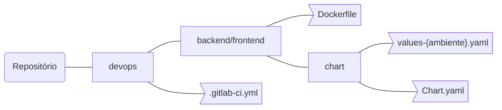
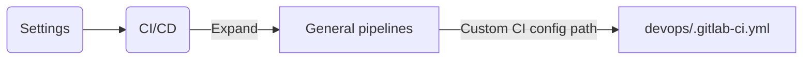
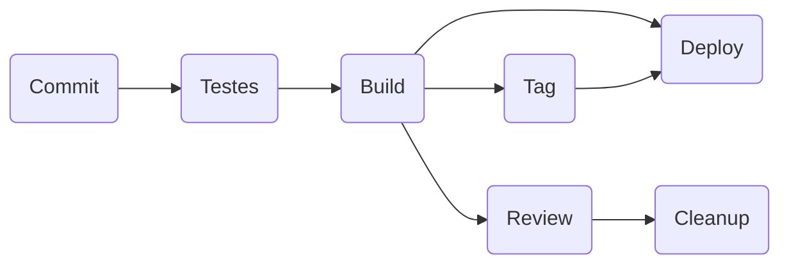

## Introdução

As metodologias contínuas de desenvolvimento de software são baseadas na
automação da execução de scripts para minimizar a chance de introdução
de erros durante o desenvolvimento de aplicativos. Eles exigem menos
intervenção humana ou mesmo nenhuma intervenção, desde o desenvolvimento
de um novo código até sua implantação.

Envolve continuamente a criação, teste e implantação de alterações de
código a cada pequena iteração, reduzindo a chance de desenvolver novo
código com base em versões anteriores com falha ou com erros.

Existem três abordagens principais para essa metodologia, 
cada uma delas a ser aplicada de acordo com o que melhor se adequa à sua estratégia.

### Integração contínua (CI - Continuous Integration)

Considere um aplicativo que tenha seu código armazenado em um
repositório Git no GitLab. Os desenvolvedores enviam alterações de
código todos os dias, várias vezes ao dia. Para cada envio ao
repositório, você pode criar um conjunto de scripts para criar e testar
seu aplicativo automaticamente, diminuindo a chance de introduzir erros
no seu aplicativo.

Essa prática é conhecida como integração contínua; para todas as
alterações enviadas a um aplicativo - mesmo para as branches de
desenvolvimento - elas são construídas e testadas de forma automática e
contínua, garantindo que as alterações introduzidas passem em todos os
testes, diretrizes e padrões de conformidade de código que você
estabeleceu para seu aplicativo.

### Entrega Contínua (CD - Continuous Delivery)

Entrega contínua é um passo além da integração contínua. Seu aplicativo
não é apenas construído e testado a cada alteração de código enviada
para a base de código, mas, como uma etapa adicional, ele também é
implantado continuamente, embora as implantações sejam acionadas
manualmente.

Esse método garante que o código seja verificado automaticamente, mas
requer intervenção humana para acionar manual e estrategicamente a
implantação das alterações.

### Implantação Contínua (CD - Continuous Deployment)

A implantação contínua também é um passo além da integração contínua, 
semelhante à entrega contínua. A diferença é que, em vez de implantar seu aplicativo manualmente, 
você o define para ser implantado automaticamente. 
Não requer intervenção humana para que seu aplicativo seja implantado.

### GitLab CI/CD

O GitLab CI/CD é uma poderosa ferramenta incorporada ao GitLab que
permite aplicar todos os métodos contínuos (integração contínua, entrega
e implantação) ao seu software sem a necessidade de aplicativos ou
integração de terceiros.

## Pipeline

O _pipeline_ é o componente de alto nível da integração contínua, entrega e implantação.

Os _pipelines_ compreendem:

- _Jobs_ que definem o que executar. Por exemplo, compilação de código
  ou execução de teste.
- _Stages_ que definem quando e como executar. Por exemplo, esses testes
  são executados somente após a compilação do código.

Vários _Jobs_ no mesmo _Stage_ são executados pelos Runners em paralelo, se houver Runners simultâneos suficientes.

Se todos os _Jobs_ em um _Stage_:

- Com sucesso, o pipeline passa para o próximo estágio.
- Falha, o próximo _Stage_ não é (geralmente) executado e o _pipeline_ termina mais cedo.

> [Git Flow](ferramentas/git/norma-de-uso/Guia-de-uso-Git.md#git-flow)


### Estrutura

#### Estrutura de diretórios do repositório

Os arquivos destinados a `CI/CD` deverão estar localizados no diretório `devops` do projeto conforme diagrama abaixo:



> **[Guia de uso](ferramentas/git/norma-de-uso/Guia-de-uso-Git.md#estrutura)**

#### _.gitlab-ci.yml_

Os _pipelines_ e seus componentes _Jobs_ e _Stages_ são definidos no arquivo `.gitlab-ci.yml` para cada projeto.

Nesse arquivo, você pode definir os scripts que deseja executar, definir as dependências de inclusão e cache, 
escolher os comandos que deseja executar em sequência e os que deseja executar em paralelo, 
definir onde deseja implantar seu aplicativo e especificar se deseja desejará executar os scripts automaticamente 
ou acionar qualquer um deles manualmente.

### Configuração

#### Alterando a localização do _.gitlab-ci.yml_
 
O `.gitlab-ci.yml` deverá estar localizado no diretório `devops` do projeto conforme já mencionado, 
porém por padrão o gitlab procura o mesmo na raiz do projeto, 
então para alterar esta configuração devemos alterar o caminho no gilab:



### Implementação

#### _Stages_

A palavra reservada `stages` é usado para definir _Stages_ que podem ser
usados por _Jobs_ e é definido globalmente.

A especificação de Stages permite ter pipelines flexíveis de multi stage.

##### Ordenação de Stages
A ordem dos elementos na Stage define a ordem da execução dos Jobs:
- _Jobs_ do mesmo _Stage_ são executados em paralelo.
- Os _Jobs_ do próximo stage são executados depois que os _Jobs_ do _Stage_ anterior são concluídos com êxito.

```yaml
stages:
  - Testes
  - Build
  - Tag
  - Deploy
  - Review
  - Cleanup
```
No caso acima os Jobs serão executados na seguinte ordem:
 1. Testes de unidade
 1. Build da aplicação
 1. Versionamento da aplicação (Apenas produção)
 1. Deploy da aplicação
 1. Review da feature branch
 1. Limpeza do ambiente de review



#### _Jobs_

Um _Jobs_ é definido como uma lista de parâmetros que definem o comportamento do _Job_.

A tabela a seguir lista os parâmetros disponíveis para tarefas:


| Palavra-chave   | Descrição                                                                                                                                                                                                                                                        |
|:----------------|:-----------------------------------------------------------------------------------------------------------------------------------------------------------------------------------------------------------------------------------------------------------------|
| `script`        | Shell script que é executado pelo Runner.                                                                                                                                                                                                                        |
| `image`         | Usa a imagem Docker. Também disponível: `image:name` e `image:entrypoint`.                                                                                                                                                                                       |
| `services`      | Usa a imagem Docker dos serviços. Também disponível: `services:name`, `services:alias`, `services:entrypoint` e `services:command`.                                                                                                                              |
| `before_script` | Substie um conjunto de comandos que são executados antes do trabalho.                                                                                                                                                                                            |
| `after_script`  | Substiue um conjunto de comandos que são executados após o trabalho.                                                                                                                                                                                             |
| `stages`        | Definir _Stages_ em um _pipeline_.                                                                                                                                                                                                                               |
| `stage`         | Define um _Stage_ do _Job_ (padrão `test`).                                                                                                                                                                                                                      |
| `only`          | Limita quando os _Jobs_ são criados. Também disponível: `only:refs`, `only:kubernetes`, `only:variables` e `only:changes` .                                                                                                                                      |
| `except`        | Limita quando os trabalhos não são criados. Também disponível: `except:refs`, `except:kubernetes`, `except:variables` e `except:changes` .                                                                                                                       |
| `rules`         | Lista de condições para avaliar e determinar os atributos selecionados de um _Job_ e se ele foi ou não criado. Não pode ser usado ao lado de `only`/ `except`.                                                                                                   |
| `tags`          | Lista de tags usadas para selecionar Runner.                                                                                                                                                                                                                     |
| `allow_failure` | Permita que o _Job_ falhe. O _Job_ com falha não contribui para o status de confirmação.                                                                                                                                                                         |
| `when`          | Quando executar o _Job_. Também disponível: `when:manual` e `when:delayed`.                                                                                                                                                                                      |
| `environment`   | Nome de um ambiente no qual o _Job_ é implementado. Também disponível: `environment:name`, `environment:url`, `environment:on_stop` e `environment:action`.                                                                                                      |
| `cache`         | Lista de arquivos que devem ser armazenados em cache entre as execuções subseqüentes. Também disponível: `cache:paths`, `cache:key`, `cache:untracked` e `cache:policy`.                                                                                         |
| `artifacts`     | Lista de arquivos e diretórios para anexar a um _Job_ com êxito. Também disponível: `artifacts:paths`, `artifacts:expose_as`, `artifacts:name`, `artifacts:untracked`, `artifacts:when`, `artifacts:expire_in`, `artifacts:reports` e `artifacts:reports:junit`. |
| `dependencies`  | Restringe de quais artefatos são passados ​​para um _Job_ específico, fornecendo uma lista de _Jobs_ para buscar artefatos.                                                                                                                                      |
| `coverage`      | Configurações de cobertura de código para um determinado _Job_.                                                                                                                                                                                                  |
| `retry`         | Quando e quantas vezes um _Job_ pode ser repetido automaticamente em caso de falha.                                                                                                                                                                              |
| `timeout`       | Defina um tempo limite personalizado no nível do _Job_ que tenha precedência sobre a configuração do projeto.                                                                                                                                                    |
| `parallel`      | Quantas instâncias de um _Job_ devem ser executadas em paralelo.                                                                                                                                                                                                 |
| `trigger`       | Define um gatilho de _pipeline_ a jusante.                                                                                                                                                                                                                       |
| `include`       | Permite que este _Job_ inclua arquivos YAML externos. Também disponível: `include:local`, `include:file`, `include:template` e `include:remote`.                                                                                                                 |
| `extends`       | Entradas de configuração das quais este _Job_ herdará.                                                                                                                                                                                                           |
| `pages`         | Carregue o resultado de um _Job_ para usar com as páginas do GitLab.                                                                                                                                                                                             |
| `variables`     | Define variáveis ​​de _Job_ a nível de _Job_.                                                                                                                                                                                                                    |
| `interruptible` | Define se um _Job_ pode ser cancelado quando redundante por uma execução mais recente.                                                                                                                                                                           |

##### Recursos para a criação de _Jobs_

###### Hidden keys (_Jobs_)

Se você deseja 'desabilitar' temporariamente um trabalho, em vez de comentar todas as linhas em que o trabalho está definido.

Você pode começar o nome com um ponto **(.)** e ele não será processado pelo GitLab CI. No exemplo a seguir, .hidden_jobserá ignorado:
```yaml
.hidden_job:
  script:
  - mvn test
```


###### Definição YAML _anchor_ de script para o _Job_

O YAML possui um recurso útil chamado '_anchor_', que permite duplicar facilmente o conteúdo do documento. 

As _anchors_ podem ser usados para duplicar/herdar propriedades e é um
exemplo perfeito para ser usado com **Hidden keys (_Jobs_)** para
fornecer modelos para seus _Jobs_

Utilizando _anchor_ para definir um _script_ de test padrão para vários _Jobs_:

```yaml
.script_test_java: &script_test_java
  script:
  - mvn test
```

###### Definição padrão de um _Job_ para a reutilização

A definição de um _Jobs_ que não será executado e sim herdado por outros
_Jobs_ é feito usando o recurso **Hidden keys (_Jobs_)**

No exemplo abaixo definimos um _Job_ e a própria definião utiliza o recurso YAML '_anchor_'

```yaml
.teste:
  stage: Testes
  image: $REGISTRY_HOST/base/maven-3.0.5-jdk-6:1.0.2
  *script_test_java
```

###### Criação de um _Job_ que herda da definição

`extends` define nomes de entrada dos quais um _Job_ será herdado.

É uma alternativa ao uso de YAML '_anchor_' e é um pouco mais flexível e legível:

```yaml
Testes de Unidade:
  extends: .teste
  only:
    refs:
    - /^feature\/.*/
```
##### _Jobs_ por _Stage_

###### _Jobs_ para a _Stage_ Testes
Os _Jobs_ para a _Stage_ Testes são para aplicar:
- Teste automaticamente seu aplicativo com a Integração Contínua.
- Análise a qualidade do seu código-fonte.
- Determinar o impacto no desempenho das alterações de código com o
  Teste de desempenho do navegador.
- Executar uma série de testes, como Digitalização de contêineres ,
  Verificação de dependência e testes JUnit/Phpunit.

###### _Jobs_ para a _Stage_ Build
Os _Jobs_ para a _Stage_ Build são para aplicar:
- Armazenar imagens do Docker no Registry Harbor.
- Armazenar pacotes NPM com o NPM Registry.
- Armazenar artefatos do Maven com o Repositório do Maven.

###### _Jobs_ para a _Stage_ Tag
Os _Jobs_ para a _Stage_ Tag são para aplicar:
- O versionamento das imagens do Docker no Registry Harbor.

###### _Jobs_ para a _Stage_ Deploy
Os _Jobs_ para a _Stage_ Deploy são para aplicar:
- Implantação contínua, implantando automaticamente seu aplicativo na produção.
- Entrega contínua, clique manualmente para implantar seu aplicativo em produção.
- Implantar sites estáticos com as páginas do GitLab .
- Enviar recursos para apenas uma parte dos seus pods e permita que uma
  porcentagem da sua base de usuários visite o recurso implantado
  temporariamente com o Canary Deployments .
- Implantar seus recursos atrás dos Feature Flags.
- Adicionar notas de versão a qualquer tag Git com as versões GitLab .
- Visualizar a integridade e status atual de cada ambiente em execução
  no Kubernetes com Deploy Boards.
- Implantar seu aplicativo em um ambiente de produção em um cluster
  Kubernetes com o Helm.
  
> [Guia de uso do Helm](devops/ferramentas-servicos/helm.md)

###### _Jobs_ para a _Stage_ Review
Os _Jobs_ para a _Stage_ Review são para:
- Implantar suas alterações com o Helm para visualizar as alterações do
  aplicativo nas features branches.

###### _Jobs_ para a _Stage_ Cleanup
Os _Jobs_ para a _Stage_ Cleanup são para:
- Limpar os ambientes de Review com o Helm.

# Referências
1. [Guia de uso Git](ferramentas/git/norma-de-uso/Guia-de-uso-Git.md)
2. [Guia de uso Helm](devops/ferramentas-servicos/helm.md)
1. [Docs - CI/CD do GitLab](https://docs.gitlab.com/ee/ci/README.html)
1. [Docs - Helm](https://helm.sh/docs/)
1. [Docs - Openshift](https://docs.openshift.com/)
1. [Docs - Kubernetes](https://kubernetes.io/pt/docs/home/)
1. [CNCF](https://www.cncf.io/)
