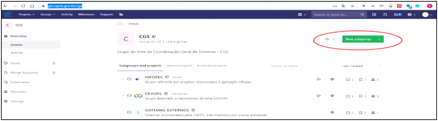
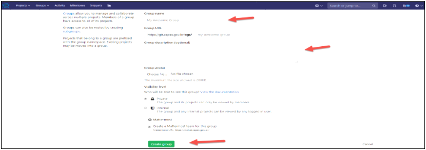
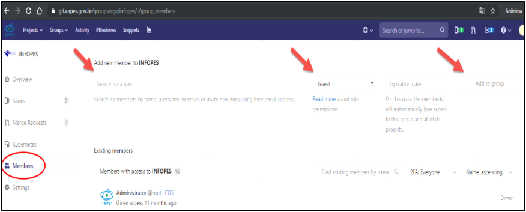
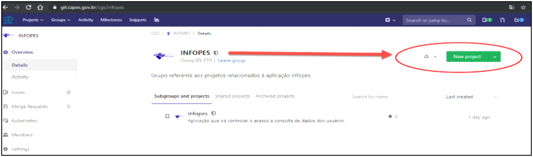
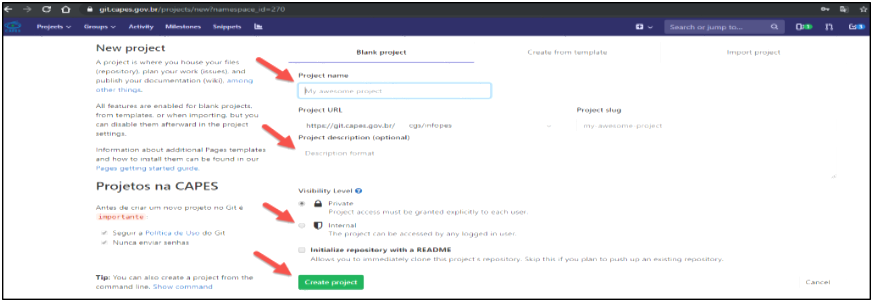

**Criar Grupos e projeto no Gitlab**

O Gitlab é um sistema de gerenciamento de projetos de software que possui diversas funcionalidades úteis que facilitam a gestão de Desenvolvimento. Neste é possível controlar o andamento das tarefas usando um formato de listas e cards; também há mecanismos para automatizar o processo de testes e publicação das aplicações (há muito foco em DevOps); e, entre outras, há a funcionalidade base dessa plataforma, que é a possibilidade de criar repositórios de código privados.

No Gitlab é possível criar repositórios privados gratuitamente. E é nesse recurso que vamos nos concentrar aqui: criaremos um novo repositório para nosso projeto que está iniciando.

**Criar um SubGrupo**

Após logar, daremos início ao processo de criar um novo SubGrupo, que é uma organização lógica para vários projetos relacionados. De maneira geral, podemos criar um grupo para cada projeto/sistema em que trabalharmos. Então, clique em Groups no menu superior e em seguida em Explore Groups.

Serão apresentadas os Groups para que se possa selecionar dentro desses os subgroup que se deseja criar. Para tanto e preciso clicar em New Project no botão superior direito e selecionar a opção New subgroup.

Na tela a seguir preencha os dados do subgrupo a ser criado. É importante frisar que o nome do subgrupo deve ser único, pois faz parte da URL que será identificada pelo repositório.

Em seguida, forneça as demais informações solicitadas (nome do grupo, descrição, etc). Selecione a opção Private para que seus repositórios sejam privados, ou seja, acessíveis apenas para membros do grupo. Para concluir, clique em Create group.

**Adicionando membros ao grupo**

Após criar o grupo você será redirecionado para o seu dashboard. Nessa tela, clique em Members do lado esquerdo para adicionar novos membros ao seu grupo.

Para adicionar um novo membro é necessário que ele tenha uma conta no Gitlab. Então basta digitar seu e-mail/login, definir sua função, sua data limite de acesso a esse repositório (opcional) e clicar em Add to group.

**Criando um novo projeto**

Agora que já temos nosso grupo criado e os membros adicionados a ele, podemos criar um novo projeto, sempre lembrando que um grupo pode conter vários projetos (o que ocorre normalmente nas empresas).

Para isso, volte para a tela inicial do dashboard do grupo, clicando sobre sua logo no canto superior esquerdo, e na tela principal clique em New project. Informe então o nome do novo projeto, sua descrição e a opção Internal em (Visibility Level) em seguida clique em Create project.

Observação: é importante dar nomes claros e significativos para os projetos.

Pronto, o novo projeto está criado e já temos acesso à sua URL, que será usada posteriormente para configurar nosso repositório local.
