# Introdução

Este treinamento tem por objetivo o auxílio aos desenvolvedores nas tarefas do cotidiano no uso do git na CAPES.


# O que é o git?
Git é um sistema de controle de versões distribuído, usado principalmente no desenvolvimento de software, mas pode ser usado para registrar o histórico de edições de qualquer tipo de arquivo. O Git foi inicialmente projetado e desenvolvido por Linus Torvalds para o desenvolvimento do kernel Linux, mas foi adotado por muitos outros projetos.

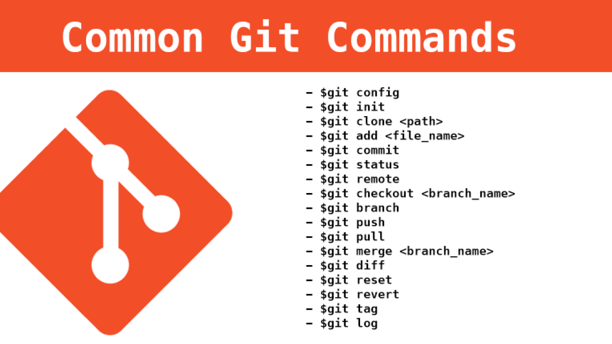

## Guia de referência

[Guia de referência da CAPES](ferramentas/version-control-system/guia-de-referencia-git.md)

## Diferenças entre Git e SVN


### git _commit_ vs svn _commit_

 - git _commit_ = Registra alterações no repositório local
 - svn _commit_ = Envia alterações da sua cópia de trabalho para o repositório (git _commit_ e git _push_).


### git _checkout_ vs svn _checkout_

- git _checkout_ = Alterna _branch_ atual ou restaura arquivos que foram modificados
- svn _checkout_ = Obtém uma cópia de trabalho a partir de um repositório (git clone).

# O que é o Gitlab?
O GitLab é um gerenciador de repositório de software baseado em git, com suporte a Wiki, gerenciamento de tarefas e CI/CD. GitLab é similar ao GitHub, mas o GitLab permite que os desenvolvedores armazenem o código em seus próprios servidores, ao invés de servidores de terceiros

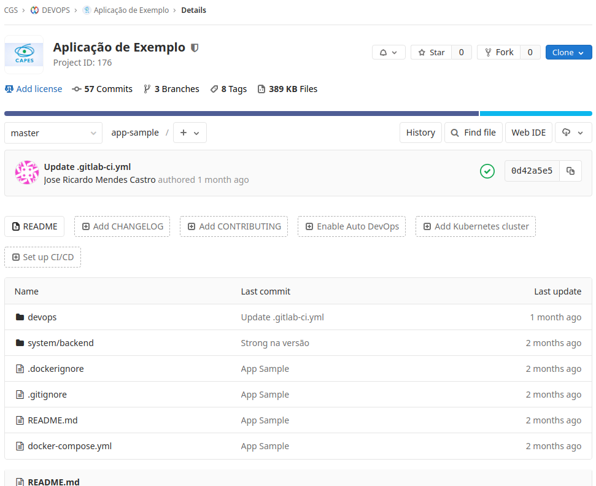

# O que é o GitLab CI/CD?

O GitLab CI / CD é uma ferramenta incorporada ao GitLab para desenvolvimento de software por meio de metodologias contínuas :

- Integração Contínua (**CI** - _Continuous Integration_)
- Entrega Contínua (**CD** - _Continuous Delivery_)
- Implantação Contínua (**CD** - _Continuous Deployment_)

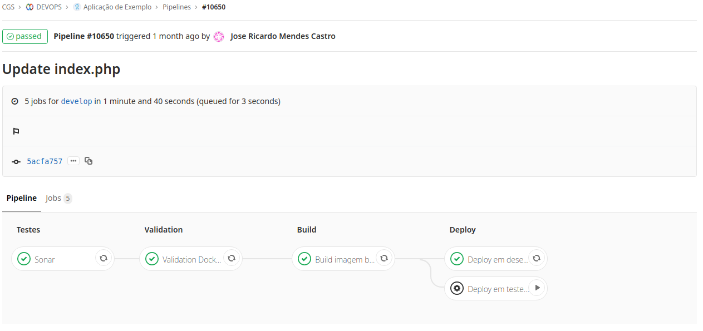

# Instalação

## Git para todas as plataformas
[https://git-scm.com/downloads](https://git-scm.com/downloads)

### Instalação no Windows

:one: Fazer o [Download](https://git-scm.com/download/win) do instalador

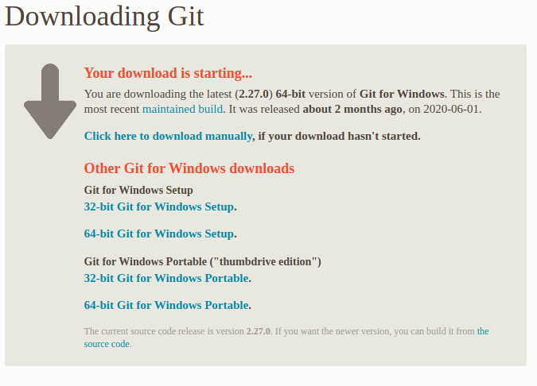

:two: Executar o instalador como administrador

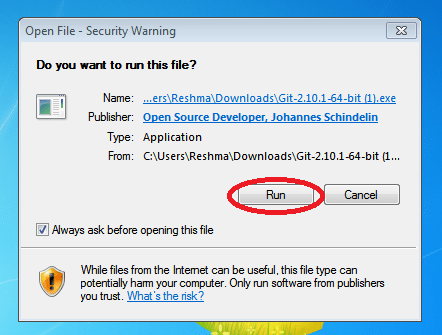

:three: Marque todas as opções do Windows Explorer

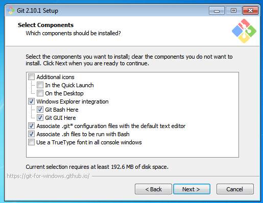

:four: Selecione a opção **Use Git From Git Bash Only**

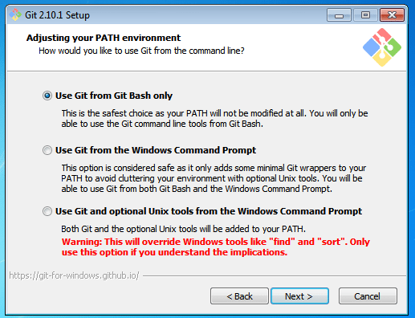

:five: Marque as Opções **Enable file system caching** e **Git Credential Manager**

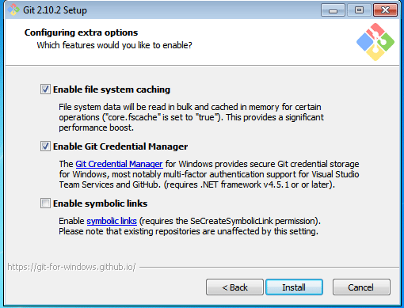

:six: Selecione a Opção **Use MinTTY**


:seven: Marque a Opção **Launch Git Bash**

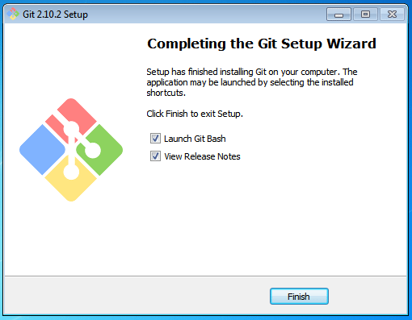


### Instalação no Linux

#### Distribuições baseadas em Red Hat (RHEL, Fedora, Centos...)

:one: Executar o seguinte comando:
```bash
sudo yum install git -y
```

#### Distribuições baseadas em Debian (Debian, Ubuntu, Mint...)

:one: Executar o seguinte comando:
```bash
sudo apt-get install git -y
```


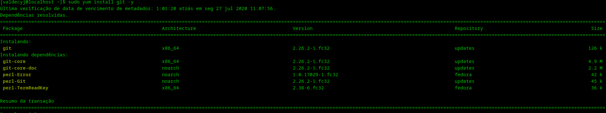
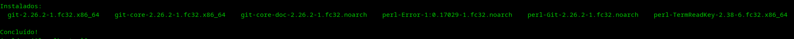


## Conferir o funcionamento do git

Abra o Terminal(Linux) ou Aplicativo Git(Windows) e digite o seguinte comando:

```bash
git --version
```

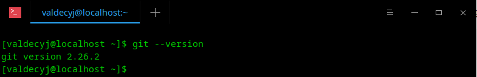


# Configuração

## Configurando Informações do Usuário utilizadas em todos os repositórios locais

### Defina um nome identificável para crédito ao revisar o histórico de versões

:one: Execute o seguinte comando:

```bash
git config --global user.name “[firstname lastname]”
```

> Ex: ```git config --global user.name "Valdecy Lourenco de Araujo Junior"```


### Defina um endereço de email que será associado a cada marcador do histórico


:one: Execute o seguinte comando:
```bash
git config --global user.email “[valid-email]”
```

> Ex: ```git config --global user.email "junior.araujo@gmail.com"```

# Trabalhando com projetos

Para nosso _Workshop_ utilizaremos o projeto do Gitlab [https://git.hom.capes.gov.br/cgs/devops/app-sample](https://git.hom.capes.gov.br/cgs/devops/app-sample)

## Começar um projeto com o git

Há duas formas de começar um projeto
  
### 1. Inicializando um diretório existente como um repositório Git

:one: Entre no diretório do projeto
```bash
cd app-sample/
```
:two: Execute o comando _git init_
```bash
git init
```
:three: Adicionando o servidor remodo
```bash
git remote add origin https://git.hom.capes.gov.br/cgs/devops/app-sample.git
```

### 2. Clonando um projeto
:one: Execute o seguinte comando:
```bash
git clone clone https://git.hom.capes.gov.br/cgs/devops/app-sample.git
```
:two: Entre no diretório do projeto:
```bash
cd app-sample/
```

# Fluxo do Git


## Branches

_Branch_ é a duplicação de um objeto sob controle de versão, para que modificações possam ocorrer em paralelo ao longo de várias _branches_.


### Master
Representa a última versão do código estável.

### Develop
A _branch_ mais atualizada, que contém o código que está sendo validado para ir para produção

### Feature

_Branch_ criado pelo desenvolvedor para a construção de uma funcionalidade, representa o código de uma tarefa específica.


## Quem faz o quê?

| |Desenvolvedor/Developer|Analista de Qualidade/Developer|Gerente/Mantainer|
|:---|:---|:---|:---|
|Cria _feature branch_| :white_check_mark: | :white_check_mark: | :eyes: |
|Escreve código| :white_check_mark: | :red_circle: | :eyes: |
|Escreve testes| :white_check_mark: | :white_check_mark: | :eyes: |
|Realiza testes| :white_check_mark: | :white_check_mark: | :eyes: |
|Realiza _commits_| :white_check_mark: | :white_check_mark: | :eyes: |
|Abre Merge Request _feature/develop_| :white_check_mark: | :eyes: | :eyes: |
|Realiza Revisão de código| :white_check_mark: | :white_check_mark: | :eyes: |
|Aprova Merge Request| :eyes: | :eyes: | :white_check_mark: |
|Abre Merge Request _develop/master_| :red_circle: | :red_circle: | :white_check_mark: |
|Criar _Tags_| :red_circle: | :red_circle: | :white_check_mark: |
|Deploy em Produção| :red_circle: | :red_circle: | :white_check_mark: |
|Acompanha os Logs| :white_check_mark: | :white_check_mark: | :eyes: |


## Realizando _commits_

:one: Criar uma feature branch

```bash
git checkout -b feature/123-nova-branch origin/develop
```

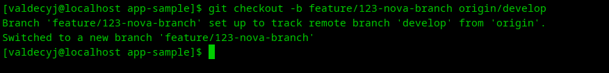

> Caso você queira apenas trocar de _branch_ utilize o comando ```git checkout [nome-do-branch]```

:two: Verifique se a criação e checkout foi feita corretamente através do seguinte comando:

```bash
git branch -a
```

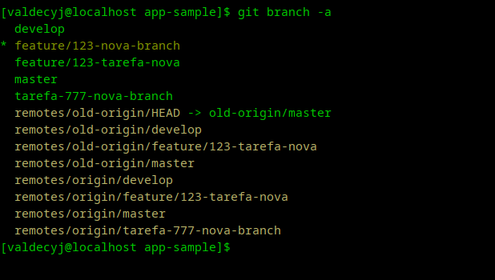

:three: Efetue uma alteração no arquivo README.md

```bash
echo teste >> README.md

```
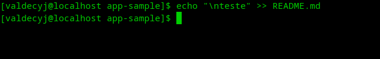

:four: Adicione o arquivo README.md na Staging Area

```bash
git add README.md
```

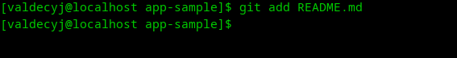

:five: Verifique o _status_ da alteração

```bash
git status
```

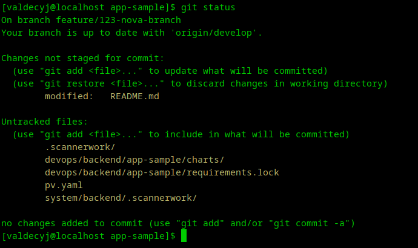

:six: Efetue o _commit_ da alteração informando uma mensagem

```bash
git commit -m "add teste in README"
```


:seven: Envie os _commits_ para o servidor remoto

```bash
git push origin feature/123-nova-branch
```

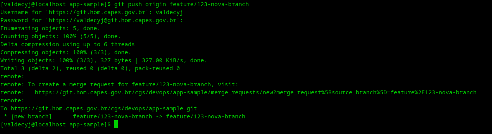

> Caso a _Branch_ develop tenha sido atualizada é necessário fazer um merge local antes de submeter o _push_
> ```git merge remotes/origin/develop```


:eight: Conferir no Gitlab se o commit foi enviado com sucesso

> Acessar: [https://git.hom.capes.gov.br/cgs/devops/app-sample](https://git.hom.capes.gov.br/cgs/devops/app-sample)

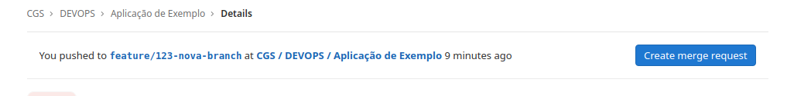

:eight: Conferir no Gitlab se a branch foi criado com sucesso

> Acessar: [https://git.hom.capes.gov.br/cgs/devops/app-sample/-/branches](https://git.hom.capes.gov.br/cgs/devops/app-sample/-/branches)

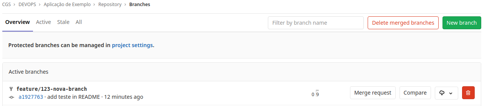


## Abrindo um _Merge Request_ _feature/develop_

:one: Acesso o projeto no Gitlab

[https://git.hom.capes.gov.br/cgs/devops/app-sample](https://git.hom.capes.gov.br/cgs/devops/app-sample)

:two: Menu lateral direto clique em _Merge Requests_

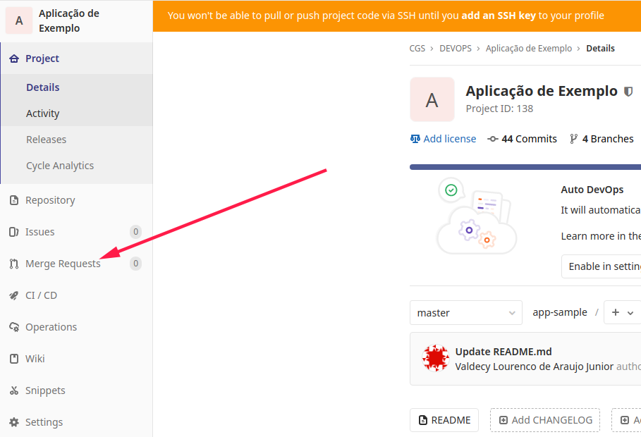

:three: Clique no botão _New Merge Request_

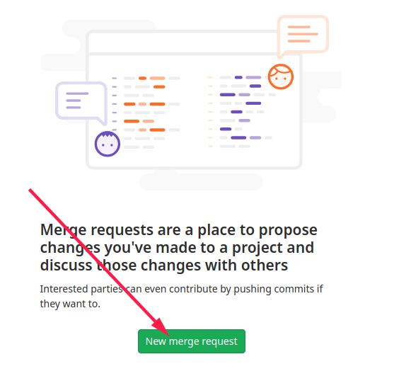

:four: Selecione as _branches_ e clique em _Compare branches and continue_ 

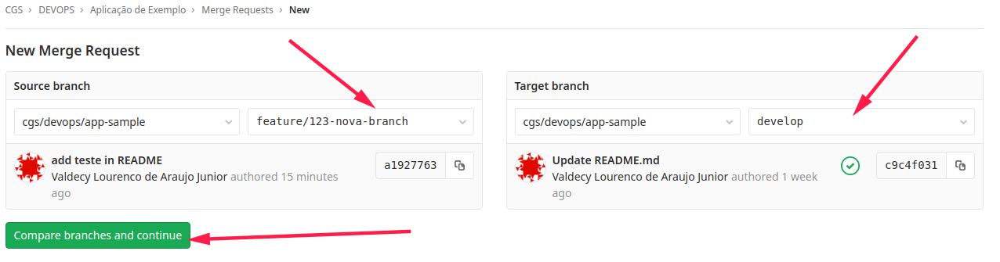

:five: Informe os campos 


:six: Confira novamente e clique em _Submit Merge Request_ 


## Realizando a Revisão de Código (_Code Review_)

A revisão de código é uma atividade de garantia de qualidade de software na qual uma ou várias pessoas verificam um programa principalmente visualizando e lendo partes de seu código-fonte, e o fazem após a implementação ou como uma interrupção da implementação.


:one: Acesse o pipeline do projeto

[https://git.hom.capes.gov.br/cgs/devops/app-sample/pipelines](https://git.hom.capes.gov.br/cgs/devops/app-sample/pipelines)

:two: Execute o _Job_ de Review

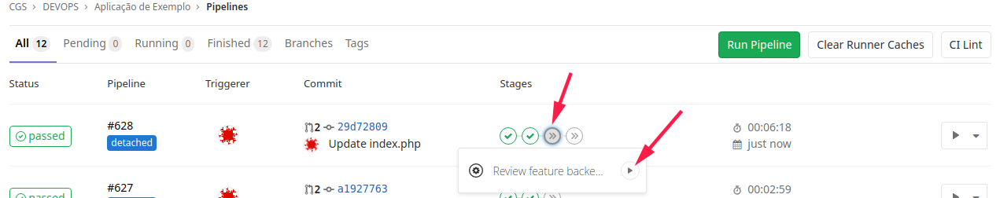

:three: Aguarde até que o _Job_ seja finalizado

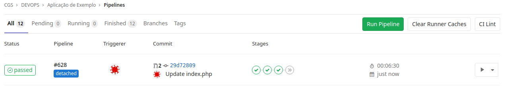

:four: Acesse o Openshift 

[https://openshift.teste.capes.gov.br/console/projects](https://openshift.teste.capes.gov.br/console/projects)

:five: Entre no Projeto da feature branch

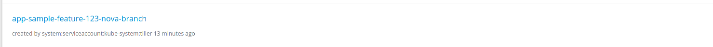

:six: Confira se aplicação subiu 

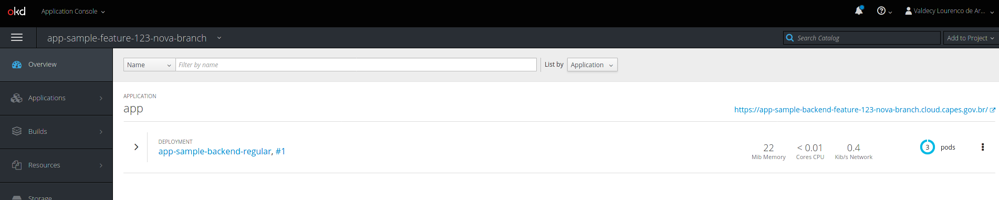

:seven: Acesse o Link para efetuar os devidos testes 

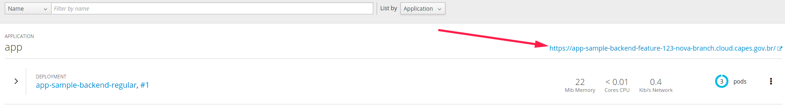

:eight: Realize Testes 


:nine: Na página do projeto, vá até o menu _Merge Requests_

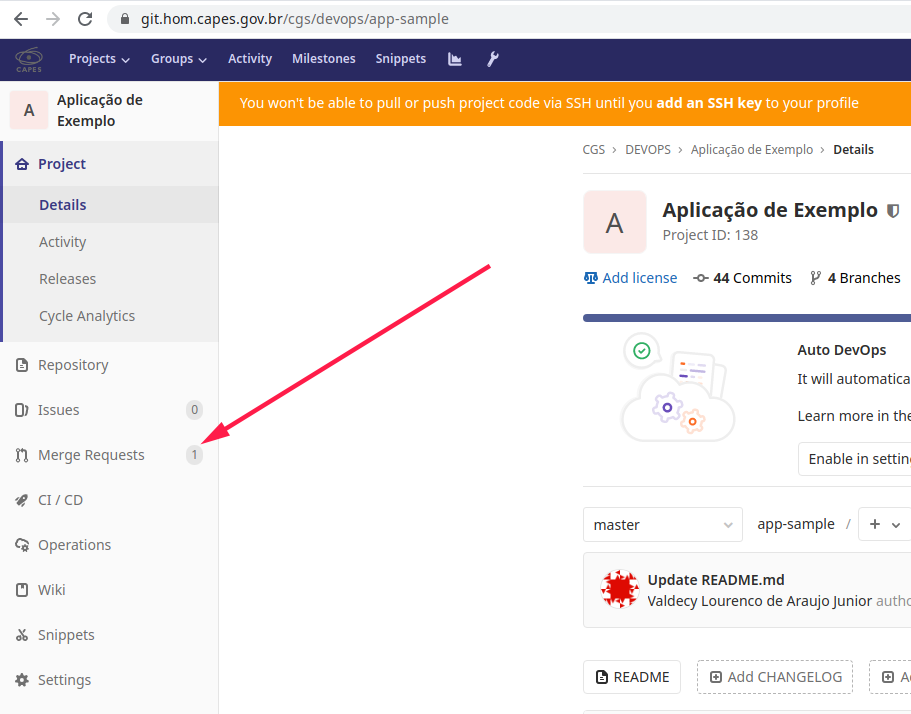

:ten: Clique no _Merge Request_

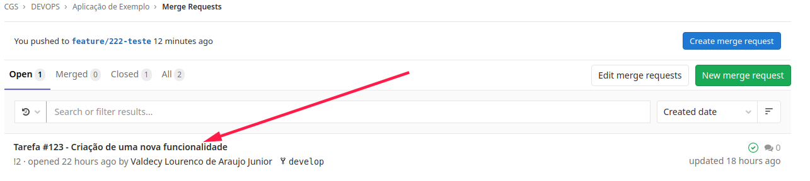

:one: :one: Verifique as mudanças

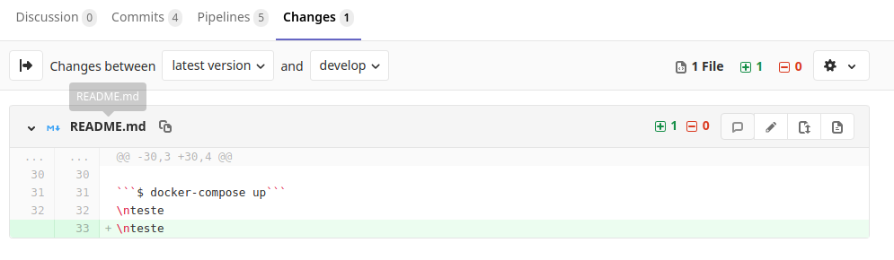

:one: :two: Abra uma Discussão

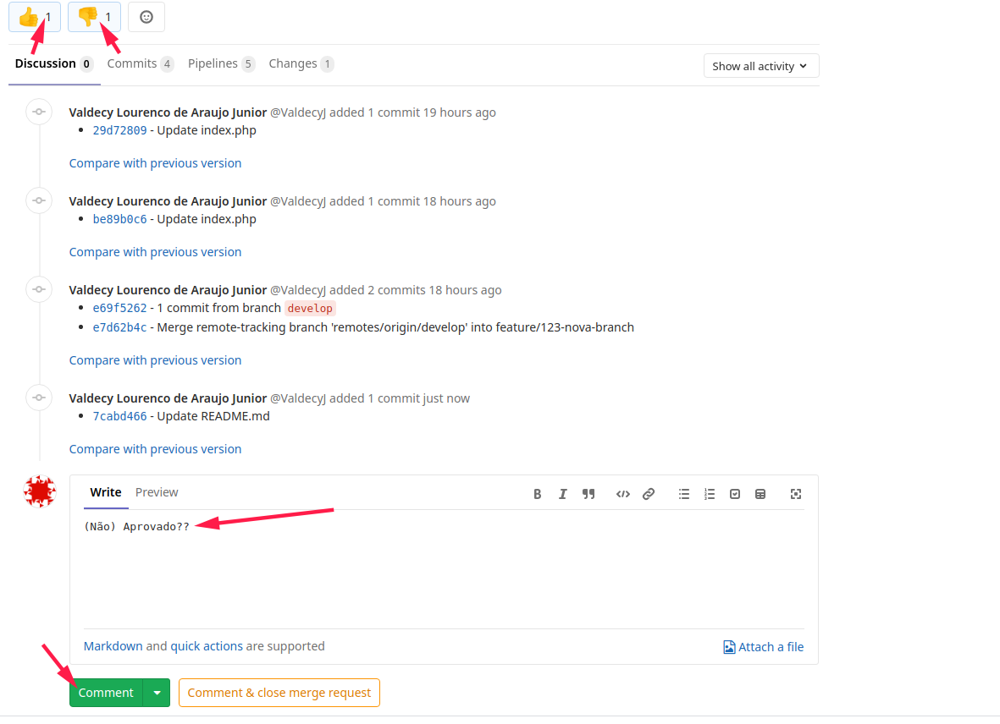

:one: :three: O Gerente faz o _Merge_

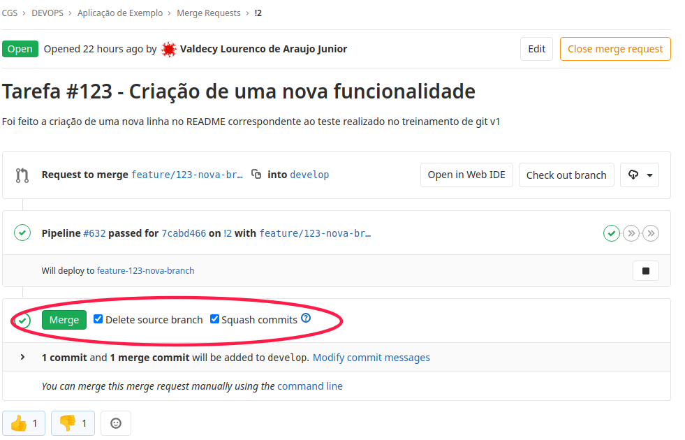

:one: :four: Acompanhe o Pipeline

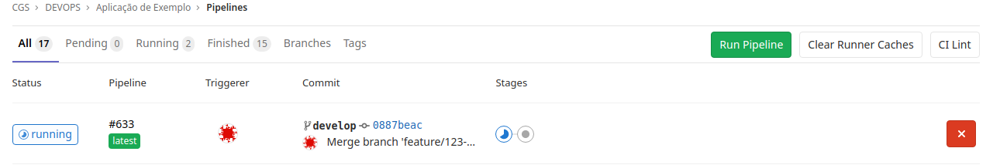


## Abrindo um _Merge Request_ _develop/master_


:one: Na página do projeto, clique em _Merge Requests_ e em seguida _New Merge Request_

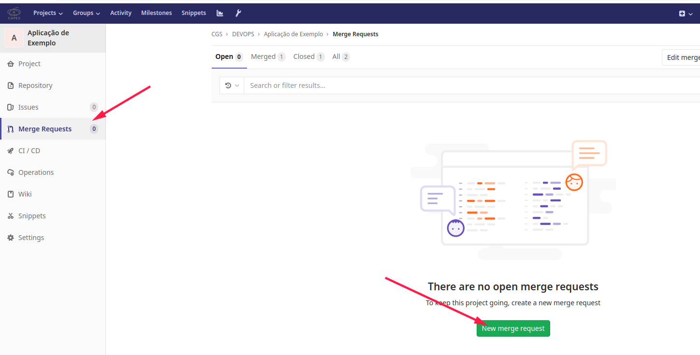

:two: Selecione as _branches_ e clique em _Compare branches and continue_

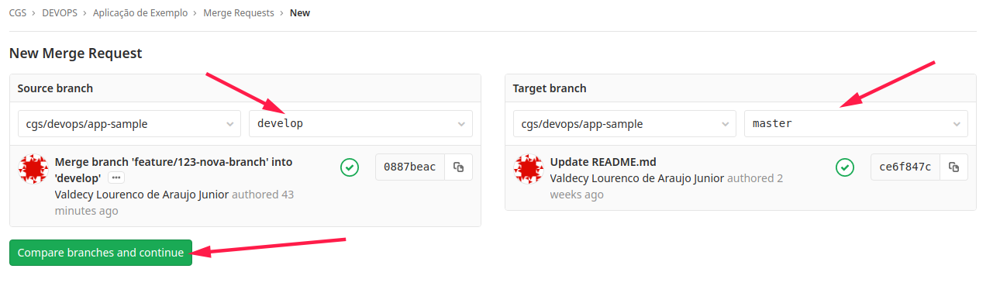

:three: Informe os campos, confira as _branches_ e clique em _Submit Merge Request_

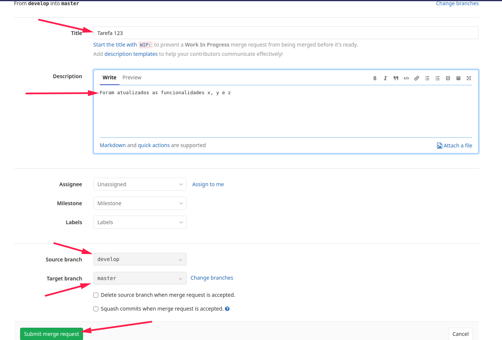

:four: Acompanhe o pipeline

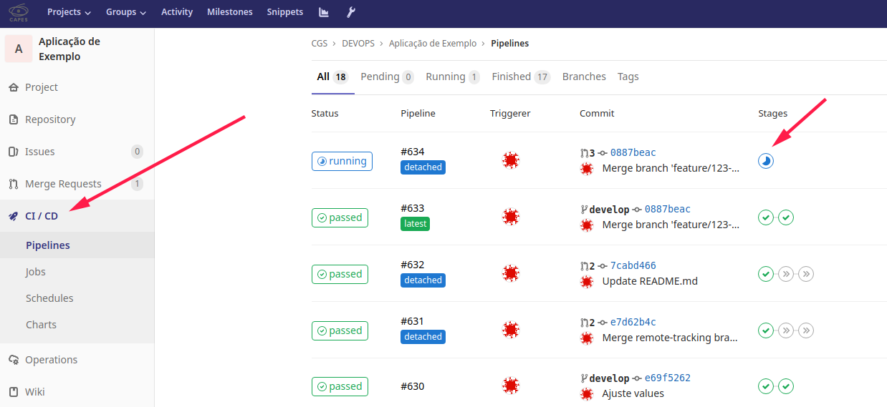

:five: Entre no _Merge Request_

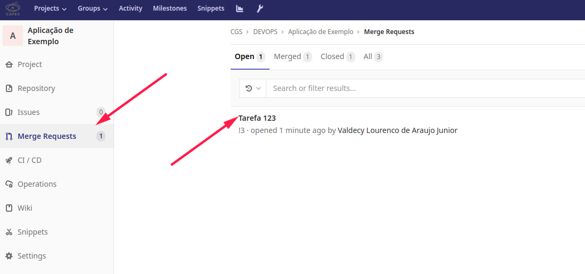

:six: Efetue o _Merge_

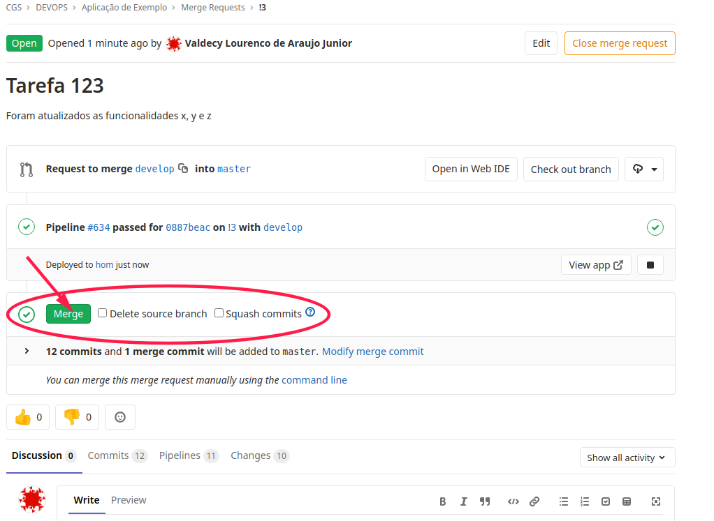


## Criando _Tags_

Da mesma forma que a maioria dos VCSs, o Git tem a habilidade de marcar pontos específicos na história como sendo importantes. Normalmente as pessoas usam essa funcionalidade para marcar pontos onde foram feitas releases (v1.0 e assim por diante).


:one: Na página do projeto, clique em _Repository_,  _Tags_ e em seguida _New Tags_

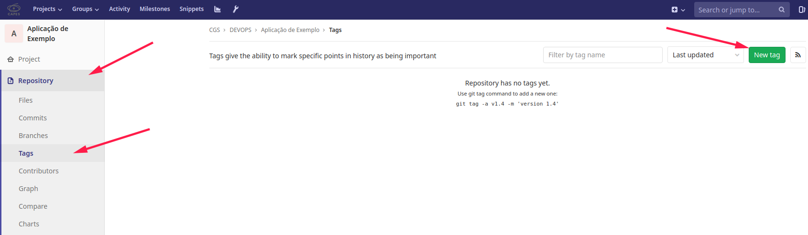

:two: Informe os campos, e em seguida _Create Tag_

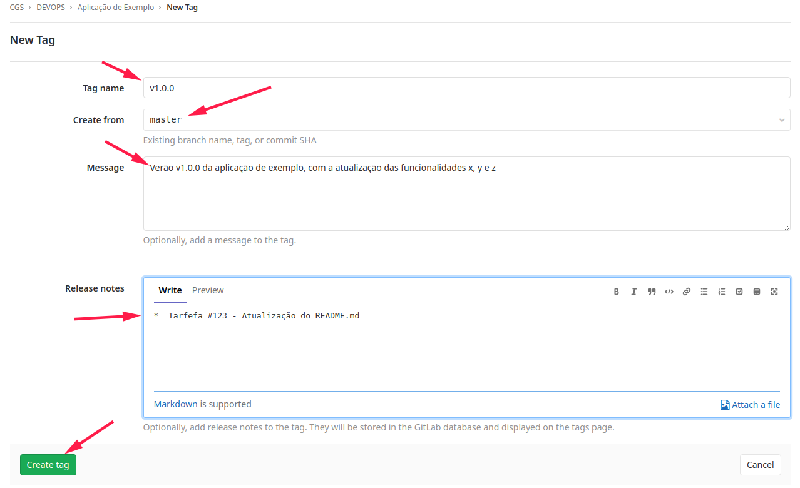

:three: Acompanhe o pipeline

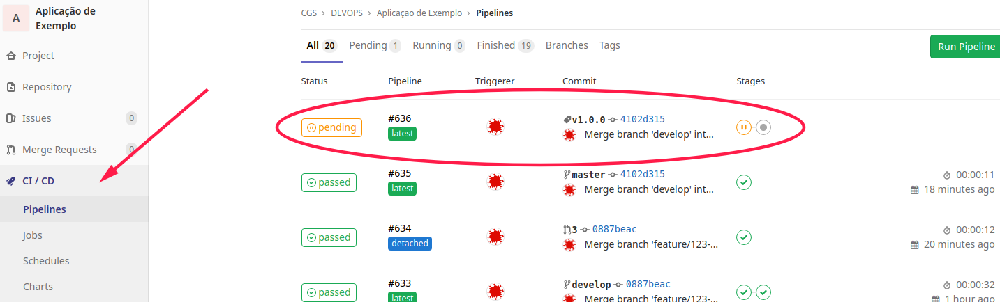


## Realizando _Deploy_ em Produção

:one: Na página do projeto, clique em _CI/CD_,  _Pipelines_ e em seguida clique no(s) _Job(s)_ que não foram executados execute-os 

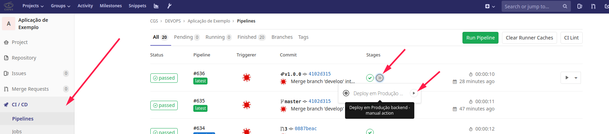

:two: Acompanhe o pipeline 

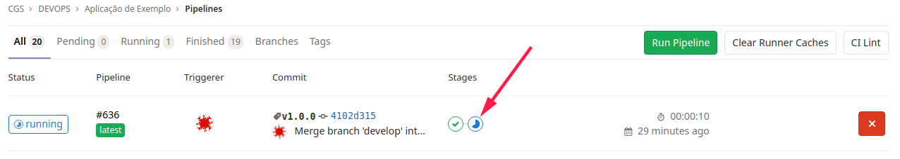

:three: Acesse o Openshift

[https://openshift.teste.capes.gov.br/console/projects](https://openshift.teste.capes.gov.br/console/projects)

:four: Acesse o projeto de produção

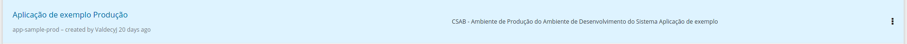

:five: Confira se a aplicação subiu e se está disponível

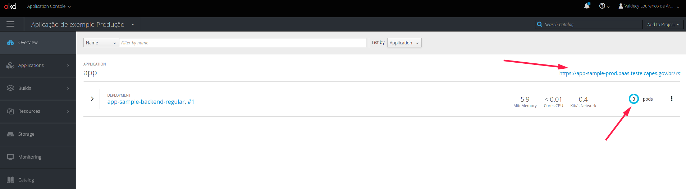

