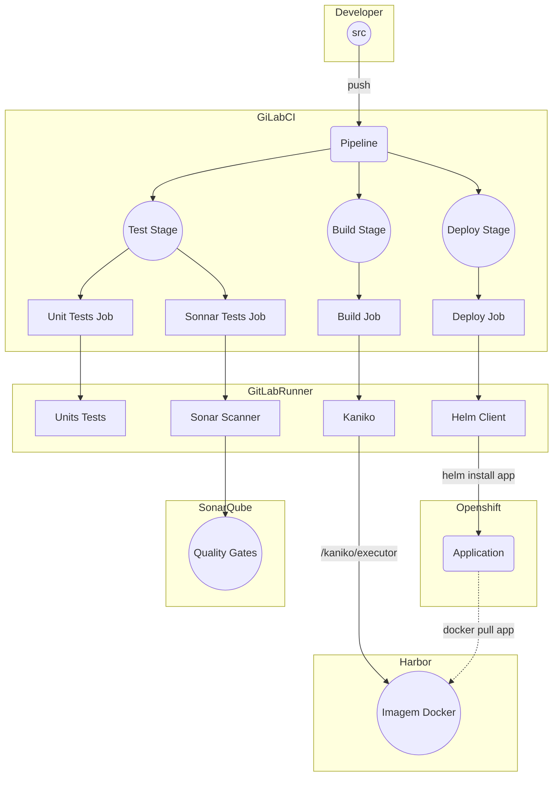

## Introdução

Neste Guia será descrito como é feito o processo de Implantação de uma aplicação no
Openshift.

## Diagrama Técnico



## Passos para fazer a implantação deploy de uma aplicação no OpenShift

>  Antes de começarmos a implantação da aplicação, vamos dar uma passada nos [Primeiros passos](devops/primeiros-passos/primeiros-passos.md).

Agora que temos todos os conhecimentos técnicos necessários, vamos saber tudo que precisamos para subir uma aplicação do ZERO no OpenShift.

### 1. Criar o Dockerfile da aplicação

O time deverá efetuar a conteinerização da aplicação.

A Dockerfile é um documento de texto que contém todos os comandos que um
usuário pode chamar na linha de comando para montar uma imagem. O uso de
`docker build` podemos criar uma compilação automatizada que executa
várias instruções da linha de comando em sucessão.

O Dockerfile da nossa aplicação que iremos escrever deve ser a receita
da infraestrutura que a aplicação necessita para rodar.

> Vide: [Pré-requisitos](devops/primeiros-passos/12factor.md)
> 
> Vide: [Como criar Dockerfiles](devops/ferramentas-servicos/docker.md)
>
> Equipe responsável: Time do projeto

### 2. Solicitar criação de _resource_ no cofre de senhas

O time deverá solicitar a criação de um _resource_ no cofre de senhas, esta deverá ser feita através de chamado CATI para a fila de BANCO DE DADOS conforme ex. abaixo:

```
Prezados, bom dia!

Solicito a criação do resource no cofre de senha para o usuário <<USUARIO_DO_BANCO>>, 
nos ambientes <<DES,HOM,TESTE,PREPROD e PROD>>, para o SGBD <<ORACLE/POSTGRESQL>>.

O resource será utilizado nas aplicações do OPENSHIFT.

Obrigado
```

> Equipe responsável: Time do projeto

### 3. Solicitar criação de volumes de storage

O time deverá solicitar a criação de volumes de storage para o armazenamento de LOG e de volumes do AplWeb que a aplicação necessite. esta deverá ser feita através de chamado CATI  para a fila INFRAESTRUTURA conforme o seguinte template:

- [Solicitação de volume](devops/templates/solicitacao_volume.md)

> Equipe responsável: Time do projeto


### 4. Criar projeto OpenShift

A criação do projeto no OpenShift permite que a gente organize e
isole a aplicação por ambiente.

Após seguir as instruções abaixo, devemos ter como resultado o
projeto/namespace criado no OpenShift com o Tiller disponível para fazer
o deploy da aplicação

> Vide: [Como criar um projeto no Openshift](devops/procedimentos-operacionais/criar-projeto-openshift.md)
>
> Equipes responsáveis: Arquitetura, GCM e Infraestrutura

### 5. Criar projeto Harbor

A criação projeto no Habor é necessária para definir um espaço onde será
armazenado as imagens Docker da aplicação.

Após seguir as instruções abaixo, devemos ter como resultado um projeto
criado no Harbor e um usuário robô com um token com permissões para
fazer `pull` e `push` de imagens neste projeto.

> Vide: [Como criar um projeto no Harbor](devops/procedimentos-operacionais/criar-projeto-harbor.md)
>
> Equipes responsáveis: Arquitetura, GCM e Infraestrutura

### 6. Criar projeto Sonarqube

A criação projeto no Sonarqube é necessária para definir a validação dos _quality gates_

Após seguir as instruções abaixo, devemos ter como resultado um projeto
criado no Sonarqube.

> Vide: [Como criar um projeto no Sonarqube](https://docs.sonarqube.org/latest/project-administration/project-existence/)
>
> Equipe responsável: GCM

### 7. Criar Repositório GIT

A criação do repositório GIT no GitLab é o ponto inicial de onde o
sistema de integração contínua tem, como ponto de partida, uma base de
código que é construída e, posteriormente, implantada em
desenvolvimento, teste e produção.

> Vide: [Criar Grupos e projetos no Gitlab](devops/procedimentos-operacionais/criar-grupos-projetos.md)[^git] [^git-guia]
>
> Equipe responsável: GCM


### 8. Configurar Variáveis GitLabCI

Após a criação do projeto no GitLab, devemos configurar as variáveis
para o correto funcionamento do CI/CD.

As seguintes variáveis devem ser configuradas:
- REGISTRY_TOKEN e REGISTRY_USER : Variáveis que são obtidas através da
  criação da conta robô no Harbor

Variáveis opcionais, que só devem ser usando que caso de valor `false`

- CGS_AMBIENTE_DES: `true` (valor default) - Habilita deploy no ambiente de desenvolvimento
- CGS_AMBIENTE_TEST: `true` (valor default) - Habilita deploy no ambiente de teste
- CGS_AMBIENTE_HOM: `true` (valor default) - Habilita deploy no ambiente de homologação
- CGS_AMBIENTE_PREPROD: `true` (valor default) - Habilita deploy no ambiente de pré-prod
- CGS_AMBIENTE_PROD: `true` (valor default) - Habilita deploy no ambiente de produção
- REPO_TIER_BACKEND: `true` (valor default) - Informa se a aplicação tem ou não backend
- REPO_TIER_FRONT: `true` (valor default) - Informa se a aplicação tem ou não frontend
 


> Vide: [Como configurar variáveis no GitLabCI](https://docs.gitlab.com/ee/ci/variables/README.html)[^git]
>
> Equipe responsável: GCM


### 9. Desabilitar Shared Runner

O Shared runner é utilizado para deploy de aplicações fora do ambiente
OpenShift, portanto devemos desabilitá-lo.

Atualmente utilizamos um runner no grupo CGS do git.

> Equipe responsável: GCM


### 10. Criar o Chart

Devemos então criar o chart da aplicação, que deve conter todas as
definições de recursos necessários para a mesma rodar em um ambiente
Kubernetes.

> Vide: [Como criar Chart](devops/orientacoes-tecnicas/chart-capes-aplic.md)[^helm]
>
> Equipes responsáveis: Arquitetura e GCM

### 11. Criar o Pipeline

O próximo passo é a definição dos _Jobs_ que entrarão na esteira de
CI/CD.

> Vide: [Como criar Pipeline](devops/orientacoes-tecnicas/pipeline.md)
>
> Equipes responsáveis: Arquitetura e GCM


### 12. GMUD

Para a aplicação entrar em produção será necessário a entrega de uma GMUD, que é preenchida através do **Formulário de requisição de mudança**.

>  Anexo a GMUD deverá ser entregue um checklist com os débitos técnicos da aplicação. Vide [PDTIC](https://www.capes.gov.br/images/novo_portal/documentos/governanca_dti/01072020_PDTIC_2020_2023_CGD_junho2020.pdf)

> Vide: [Formulário de requisição de mudança](https://git.capes.gov.br/cgii/ccm/gmud/wikis/home)
>
> Equipe responsável: Time do Projeto


## Referências

[^git]: [Sobre o Git](ferramentas/git/Git.md)
[^git-guia]: [Guia de Uso](ferramentas/norma-de-uso/Guia-de-uso-Git.md)
[^helm]: [Helm Charts](devops/ferramentas-servicos/helm.md)
