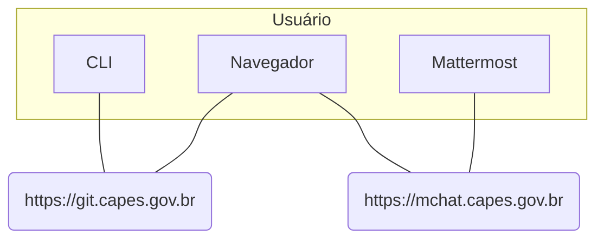

Git é um sistema de controle de versão distribuído (DVCS). Isso significa que todos que trabalham com o código-fonte possuem uma cópia local do repositório completo. Nele, repositórios de códigos da instituição são armazenados e versionados. A Capes utiliza a ferramenta **Gitlab** e uma ferramenta de comunicação (integrada ao Gitlab) é o **Mattermost**.

Desta forma, o Gitlab[^Gitlab] é uma aplicação que implementa o conceito de um Git, sendo que nele há um conjunto de componentes que aprimoram o uso da ferramenta e agregam valor, permitindo fluxos mais completos dentro do ciclo de vida do desenvolvimento. Além disto, permite integração com outros serviços de comunicação (Mattermost) e utilização do conceito de CI/CD. Ele possui uma interface Web para visualização e edição dos códigos, porém permite o uso de softwares que implementam git.

> **NOTA**: Essa página destina-se a orientar sobre o funcionamento e uso do Git, assim como sua política de uso, voltado aos usuários da ferramenta. Para assuntos relacionados à administração do Gitlab (administradores da ferramenta) viste a página do **[Gitlab](https://git.capes.gov.br/cgii/armazenamento/git/gitlab/wikis/home)**. 

# Descrição Técnica
Em resumo, a da solução permite:
* **git.capes.gov.br** - repositório para armazenar os códigos/scripts das aplicações (**repository**), além de possuir outros recursos internos como: 
  * cadastro de tarefas (**issues**)
  * documentação (**wiki**) 
  * uso de esteira de desenvolvimento (**CI/CD**)
  * compartilhamento de trechos de códigos (***snippets***)
* **mchat.capes.gov.br** - comunicação entre usuários e canais públicos/privados para as equipes, além da integração com Gitlab que permite:
  * através dos canais, pesquisar sobre tarefas ou registrar novas 
  * gerar avisos nos canais sobre alterações em um projeto do git (wiki, issues, pipeline CI/CD).
  * troca de arquivos

O **usuário** (desenvolvedor), pode através da interface Web usufruir do Git, mas pode utilizar softwares que utilizando o git, como o Github Desktop, sendo recomendado em alguns casos devido a limitação da interface Web. Já o MChat, pode ser utilizado também por um navegador e conta com aplicativo para os sistemas operacionais.
> Vide os [**Procedimentos Operacionais**](procedimentos-operacionais/README.md) para saber como instalar e configurar as ferramentas.

Logo, faz-se necessário padronizar e estabelecer regras de uso das ferramentas de acordo com as necessidades da instituição.
> Vide a [**Política de Uso**](norma-de-uso/Politica_de_Uso.md) para entender as diretrizes de uso do serviço.

## Diagrama Técnico

    
# Referências
[^Gitlab]: https://about.gitlab.com/features/