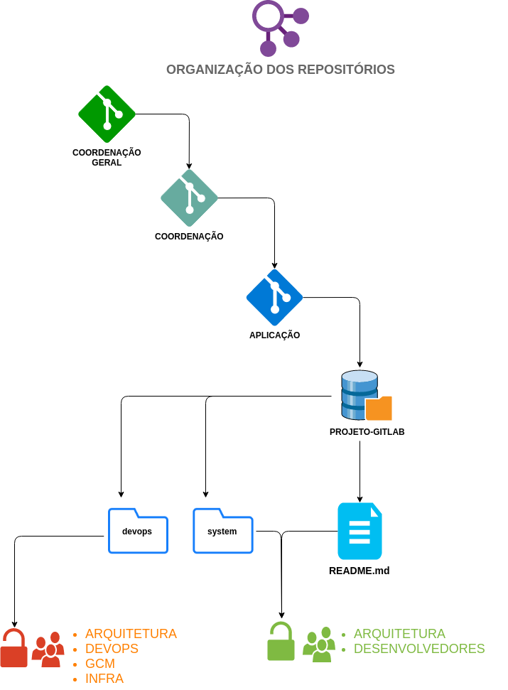
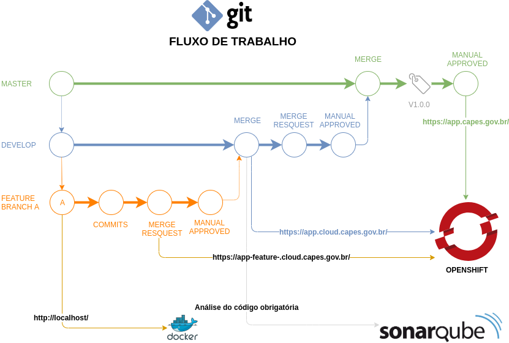
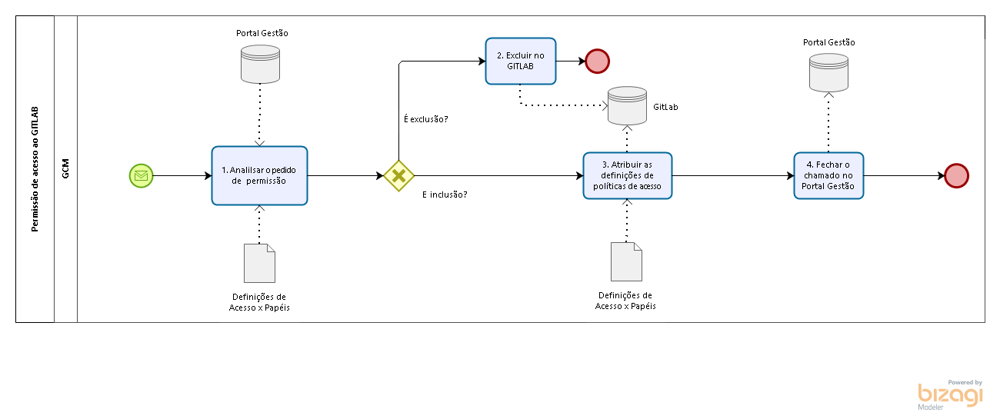

# Estrutura



### Projeto

Cada projeto ficará organizado conforme mostrado na figura acima em que cada item está descriminado a seguir.

- **COORDENAÇÃO GERAL**: Grupo[^1] do gitlab que representa a coordenação geral que mantém os projetos.
- **COORDENAÇÃO**: Subgrupo[^2] do gitlab que representa a coordenação abaixo da coordenação geral.
- **PROJETO**: Subgrupo[^2] do gitlab que representa que agrupa um ou mais projetos[^3].
- **SISTEMA**: Subgrupo[^3] do gitlab que vai gerenciar o conteúdo/arquivo do sistema.
* Vide item:  [DevOps - Criar Projetos](devops/procedimentos-operacionais/criar-grupos-projetos.md)

### Repositório
A raiz do repositório deverá ser composta apenas dos seguintes elementos:
- **/devops**: pasta destinada ao processo de deploy.
- **/system**: pasta que agruapará o conteúdo do sistema.
- **/README.md**: arquivo usado para documentar procedimentos/características relevantes do sistema.

### Grupos
1. No gitlab, um **grupo** é um agrupador que concentra várias funcionalidades, tais como: subgrupos, wiki, variáveis que podem ser compartilhadas com seus subcomponentes.
1. No gitlab, um **subgrupo** é criado tal qual a grupo normal, diferente apenas por estar dentro de um grupo. Porém, um subgrupo herda várias propriedades do grupo pai.
1. No gitlab, um **projeto** é um agrupador de várias funcionalidades, dentre elas um repositório git.
* Vide item:  [DevOps - Criar Grupos](devops/procedimentos-operacionais/criar-grupos-projetos.md)

# Git Flow

O fluxo adotado aborda branches dedicados para cada ambiente de deploy:
- Produção (master)
- Desenvolvimento/Homologação (homolog).

## Funcionamento
1. **Criação da feature branch** - O desenvolvedor deve criar uma feature para o que estiver trabalhando. [**Vide padrão de nomenclatura**](#feature-nomenclatura)
1. **Commits** - Após a criação da funcionalidade ou correções de erros o desenvolvedor realizará os commits na feature branch.
    1. As mensagens de commit refletem a intenção. O desenvolvedor não deve apenas dizer o que você fez, mas também porque você fez isso. É ainda mais útil explicar porque você fez isso em relação a outras opções.
1. **Merge Request para Homolog** - O desenvolvedor deve solicitar um mergue request para a branch homolog.
1. **Manual Aproved** - A ideia é que a programação seja feita em pares, quando um desenvolvedor faz o commit outro desenvolvedor avalia e valida se o que foi pedido foi realmente implementado e após esta validação realiza a aprovação manual dentro do Gitlab.
1. **Merge** - Após o aproved do outro desenvolvedor, será feito o merge da feature branch, no qual o desenvolvedor estaria trabalhando, com a branch homolog.
1. **Deploy em Homolog** - O GitLab irá rodar o pipeline de homologação e subirá um ambiente para que os testes e validações sejam realizados.
1. **Testes de aceitação da aplicação** - A aplicação passará por testes de aceitação pela equipe de qualidade e/ou pelo próprio cliente.
1. **Mergue Request para a Master** - Após os testes, validações e a aprovação do cliente será feito o merge request para a branch master
1. **Manual Aproved** - O gerente do projeto realizará o manual approved daquele commit, então será feito o merge da branch homolog com a master.
1. **Deploy em Pré-Produção** - O GitLab irá rodar o pipeline de produção e subirá um ambiente de pré-produção, ou seja, disponível apenas para rede interna para que os testes e validações sejam realizados. (Caso o projeto tenha este ambiente configurado).
1. **Manual Aproved** - O gerente do projeto realizará o manual approved para que a aplicação seja disponibilizada para o usuário final.

## Feature nomenclatura
- Regras para nomenclatura:
    - Formato Geral: **#numero-tarefa-redmine**-*nome-tarefa-redmine*

Tomando como exemplo a tarefa número `#12931`, cujo nome é `[PORTAL CAPES] - Migração de repositório`.
Do número da tarefa, será usado aperte numérica **12931** e do nome da tarefa, será usado a parte após o hífen: **Migração de repositório**. Em todo caso, deverá ser normalizado para troca de espaços por traços, caracteres especiais por seu respectivo **normal** (ã -> a, ç->c) e alterado para minúsculo.

- Exemplo de nome de feature válido:
  - [feature/12931-migracao-de-repositorio](https://redmine.capes.gov.br/issues/12931)
  - [feature/17064-indicacao-e-impactos](https://redmine.capes.gov.br/issues/17064)

## *Branch* X Eventos
### Feature Branch
- ```Commits``` nessa ```branch``` **NÃO** acarreta nenhum evento de pipeline.

### Develop
- Solicitação de ```MERGE REQUEST``` ao ```develop``` servirá de gatilho para pipeline.
- A aceitação de ```MERGE REQUEST``` ao ```develop```, servirá de gatilho para pipeline.

### Master
- Solicitação de ```MERGE REQUEST``` ao ```master``` servirá de gatilho para pipeline.
- A aceitação de ```MERGE REQUEST``` ao ```master```, servirá de gatilho para pipeline.

### Tag
- A criação de tag servirá de gatilho para pipeline que atualizará o produção.

# Políticas de Acesso

### Políticas
O GitLab é um gerenciador de repositório de software também baseado em Git e de software livre. O diferencial do GitLab é que permite que os desenvolvedores armazenem o código em seus próprios servidores, ao invés de servidores de terceiros. Em relação aos privilégios de uso, o GitLab permite cinco tipos diferentes: convidado (guest), relator (repórter), desenvolvedor (developer), líder (máster) e o proprietário (owner).

As características dos perfis seguem as seguintes premissas:

 - **Owner** – Este é o administrador do grupo e pode dar acesso além de capacidade destrutiva.

 - **Guest** – As ações que o guest pode realizar são as de criar notificações de problemas (issues), deixar comentários, visualizar a lista de buids, ver os logs de buids, procurar e baixar artefatos de builds.

 - **Reporters** – Os reporters além de assumir as propriedades do Guest, podem inclusive baixar códigos de projeto (pull), baixar o projeto, criar fragmentos e código (snippets), gerenciar as notificações de problemas (issues), gerenciar labels, visualizar estado dos commits, visualizar registros e o ambiente do projeto.
 
 - **Developers** – Além de assumir as ações do guest e do reporter podem também criar novas requisições de merge, criar novas branches, enviar modificações para branches não protegidas (push e force-push), remover branches não protegidas, adicionar mensagens de monitoramento em commits (tags), escrever na página da Wiki, cancelar e testar novamente builds de código, criar ou atualizar estados de commits, atualizar e remover registros e criar novos ambientes.

 - **Maintainers** – O nível master, além de todas as ações já citadas, tem permissão também para criar novos conjuntos de tarefas (milestones), adicionar novos membros no time, enviar modificações para branches protegidas (push), habilitar ou desabilitar envio de modificações de desenvolvedores à branches protegidas, editar ou remover notificações de commits (tags), editar informações do projeto, adicionar chaves de deploy no projeto, gerenciar páginas do projeto, gerenciar domínios das páginas e certificados, excluir ambientes. É importante frisar que as permissões deste e só no projeto enquanto no grupo são os Developers. 

#### Perfis de acesso x papéis:

|                            | **Guest** | **Reporter** | **Developers** | **Maintainers** | **Owner** |
| ------                     | :------:  | :------:     | :------:       | :------:        |:------:   |
| **GCM**                    |           |              |                |                 |x          |
| **Gerente do Projeto**     |           |              |                |x                |           |
| **Arquitetura**            |           |              |                |x                |           |
| **Devops**                 |           |              |                |x                |           |
| **Time de Desenvolvimento**|           |              |x               |                 |           |

**Caso algum técnico do Time deseja ter permissão de maior nível, este deverá solicitar ao coordenador de sua área uma formalização para a equipe da qualidade.**

O fluxo que define a concessão de permissão de acesso ao GitLab na Capes segue as seguintes etapas dado pelo processo “Permissão de acesso ao GitLab”:




**DESCRIÇÃO DO PROCESSO (Permissão de acesso ao GitLab)**

| **ID** | **Atividade/Descrição** |**Sistemas Associados** |**Responsável** |
| ------ | ------ |------ |------ |
| 1. | **Analisar o pedido de permissão** <br /> Verificar no Portal Gestão o chamado aberto quanto a solicitação de permissão de acesso ao GitLab  | **Portal Gestão** | **GCM**  |
| 2. | **Excluir no Git Lab**  <br /> Excluir o acesso ao GitLab    | **GitLab** | **GCM**  |
| 3. | **Atribuir as definições de políticas de acesso**   <br /> Adicionar no GitLab a permissão de acesso de acordo com o artefato “Definições de Acesso x Papéis”.    | **GitLab<br /> Portal Gestão** | **GCM**  |
| 4. | **Fechar o chamado no Portal Gestão**  <br /> Após concluída a permissão de acesso deverá fechar o chamado no Portal Gestão   | **Portal Gestão** | **GCM**  |

É importante frisar que uma vez concedida as permissões de acesso ao projeto, pela equipe do GCM, o gerente deverá administrar todas as demais, definindo as novas inclusões ou alterações que forem acorrer ao longo do projeto.

---
[^1]: No gitlab, um **grupo** é um agrupador que concentra várias funcionalidades, tais como: subgrupos, wiki, variáveis que podem ser compartilhadas com seus subcomponentes.
[^2]: No gitlab, um **subgrupo** é criado tal qual a grupo normal, diferente apenas por está dentro de um grupo. Porém, um subgrupo herda várias propriedades do grupo pai.
[^3]: No gitlab, um **projeto** é um agrupador de várias funcionalidades, dentre elas um repositório git.
[^4]: Nesse contexto, *pipeline* refere-se ao processo de automatização relacionados à publicação da aplicação.