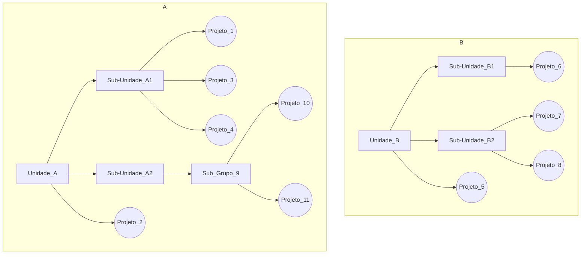

# Política de Uso
Para uma melhor compreensão de regras adotadas no uso do Gitlab, exemplifica-se a estrutura de seu funcionamento no qual existem **Grupos** (retângulos) e **Projetos** (círculos). Cada grupo pode ter permissões diferentes, porém seguem a herança do grupo superior e cada projeto segue a herança do grupo. Todavia, os projetos e grupos podem ter permissões diferentes e também diferentes membros.

Com base nessa estrutura, os Grupos e Projetos seguem as seguintes diretrizes abaixo.
   

## Regras e Normas
Para uma organização na utilização das ferramentas, algumas regras foram definidas para que seja mantido o padrão no seu uso, sendo elas:

### Git
Abaixo estão as regras e normas definidas para a utilização do Git.
  
####  Unidade
Todo projeto estará vinculado a uma unidade (ou sub-unidade), podendo haver projetos agrupados em eixos temáticos. Os projetos devem estar vinculados a área correspondente no sistema **Gestão**. 
   * Exemplo: Sistema SCBA está vinculado no Gestão a unidade DTI/CGS/CSAB, logo, no Git deve estar dentro da mesma estrutura, porém pode haver um agrupador Bolsas (DTI/CGS/CSAB/Bolsas/SCBA).
 

* **Nomenclatura** - O nome das unidades devem ser os acrônimos, porém contendo na descrição o seu significado. Os demais grupos e projetos devem ser concisos e vinculados à tecnologia ou ferramenta. Isto permite que mudanças de tecnologia ou ferramenta não criem confusão no futuro. Exemplo: Projeto do Git chama-se "Gitlab". 
 

* **Ícone (imagem)** - as unidades não podem conter imagens (determinação CCS), porém os demais grupos e projetos podem. Isso também ajuda na identificação de grupos que na verdade são unidades organizacionais.
   

#### Permissões
Define os níveis de permissão para os usuários da ferramenta, sendo que há dois contextos
* **Projetos** - os membros dos projetos podem ter alguns tipos de permissões[^PermissionGitlab]. Para um quadro completo das permissões vide a tabela [Detalhes das Permissões](#Detalhes das Permissões)

| **Permissão**  | **Descrição**                                                                                          | **Quando Utilizar**                                     |
| ---------------|------------------------------------------------------------------------------------------------------- | ------------------------------------------------------- |
| **Guests**     | não podem contribuir e somente podem ver e deixar comentários.                                          | Usuários Convidados visualizar.                          |
| **Reporters**  | podem contribuir parcialmente, não podendo escrever no repositório mas podem nas *issues*.              | Usuários Convidados que querem abrir tarefas (*issues*). |
| **Developers** | são contribuidores diretos e podem acessar tudo, ao menos que haja restrições explícitas como em *branches* protegidas. | Usuários que desenvolvem.                |
| **Maintainers**| são os "super desenvolvedores" que podem submeter código para o *master* e fazer *deploy* em produção. Normalmente os *maintainers* são os cargos de gerência.    | Usuários **Gerentes** (responsáveis pelo respectivo sistema conforme [Gestão](https://gestao.capes.gov.br) e **Coordenadores** (da respectiva unidade). |
| **Owners**     | em essência são os administradores dos grupos. Eles podem dar acesso além de capacidades destrutivas.  | Usuários Administradores do Gitlab.  O Uso do **segundo fator de autenticação é obrigatório** para esses usuários.                       |
| **Admin-only** | funcionalidade somente na área "/admin". Fora disso, eles tem o maior nível de permissão que é *owner*.| Usuários Administradores do Gitlab.  O Uso do **segundo fator de autenticação é obrigatório** para esses usuários.                       |
  

* **Grupos** - 
   

#### Configurações dos Projetos
O perfil que cria/altera/apaga projetos é segmentado utilizando a seguinte lógica:
 

* **Visibilidade** - define os níveis de permissão para os usuários da ferramenta, sendo que há dois contextos
  * **Projetos** 
 

* **Documentação (Wiki)** - a documentação do serviços e sistemas dos projetos armazenados no Git devem utilizar o recurso **Wiki** em cada repositório. Para manter coesão dos assuntos, a estrutura de índice da  Wiki deve ser seguida em todas as páginas, conforme o menu lateral dessa página. Vide [Procedimentos Operacionais](Git/procedimentos-operacionais) para verificar como fazer isso.

* **Snippets** - 

   
### MChat
* **Equipes** -

* **Canais** -

* **Integrações com Gilab** - 

   
## Usuários
* **Login**  - tanto o **Git** quanto o **MChat** podem ser acessados por qualquer usuário da Rede CAPES utilizando seu login de rede.
 

* **Projetos Pessoais** - é permitido a criação de projetos por usuário, porém de forma limitada, evitando a criação desnecessária e aumento da área de armazenamento.
  * **Limite** - 5 projetos

    
# Detalhes das Permissões
As ações de cada tipo de permissões dos membros do projeto podem ser[^PermissionGitlab]:

| Action                                        | Guest | Reporter | Developer | Maintainer | Owner |
|-----------------------------------------------|-------|----------|-----------|------------|-------|
| Download project                              | ✓ (1) | ✓        | ✓         | ✓          | ✓     |
| Leave comments                                | ✓ (1) | ✓        | ✓         | ✓          | ✓     |
| View Insights charts                          | ✓     | ✓        | ✓         | ✓          | ✓     |
| View approved/blacklisted licenses            | ✓     | ✓        | ✓         | ✓          | ✓     |
| View license management reports               | ✓ (1) | ✓        | ✓         | ✓          | ✓     |
| View Security reports                         | ✓ (1) | ✓        | ✓         | ✓          | ✓     |
| View Dependency list                          | ✓ (1) | ✓        | ✓         | ✓          | ✓     |
| View Design Management pages                  | ✓ (1) | ✓        | ✓         | ✓          | ✓     |
| View project code                             | ✓ (1) | ✓        | ✓         | ✓          | ✓     |
| Pull project code                             | ✓ (1) | ✓        | ✓         | ✓          | ✓     |
| View GitLab Pages protected by access control | ✓     | ✓        | ✓         | ✓          | ✓     |
| View wiki pages                               | ✓ (1) | ✓        | ✓         | ✓          | ✓     |
| See a list of jobs                            | ✓ (3) | ✓        | ✓         | ✓          | ✓     |
| See a job log                                 | ✓ (3) | ✓        | ✓         | ✓          | ✓     |
| Download and browse job artifacts             | ✓ (3) | ✓        | ✓         | ✓          | ✓     |
| Create new issue                              | ✓ (1) | ✓        | ✓         | ✓          | ✓     |
| See related issues                            | ✓     | ✓        | ✓         | ✓          | ✓     |
| Create confidential issue                     | ✓ (1) | ✓        | ✓         | ✓          | ✓     |
| View confidential issues                      | -2    | ✓        | ✓         | ✓          | ✓     |
| Assign issues                                 |       | ✓        | ✓         | ✓          | ✓     |
| Label issues                                  |       | ✓        | ✓         | ✓          | ✓     |
| Lock issue threads                            |       | ✓        | ✓         | ✓          | ✓     |
| Manage issue tracker                          |       | ✓        | ✓         | ✓          | ✓     |
| Manage related issues                         |       | ✓        | ✓         | ✓          | ✓     |
| Manage labels                                 |       | ✓        | ✓         | ✓          | ✓     |
| Create code snippets                          |       | ✓        | ✓         | ✓          | ✓     |
| See a commit status                           |       | ✓        | ✓         | ✓          | ✓     |
| See a container registry                      |       | ✓        | ✓         | ✓          | ✓     |
| See environments                              |       | ✓        | ✓         | ✓          | ✓     |
| See a list of merge requests                  |       | ✓        | ✓         | ✓          | ✓     |
| View project statistics                       |       | ✓        | ✓         | ✓          | ✓     |
| View Error Tracking list                      |       | ✓        | ✓         | ✓          | ✓     |
| Pull from Maven repository or NPM registry    |       | ✓        | ✓         | ✓          | ✓     |
| Publish to Maven repository or NPM registry   |       |          | ✓         | ✓          | ✓     |
| Upload Design Management files                |       |          | ✓         | ✓          | ✓     |
| Create new branches                           |       |          | ✓         | ✓          | ✓     |
| Push to non-protected branches                |       |          | ✓         | ✓          | ✓     |
| Force push to non-protected branches          |       |          | ✓         | ✓          | ✓     |
| Remove non-protected branches                 |       |          | ✓         | ✓          | ✓     |
| Create new merge request                      |       |          | ✓         | ✓          | ✓     |
| Assign merge requests                         |       |          | ✓         | ✓          | ✓     |
| Label merge requests                          |       |          | ✓         | ✓          | ✓     |
| Lock merge request threads                    |       |          | ✓         | ✓          | ✓     |
| Manage/Accept merge requests                  |       |          | ✓         | ✓          | ✓     |
| Create new environments                       |       |          | ✓         | ✓          | ✓     |
| Stop environments                             |       |          | ✓         | ✓          | ✓     |
| Add tags                                      |       |          | ✓         | ✓          | ✓     |
| Cancel and retry jobs                         |       |          | ✓         | ✓          | ✓     |
| Create or update commit status                |       |          | ✓         | ✓          | ✓     |
| Update a container registry                   |       |          | ✓         | ✓          | ✓     |
| Remove a container registry image             |       |          | ✓         | ✓          | ✓     |
| Create/edit/delete project milestones         |       |          | ✓         | ✓          | ✓     |
| Use security dashboard                        |       |          | ✓         | ✓          | ✓     |
| View vulnerabilities in Dependency list       |       |          | ✓         | ✓          | ✓     |
| Create issue from vulnerability               |       |          | ✓         | ✓          | ✓     |
| Dismiss vulnerability                         |       |          | ✓         | ✓          | ✓     |
| Apply code change suggestions                 |       |          | ✓         | ✓          | ✓     |
| Create and edit wiki pages                    |       |          | ✓         | ✓          | ✓     |
| Rewrite/remove Git tags                       |       |          | ✓         | ✓          | ✓     |
| Use environment terminals                     |       |          |           | ✓          | ✓     |
| Run Web IDE’s Interactive Web Terminals       |       |          |           | ✓          | ✓     |
| Add new team members                          |       |          |           | ✓          | ✓     |
| Enable/disable branch protection              |       |          |           | ✓          | ✓     |
| Push to protected branches                    |       |          |           | ✓          | ✓     |
| Turn on/off protected branch push for devs    |       |          |           | ✓          | ✓     |
| Enable/disable tag protections                |       |          |           | ✓          | ✓     |
| Edit project                                  |       |          |           | ✓          | ✓     |
| Add deploy keys to project                    |       |          |           | ✓          | ✓     |
| Configure project hooks                       |       |          |           | ✓          | ✓     |
| Manage Runners                                |       |          |           | ✓          | ✓     |
| Manage job triggers                           |       |          |           | ✓          | ✓     |
| Manage variables                              |       |          |           | ✓          | ✓     |
| Manage GitLab Pages                           |       |          |           | ✓          | ✓     |
| Manage GitLab Pages domains and certificates  |       |          |           | ✓          | ✓     |
| Remove GitLab Pages                           |       |          |           | ✓          | ✓     |
| Manage clusters                               |       |          |           | ✓          | ✓     |
| Manage license policy                         |       |          |           | ✓          | ✓     |
| Edit comments (posted by any user)            |       |          |           | ✓          | ✓     |
| Manage Error Tracking                         |       |          |           | ✓          | ✓     |
| Delete wiki pages                             |       |          |           | ✓          | ✓     |
| View project Audit Events                     |       |          |           | ✓          | ✓     |
| Switch visibility level                       |       |          |           |            | ✓     |
| Transfer project to another namespace         |       |          |           |            | ✓     |
| Remove project                                |       |          |           |            | ✓     |
| Delete issues                                 |       |          |           |            | ✓     |
| Disable notification emails                   |       |          |           |            | ✓     |
| Force push to protected branches (4)          |       |          |           |            |       |
| Remove protected branches (4)                 |       |          |           |            |       |

*(1): All users are able to perform this action on public and internal projects, but not private projects.
*(2): Guest users can only view the confidential issues they created themselves
*(3): If Public pipelines is enabled in Project Settings > CI/CD
*(4): Not allowed for Guest, Reporter, Developer, Maintainer, or Owner

# Referencias
[^PermissionGitlab]: https://about.gitlab.com/handbook/product/index.html#permissions-in-gitlab

