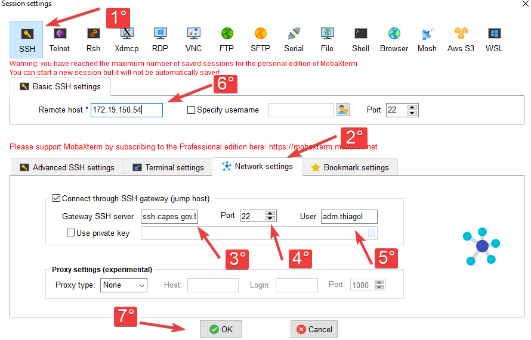

# Visão Geral
Para um controle nos acessos SSH aos servidores, foi implantada a solução **[FreeIPA](https://git.capes.gov.br/cgii/gerenciamento-de-identidade/freeipa)** (acesso restrito) que gerencia as permissões e o controle de acessos dos usuários aos grupos de servidores.

<br><br>

# Como Acessar um Servidor via SSH
## via Mobaxterm no Windows
Utilizando a ferramenta [Mobaxterm](https://mobaxterm.mobatek.net/download-home-edition.html):

1. Clique sobre o botão "SSH".
2. Na sequência pressione o botão "Network settings".
3. Preencha o campo "Gateway SSH server": `ssh.capes.gov.br`
4. Porta padrão: `22`
5. Defina o usuário que acessará os servidores. Exemplo:  `login`  ou  `login@fc.capes.gov.br`
   * Utilizar a conta **adm.xxx** sempre que possível.
6. Defina o servidor que deseja acessar "Remote host".




<br><br>

## via Terminal (CLI)
Em um terminal (Linux, MacOS ou Windows pelo MobaXterm, digite o comando, alterando o `<login>` e o `<servidor_destino>`, conforme necesidade.

```
ssh <login>@fc.capes.gov.br@<servidor_destino>.capes.gov.br -J <login>@ssh.capes.gov.br
```

<br><br>

## via Terminal (CLI) usando um Script
Para agilizar a digitação, um script pode ser usado, para usar o freeipa como gateway de acesso ssh 
> Execute na sua estação trabalho linux, MacOS ou no MobaXterm. Altere o `<login>` com sua conta de Rede CAPES.

* Crie o arquivo com o conteúdo abaixo:
```
vi /usr/bin/gw
```


```
 #!/bin/bash
        if [ -z "$1" ]; then
                ssh -A <login>@fc.capes.gov.br@ipa.hom.capes.gov.br
        else
                ssh -A <login>@fc.capes.gov.br@ipa.hom.capes.gov.br -t "ssh -o StrictHostKeyChecking=no $1"
       fi
```

* Aplique permissão de execução

```
chmod a+x /usr/bin/gw
```

* Agora basta executar 

```
gw <servidor>
```