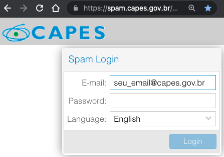
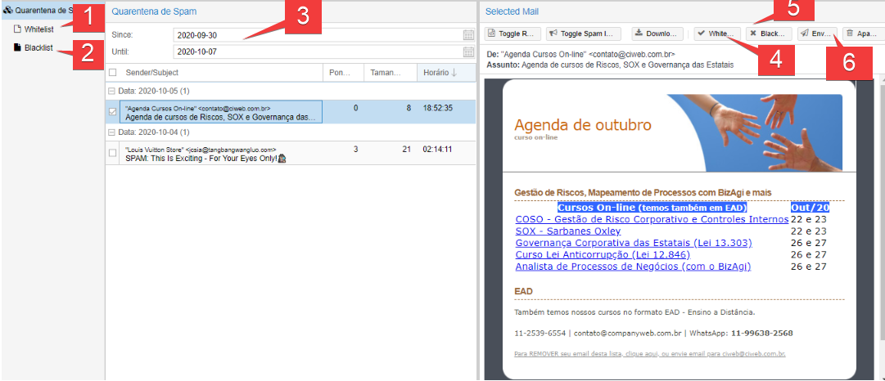

# Spam 
É uma mensagem enviada sem o consentimento do destinatário e que, normalmente, são disparadas para um grande número de contas.

# Quarentena de spam 
É um recurso do agente de Filtro de Conteúdo que reduz o risco de perda de mensagens legítimas. Quando uma mensagem atinge o limite de quarentena de spam, ela é agrupada em uma notificação de falha de entrega e entregue à caixa de correio de quarentena de spam.
 

Com o navegador de sua preferência acesse o endereço:
* https://spam.capes.gov.br.
  * Digite seu e-mail completo incluído o domínio "`seu_email@capes.gov.br`".
  * Digite sua senha, a mesma que você usa para acessar sua conta de e-mail.

Depois de entrar, veja as opções:

* 1 - Mostra os e-mails / domínios que estão na sua *whitelist* (Lista branca).

> **Para que serve a *Whitelist*?** Ela seleciona e repassa aos provedores quais IPs / domínios que você considera idôneos e assim libera a entrega na sua caixa de entrada.

* 2 - Mostra os e-mails / domínios que estão na sua *Blacklist* (Lista Negra)

> **Para que serve a *Blacklist*?** Ela seleciona e repassa aos provedores quais IPs / domínios que você considera impertinente e assim bloqueia a entrega na sua caixa de entrada.

3 - Definir o período que deseja ver seus e-mails que foram direcionados para quarentena. 

> A ferramenta de anti-spam faz uma retenção máxima na quarentena de `60 dias`.

* 4 - No botão *whitelist* você incluirá o e-mail / domínio na sua pessoal (*whitelist*) e e-mail dessa origem não será mais bloqueados. 
* 5 - No botão *blacklist* você incluirá o e-mail / domínio na sua pessoal (*blacklist*) e e-mail dessa origem será bloqueados permanentemente.
  * Vale salientar que uma vez o e-mail / domínio incluído na blacklist não será possível de recuperação e será descartado pela 
ferramenta de AntiSpam. 

* 6 - Caso você tenha interesse no o e-mail bloqueado na quarentena, clique no botão enviar e você receberá o e-mail na sua caixa. 

