- [Tratando SPAMs](#tratando-spams)
  - [Reconhecendo e-mails indesejados](#reconhecendo-e-mails-indesejados)
    - [Links Maliciosos](#links-maliciosos)
  - [Verificando o remetente](#verificando-o-remetente)
    - [Webmail](#webmail)
  - [Em Dispositivos Móveis](#em-dispositivos-móveis)
    - [Android](#android)
    - [IOS](#ios)
    - [Outlook](#outlook)
      - [Abrindo a Mensagem](#abrindo-a-mensagem)
    - [Visualização do Remetente](#visualização-do-remetente)
  - [Enviando um e-mail indesejado para análise/bloqueio](#enviando-um-e-mail-indesejado-para-análisebloqueio)
    - [Salvando e submetendo o e-mail original](#salvando-e-submetendo-o-e-mail-original)
- [Quarentena de SPAM](#quarentena-de-spam)

  

Apesar da CAPES possuir mecanismos para bloqueio contra SPAM e outras ameaças, alguns desses e-mails indesejados acabam passando pelo mecanismo. Neste momento, é importante saber interpretar e tratar corretamente.
> **O que é SPAM?** - É uma mensagem enviada sem o consentimento do destinatário e que, normalmente, são disparadas para um grande número de contas.

 

# Tratando SPAMs

## Reconhecendo e-mails indesejados
Algumas boas práticas são importantes ao se receber um e-mail, como regra geral, verifique:
* Se o remetente é conhecido ou de um domínio oficial.
* Mensagens com ofertas muito lucrativas sem precedentes como prêmios, viagens, smartphones e carros, solicitando urgência na resposta à mensagem.
* Frases com abordagem de ameaça como “seu serviço será suspenso se…” ou “sua conta foi bloqueada, clique aqui para verificar”.
* Solicitação de senhas ou dados sensíveis.
* Conteúdo com links que submetem para endereços falsos. Antes de clicar passe o mouse em cima do link para ver a URL.
* Links encurtados (tipo bit.ly).
* Mensagens com falhas grosseiras no aspecto visual, como figuras faltantes, itens desalinhados, imagens de qualidade ruim ou erros gramaticais;

 

### Links Maliciosos
Como é possível colocar qualquer endereço web (hiperlink) no conteúdo de um texto é `extremamente importante` verificar se o endereço é confiável, sempre antes de clicar.

Observe o exemplo abaixo, no qual o texto mostra um endereço, mas o endereço real, ao passar o mouse em por cima `sem clicar` é outro. O texto diz um endereço, mas o hiperlink aponta para um domínio que não é da CAPES, pois o domínio oficial do órgão é "`capes.gov.br`".

* **Link Malicioso para domínio falso**

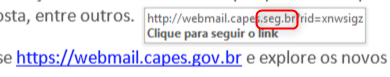

>:warning: **Importante:** Nunca clique em links que não tenha certeza!

  

## Verificando o remetente
Existem algumas formas de verificar o endereço de e-mail do remetente. Isto ajuda a verificar se o e-mail não está sendo forjado, onde o nome de exibição tenta ludibriar o usuário.

### Webmail
Para verificar o endereço de e-mail através do Webmail, selecione a mensagem e verifique o nome e e-mail exibido no cabeçalho. Exemplo:

* **Remetente Válido**

* **Remetente Falso** - Observe o endereço de e-mail e principalmente o `domínio`.

  
## Em Dispositivos Móveis
Para verificar o endereço de e-mail através do aplicativo do celular, abra a mensagem e expanda o cabeçalho. Exemplo:

### Android
* **Remetente Válido** 

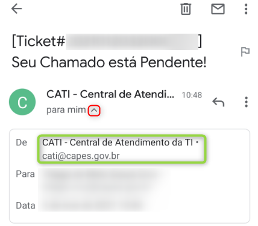

* **Remetente Falso** - Observe o endereço de e-mail e principalmente o `domínio`.

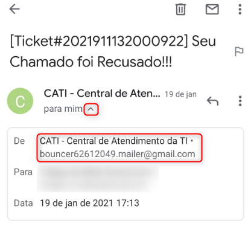

  

### IOS
* **Remetente Válido** 

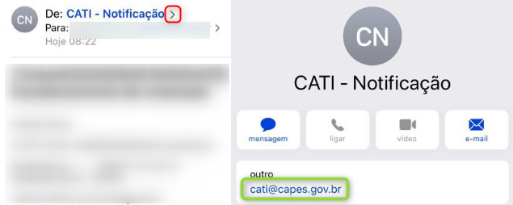

* **Remetente Falso** - Observe o endereço de e-mail e principalmente o `domínio`.

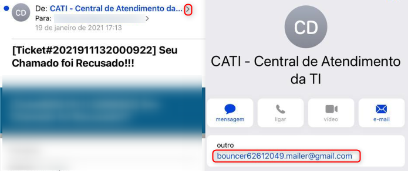

  

### Outlook
Pelo Microsoft Outlook, duas formas são possíveis de verificar o e-mail de um remetente:

#### Abrindo a Mensagem
Ao abrir a mensagem, pelo cabeçalho é possível verificar o remetente. Exemplo:

* **Remetente Válido**
  
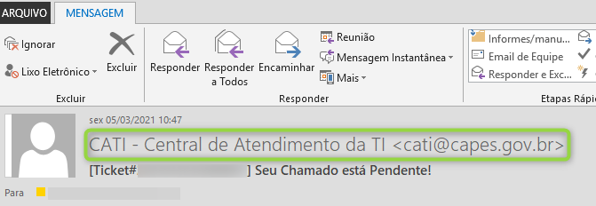

* **Remetente Falso** - Observe o endereço de e-mail e principalmente o `domínio`.

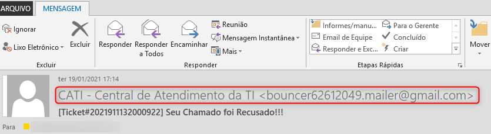

  
### Visualização do Remetente
Na visualização de uma caixa postal, por padrão, o Outlook não exibe o endereço de e-mail do remetente em suas colunas, apenas o nome, o que pode ser facilmente forjado, porém é possível incluir uma nova coluna que mostre o e-mail do remetente, para isto, siga os passos abaixo:

* 1. Abra seu Microsoft Outlook e selecione sua **caixa de entrada**.

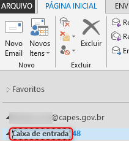

  
* 2. Vá no menu "**Exibição > Adicionar Colunas**"
> :blue_book: Infelizmente essa alteração é válida somente para a caixa/pasta selecionada, sendo necessário realizar a operação para cada pasta desejada.

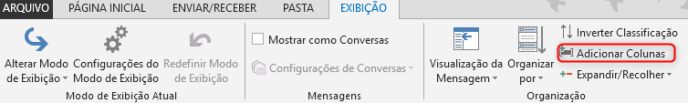

  
* 3. Adicione uma **nova coluna** com:
  * **Nome**: `Remetente`
  * **Tipo**: `Fórmula`
  * **Fórmula**: `IIf(InStr([SearchFromEmail], "@") = 0, "", right([SearchFromEmail],len([SearchFromEmail])))`

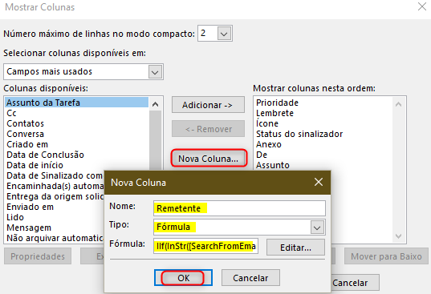

  
* 4. Pronto! Agora você pode ver o endereço de **e-mail do remetente**, quando o mesmo for de uma origem externa.
> :warning: O exemplo abaixo mostra um caso de *phishing* no qual o remetente forjou o nome de exibição com o nome do sistema CATI. **Note o endereço de e-mail**!

> :blue_book: Os e-mails dos usuários internos do sistema não são exibidos.

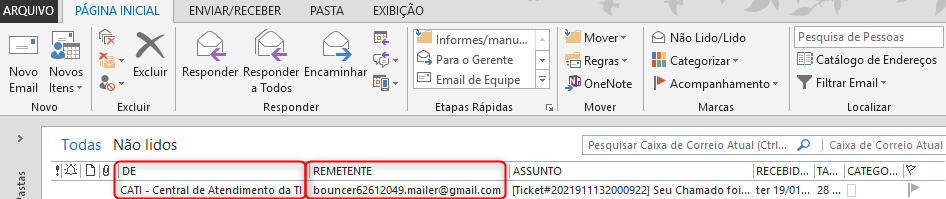

   

## Enviando um e-mail indesejado para análise/bloqueio
Quando desconfiar de algum e-mail, é importante notificar a DTI para que uma análise mais minuciosa seja feita. Quando um SPAM/Phishing é identificado pela equipe da DTI, procede-se com o bloqueio do remetente e links possivelmente maliciosos.
Isto ajuda a evitar que outros usuários recebam a mensagem não solicitada.

### Salvando e submetendo o e-mail original
* Salve a mensagem original. Para preservar todas as informações do e-mail original, siga os passos de `A` até `C`.
* Depois, abra um CATI, anexando o e-mail salvo, enviando um e-mail para cati@capes.gov.br .

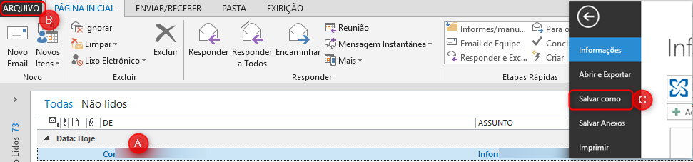

   

# Quarentena de SPAM
É um recurso do serviço anti-SPAM que reduz o risco de perda de mensagens legítimas (falso-positivo), isto é, toda mensagem considerada SPAM é retida (quarentena) e pode ser visualizada pelo dono da caixa postal. Caso alguma mensagem tenha sido bloqueada indevidamente pelo serviço, pode-se solicitar o envio, da seguinte forma:

Com o navegador de sua preferência acesse o endereço:
* https://spam.capes.gov.br.
  * Digite seu e-mail completo incluído o domínio "`seu_email@capes.gov.br`".
  * Digite sua senha, a mesma que você usa para acessar sua conta de e-mail.

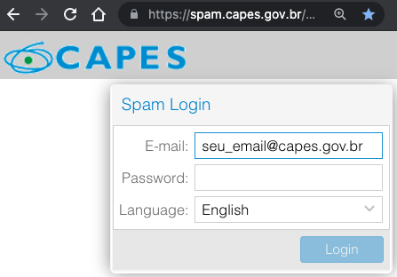

Depois de entrar, veja as opções:

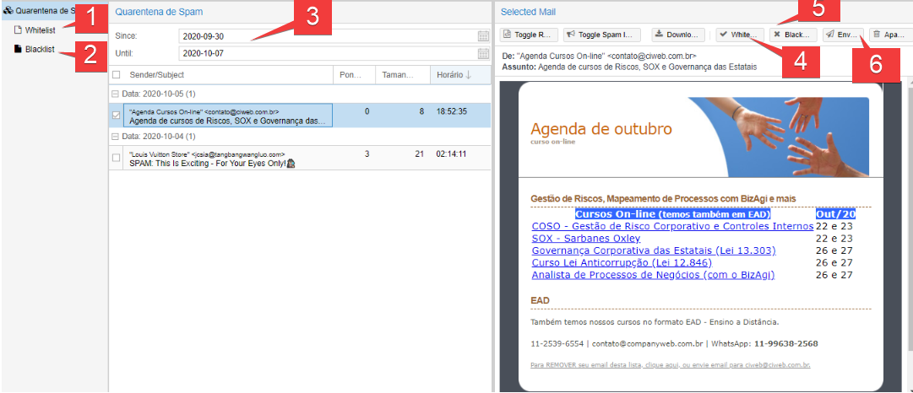

* 1 - Mostra os e-mails / domínios que estão na sua *whitelist* (Lista branca).

> **Para que serve a *Whitelist*?** Ela seleciona e repassa aos provedores quais IPs / domínios que você considera idôneos e assim libera a entrega na sua caixa de entrada.

* 2 - Mostra os e-mails / domínios que estão na sua *Blacklist* (Lista Negra)

> **Para que serve a *Blacklist*?** Ela seleciona e repassa aos provedores quais IPs / domínios que você considera impertinente e assim bloqueia a entrega na sua caixa de entrada.

* 3 - Definir o período que deseja ver seus e-mails que foram direcionados para quarentena. 

> A ferramenta de anti-spam faz uma retenção máxima na quarentena de `60 dias`.

* 4 - No botão *whitelist* você incluirá o e-mail / domínio na sua pessoal (*whitelist*) e e-mail dessa origem não será mais bloqueados. 
* 5 - No botão *blacklist* você incluirá o e-mail / domínio na sua pessoal (*blacklist*) e e-mail dessa origem será bloqueados permanentemente.
> Vale salientar que uma vez o e-mail / domínio incluído na blacklist não será possível de recuperação e será descartado pela 
ferramenta de AntiSpam. 
  

* 6 - Caso você tenha interesse no o e-mail bloqueado na quarentena, clique no botão enviar e você receberá o e-mail na sua caixa. 