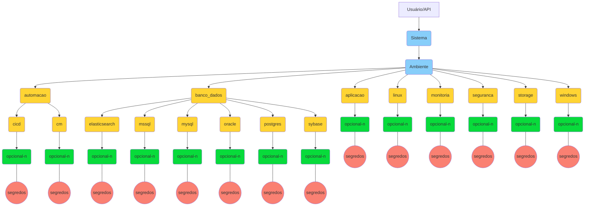
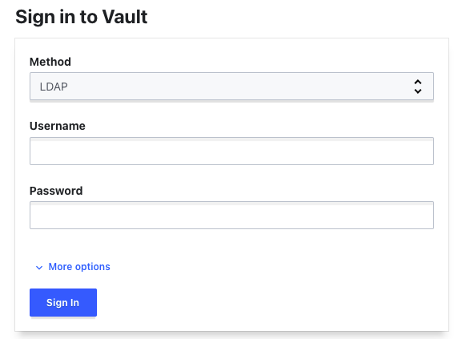

- [Visão Geral](#visão-geral)
- [Normas Gerais de Uso](#normas-gerais-de-uso)
  - [Nomenclatura](#nomenclatura)
    - [Estrutura dos Segredos](#estrutura-dos-segredos)
  - [Permissões](#permissões)
    - [Tabela de Controle de Acesso](#tabela-de-controle-de-acesso)
- [Como Acessar o Cofre de Senhas Vault](#como-acessar-o-cofre-de-senhas-vault)
  - [Interface Web](#interface-web)
  - [API](#api)
    - [Listar os Segredos](#listar-os-segredos)
- [Integração via OpenShift (Chart)](#integração-via-openshift-chart)

<br><br>

# Visão Geral
No gerenciamento de um ambiente computacional com certa complexidade, como o da CAPES, o gerenciamento das senhas de serviço (senhas não pessoais) que integram os serviços, sistemas e bancos de dados entre outros, se faz necessário. Entretanto, obviamente, o controle com uso de planilhas, e-mail e ferramentas descentralizadas trazem vulnerabilidades e problemas em tal gerenciamento. 

Com isto, a DTI/CGII implantou um **[Cofre de Senhas](https://git.capes.gov.br/cgii/seguranca/vault)** (acesso restrito), utilizando o software **Vault** da empresa Hashicorp, que centraliza tais dados sensíveis (segredos) e permite o compartilhamento das contas com colaboradores e também através do uso de API, para as automações necessárias.

<br><br>

# Normas Gerais de Uso

* **Segredos** - todos os segredos - contas (usuário/senhas) de serviço, banco de dados, contas locais e de super-usuários (root, admin, sa, administrador), certificados, tokens e entre outros - utilizados para o funcionamento do ambiente computacional, deverão ser armazenados no Cofre de Senhas.

<br>

* **Permissões** - as contas locais de administração (root, admin...) serão compartilhadas com os administradores respectivos da ferramenta, **quando estritamente necessário**, pois a regra padrão é que os sistemas permitam o uso de contas pessoais, integradas ao LDAP/AD quando possível, para que seja usado a conta de perfil de administrativo (`adm.<login>`), ou seja, o login com contas impessoais (root, admin...) somente será feito quando não houver outra opção.
   * [Tabela de Controle de Acesso](#permissões) - a tabela detalhes sobre a norma padrão no compartilhamento dos segredos com as equipes.
   * Os usuários com acesso no Cofre de Senhas serão concedidos mediante autorização da coordenação da DTI.

<br>

* **Complexidade da senha** - define o número mínimo de caracteres que a senha deve conter, conforme [portaria nº179, de 9 de Novembro de 2021](http://cad.capes.gov.br/ato-administrativo-detalhar?idAtoAdmElastic=7762#anchor).


<br>

* **Criação / Alteração / Exclusão** - tais ações nos segredos, para o ambiente de produção, requer o [registro de uma mudança](https://git.capes.gov.br/cgii/ccm/gmud/wikis/home). Para o ambiente DHT, não há necessidade.
  * **Ambiente DHT** - considera-se DHT (não produção) os ambientes "Desenvolvimento", "Homologação", "Teste" e "PreProd".


> :blue_book: As exceções a estas regras devem ser registradas via CATI sendo necessário autorização da coordenação.

<br>

## Nomenclatura 
### Estrutura dos Segredos
A estrutura do Cofre de Senhas foi definida de forma que os segredos fiquem organizados de acordo com o sistema a qual o segredo corresponde. Além de facilitar a criação de políticas no compartilhamento com os usuários, quando um sistema for descontinuado, a exclusão também será fácilitada.

Os segredos foram hierarquizados em sub-pastas ou caminhos (*paths*), considerando a ***secret engine*** do tipo `chave-valor`, pois este será o mecanismo mais utilizado para o armazenamento dos segredos. Para as demais *secret engines* adota-se o caminho raiz com o nome do próprio *secret engine*, exemplo: `ssh_<sistema>`.
> ***Secret Engine*** - O Cofre de Senha possui mecanismos diferentes para o armazenamento de segredos (ssh, totp, pki), porém esta documentação é voltada para o de **chave-valor** (KV - *Key Value*).

Em resumo, os segredos (senhas, certificados, tokens...) são armazenados na hierarquia, definida abaixo, e compartilhada com as equipes. O acesso aos segredos pode ser feito via API ou pela interface web, com o login da Rede CAPES.

A estrutura criada para armazenar os segredos segue as diretriz:
* **AZUL** - é **mandatório** e indicarão o nome do **sistema** e o **ambiente**. 
  * **IMPORTANTE**: O nome do sistema será exatamente igual ao cadastrado no projeto do Git. Havendo nome igual, recomenda-se alteração do nome no Git. 
    * Exemplo: Para o projeto `https://git.capes.gov.br/dti/orientacoes-gerais/guia`, considera-se o nome do sistema `guia`.

<br>

* **AMARELO** - irá variar de acordo com a necessidade do sistema, isto é, não haverá necessariamente toda as pasta (storage, automacao...), porém deverão ser usados os nomes aqui padronizados, de forma a facilitar a criação das políticas de compartilhamento. <br>

<br>

* **VERDE** - são sub-pastas que não tem um critério de nome, podendo existir ou não. Servirá como forma de organizar ainda mais os segredos. Entretanto, não haverá criação de políticas neste nível, somente no nível superior (amarelo).

<br> 

* **VERMELHO** - local dos segredos.

> Exemplo: Para o sistema "sucupira", o segredo do banco de dados Oracle de homologação, será armazenado no Cofre de Senhas no local: `sucupira/hom/banco_dados/oracle`




<br><br><br>

## Permissões

O acesso aos segredos serão concedidos conforme necessidade de uso, mediante justificativa. Todavia, grupos pré-definidos são utilizados no compartilhamento dos segredos com as equipes que atuam em determinada categoria (linux, windows...). A tabela abaixo mostra a regra padrão adotada.

<br>

### Tabela de Controle de Acesso
Definições:
* **Admin** - grupo com perfil de administrar todo o cofre.
* **Gerente** - grupo de usuários com privilégios de escrita (criação/alteração) dos segredos.
* **Equipe** - grupo de usuários com privilégios de leitura apenas aos segredos.
* **R** - permissão de leitura (*read*).
* **RW** - permissão de leitura (*read*) e escrita (*write*).

| **Pasta** | **Objetivo** | **Permissões** |
| --------- | ------------ | -------------- |
| **sistema** exemplo:<br>`sucupira` | Raiz da estrutura onde estarão os segredos daquele respectivo sistema. | Admin do Cofre (RW) |
| **ambiente**, podendo ser:<br>`teste` <br>`des` <br>`hom` <br>`preprod` <br>`prod` | Ambiente a qual se destina tais segredos. | Admin do Cofre (RW) |
| --------- | ------------ | -------------- |
| `automacao/cicd` | ***Continuous Integration / Continuous Deployment***: segredos usados por ferramentas de tal categoria como: OpenShift, Gitlab. | Gerente de Infraestrutura (RW)<br><br>Gerente de DevOps (RW) <br><br>Equipe API CICD (Contas de integração) (R) |
| `automacao/cm` | ***Configuration Management***: segredos usados por ferramentas de tal categoria como: Ansible, Foreman, Puppet. | Gerente de Infraestrutura (RW) <br><br>Equipe API CM (Contas de integração) (R) |
| `banco_dados` e seus tipos:<br>`elasticsearch`<br>`mssql`<br>`mysql`<br>`oracle`<br>`postgres`<br>`sybase` | Segredos das bases de dados. |  Gerente de Infraestrutura (RW)<br>Gerente de Banco de Dados (RW)<br>Equipe de Banco de Dados (R)<br><br>Equipe API CICD (Contas de integração) (R)<br>Equipe API CM (Contas de integração) (R)<br><br>Equipe de Linux (R) <br><br>Equipe de Segurança (R)<br><br>Equipe de Desenvolvimento (R - **somente para DHT**)|
| `aplicacao` | Segredos utilizados para o acesso ao sistema. Normalmente são as contas "admin" das aplicações. | Gerente de Infraestrutura (RW) <br><br>Equipe da Aplicação (**grupo específico quando necessário**) (R)|
| `storage` | Segredos do sistema de armazenamento. |  Gerente de Infraestrutura (RW) <br><br>Equipe de Storage (R) |
| `windows` | Segredos que sejam do sistema operacional Windows, como contas de serviço e administrador. | Gerente de Infraestrutura (RW) <br><br>Equipe de Windows (R) |
| `linux` | Segredos que sejam do sistema operacional Linux, como contas de serviço e root. |  Gerente de Infraestrutura (RW) <br><br>Equipe de Linux (R) |
| `seguranca` | Segredos que ficarão mais restritos, à equipe de segurança. |  Gerente de Infraestrutura (RW) <br><br>Equipe de Segurança (R) |
| `monitoria` | Segredos utilizados pela equipe de monitoramento | Gerente de Infraestrutura (RW) <br><br>Equipe de Monitoramento(R) <br><br>Equipe de Segurança(R) <br><br>Equipe de Windows(R)<br><br>Equipe de Linux(R) |


<br><br>

# Como Acessar o Cofre de Senhas Vault
Veja abaixo as formas para acessar o Cofre de Senhas Vault.

> :blue_book: Com base nas definições acima, somente usuários previamente cadastradas poderão ter acesso aos segredos. As solicitações são feitas pelo CATI.

<br>

## Interface Web
O acesso a ferramenta Vault pode ser feito feito da seguinte forma:
* Acesse a URL https://cofre.capes.gov.br:8200/ui/vault/auth?with=ldap
* Pelo **Método** `LDAP`, entre com as credenciais:
  * **Username**: 
    * `<login>` - conta de Rede da CAPES.
    * `<adm.login>` - para usuários administradores do Cofre (conta administrativa).
  * **Password**: `<senha_da_rede>`





<br>

## API
Também é possível usar a API para ver os segredos.  
> Para a listagem completa, vide [documentação do fabricante](https://www.vaultproject.io/api-docs).

Um dos métodos é acessar a ferramenta com o Token do usuário. Para conseguir um token, faça login pela [Interface Web](#interface-web) e no menu do canto superior direito, clique em `copy token`.

> :blue_book: Os exemplos abaixo utilizam o *token* como uma variável de ambiente (`$TOKENVAULT`), porém poderia ser informado o token na própria requisição, porém **não é recomendado**.

<br>

### Listar os Segredos 
Segue exemplo de como listar os segredos usando a API.
> :warning: O comando utiliza o pacote **jq** para facilitar a visualização da saída, em formato *json*.

* **Lista todas as senhas** - para listar todas as senhas (chave-valor) existentes no segredo `teste_vault/des/banco_dados/oracle`

```bash
curl -sH "X-Vault-Token: $TOKENVAULT" -X GET "https://cofre.capes.gov.br:8200/v1/teste_vault/data/des/banco_dados/oracle" |jq -r '.data.data'
```

Saída do comando:
```yaml
{
  "db1-oracle": "senha_des1",
  "db2-oracle": "senha_des2"
}
```

<br>


* **Lista apenas um valor** - para visualizar apenas o valor da chave `db1-oracle` existente no segredo `teste_vault/des/banco_dados/oracle`

```bash
curl -sH "X-Vault-Token: $TOKENVAULT" -X GET "https://cofre.capes.gov.br:8200/v1/teste_vault/data/des/banco_dados/oracle" |jq -r '.data.data["db1-oracle"]'
```


Saída do comando:
```yaml
senha_des1
```

<br><br>

# Integração via OpenShift (Chart)
A integração entre o Openshift e o Cofre de Senhas é feita através de um [Operator do Kubernetes](https://git.capes.gov.br/cgs/DEVOPS/helm/chart-cofresenha-operator) ([código do operador](https://git.capes.gov.br/cgs/DEVOPS/Operators/cofresenha-operator)).
Foi criado o [*chart*](https://git.capes.gov.br/cgs/DEVOPS/helm/chart-cofresenha) nomeado de `cofresenha` para facilitar a utilização dessa integração. 
> Veja [como usar](/devops/orientacoes-tecnicas/cofre-senha.md).
