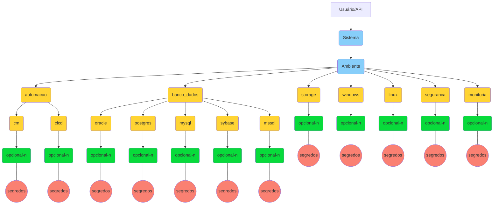

- [Visão Geral](#visão-geral)
- [Normas Gerais de Uso](#normas-gerais-de-uso)
  - [Nomenclatura](#nomenclatura)
    - [Estrutura dos Segredos](#estrutura-dos-segredos)
  - [Permissões](#permissões)
    - [Tabela de Acessos](#tabela-de-acessos)
- [Como Acessar o Cofre de Senhas Vault](#como-acessar-o-cofre-de-senhas-vault)
  - [Interface Web](#interface-web)
  - [API](#api)
    - [Listar os Segredos](#listar-os-segredos)
- [Integração via OpenShift (Chart)](#integração-via-openshift-chart)

<br><br>

# Visão Geral
No gerenciamento de um ambiente computacional com certa complexidade, o gerenciamento das senhas de serviço (senhas não pessoais) que integram os serviços, sistemas e bancos de dados, se faz necessário. O uso de planilhas, e-mail e ferramentas descentralizadas trazem vulnerabilidades problemas na gestão de forma profissional. 

Com isto, a DTI/CGII implantou um **[cofre de senhas](https://git.capes.gov.br/cgii/seguranca/vault)** (acesso restrito), utilizando o software **Vault** da empresa Hashicorp, que centraliza tais dados sensíveis e permite o compartilhamento das contas com colaboradores e também através do uso de API, para as automações necessárias.

<br><br>

# Normas Gerais de Uso

* **Complexidade da senha (PORTARIA EM CONSTRUÇÃO)** - define o número mínimo de caracteres que a senha deve conter.

* **Cadastro e Compartilhamento da senha** - Cada área - CGS (sistemas), CGII (infraestrutura) e NDAC (Banco de Dados) - tem um administrador que é responsáveis por gerenciar o cadastro e compartilhamento necessário das senhas. Via de regra, o compartilhamento é feito da seguinte forma:
    * **Para acesso ao banco de dados** - as senhas que são cadastradas no *datasource* da aplicação são criadas pela área de **banco de dados** e compartilhadas com:
      
      * **Equipe GCM** - para a configuração das aplicações de ambiente DHT (não produção).
      * **Equipe Infraestrutura** - para a configuração das aplicações de ambiente de produção.
      * **Automação via API** - para autoconfiguração

<br>

* **Alteração / Exclusão da senha** - a alteração da senha requer atualização tanto no cofre de senhas quanto na aplicação, sendo necessário o [registro de uma mudança](https://git.capes.gov.br/cgii/ccm/gmud/wikis/home), aplicando-se também para o caso de desativação de uma senha.

* **Contas locais, super usuários e senhas de certificados** - as senhas locais de administração (root, admin, sa, administrador...), normalmente criadas na instalação de um serviço, precisam estar registradas no cofre de senhas e serão compartilhadas apenas com os administradores respectivos daquela ferramenta, **quando estritamente necessário**. Os sistemas que permitem a criação de contas pessoais (ou integradas ao AD), com perfil de administrador devem ser utilizadas sempre que possível.


> :blue_book: As exceções a estas regras devem ser registradas via CATI sendo necessário autorização da coordenação.

<br>

## Nomenclatura 
### Estrutura dos Segredos
A estrutura do cofre de senhas foi definida de forma que os segredos fiquem organizados de acordo com o respectivo sistema, além de facilitar a criação de políticas no compartilhamento com os usuários, quando um sistema form descontinuado, a exclusão dos segredos atrelados também será fácil.

Os segredos foram hierarquizados em sub-pastas ou caminhos (*paths*), considerando o *secret engine* do tipo **chave-valor**, pois este será o mais utilizado. Para os demais *secret engines* adota-se o caminho raiz com o nome do próprio *secret engine*.
> ***Secret Engine*** - O cofre de senha possui mecanismos diferentes para o armazenamento de segredos (ssh, totp, pki), porém essa documentação é voltada para o de **chave-valor** (KV - *Key Value*).

Em resumo, os segredos (senhas, certificados, tokens...) são armazenados na hierarquia, definida abaixo, e compartilhada com as equipes. O acesso aos segredos pode ser feito via API ou pela interface web, com usuário da Rede CAPES.

A estrutura criada para armazenar os segredos segue as diretriz:
* **AZUL** - é **mandatório** e indicarão o nome do **sistema** e o **ambiente**. 
  * **IMPORTANTE**: O nome do sistema será exatamente igual ao cadastrado no Git. Havendo nome igual, recomenda-se alteração do nome no Git.
* **AMARELO** - irá variar de acordo com a necessidade do sistema, isto é, não haverá necessariamente toda as pasta (storage, automacao...), porém deverão ser usados os nomes aqui padronizados, de forma a facilitar a criação das políticas de compartilhamento.
* **VERDE** - são sub-pastas que não tem um critério, podendo existir ou não, servirá como forma de organizar os segredos que possam vir a ter o nome da chave igual, porém atrelados ao mesmo nicho. Entretanto, não haverá criação de políticas neste nível, somente no nível superior (amarelo).
* **Vermelho** - constarão os segredos.

> Exemplo: `sucupira/hom/banco_dados/oracle` - local onde os segredo do sistema "sucupira" no ambiente de homologação, para a categoria de "banco de dados" do tipo "oracle" estarão armazenados.




<br>

## Permissões

O acesso aos segredos no cofre serão concedidos conforme necessidade de uso, mediante justificativa. Todavia, grupos pré-definidos são utilizados no compartilhamento dos segredos com as equipes que atuam em determinada categoria (linux, windows...). A tabela abaixo mostrar a regra padrão adotada.

### Tabela de Acessos

| **Pasta** | **Objetivo** | **Permissões** |
| --------- | ------------ | -------------- |
| **sistema** exemplo:<br>`sucupira` | Raiz da estrutura onde estarão os segredos daquele respectivo sistema. | Gerente do Cofre (RW) |
| **amiente**, podendo ser:<br>`teste` <br>`des` <br>`hom` <br>`preprod` <br>`prod` | Ambiente a qual se destina tais segredos. | Gerente do Cofre (RW) |
| --------- | ------------ | -------------- |
| `automacao` | Pasta contendo as demais sub-pastas contendo os segredos usados para as integrações automatizadas. | Contas de integração (R) |
| `cm` | ***Configuration Management***: segredos usados por ferramentas de tal categoria como: Ansible, Foreman, Puppet. | Equipe de Infraestrutura (RW) |
| `cicd` | ***Continuous Integration / Continuous Deployment***: segredos usados por ferramentas de tal categoria como: OpenShift, Gitlab. | Equipe de Infraestrutura (RW)<br>Equipe DevOps (RW) <br>Equipe de Desenvolvimento (RW - **somente para DHT**) |
| `banco_dados` | Segredos das bases de dados. |  <br>Equipe de Banco (RW) <br>Equipe de Infraestrutura (R) <br>Equipe de Desenvolvimento (R - **somente para DHT**)|
| `storage` | Segredos do sistema de armazenamento. |  Equipe Storage (RW) |
| `windows` | Segredos que sejam do sistema operacional Windows, como contas de serviço e administrador. |  Equipe Windows (RW) |
| `linux` | Segredos que sejam do sistema operacional Linux, como contas de serviço e root. |  Equipe Linux (RW) |
| `seguranca` | Segredos que ficarão mais restritos, à equipe de segurança. |  Equipe Segurança (RW) |
| `monitoria` | Segredos utilizados pela equipe de monitoramento | Equipe Monitoramento(RW) <br>Equipe Segurança(R) <br>Equipe Windows(R)<br>Equipe Linux(R) |


<br><br>

# Como Acessar o Cofre de Senhas Vault
Veja abaixo as formas para acessar o Cofre de Senhas Vault.

> :blue_book: Com base nas definições acima, somente usuários previamente cadastradas poderão ter acesso aos segredos. As solicitações são feitas pelo CATI.

<br>

## Interface Web
O acesso a ferramenta Vault pode ser feito feito da seguinte forma:
* Acesse a URL https://cofre.capes.gov.br:8200
* Selecione o **Método** `LDAP`
  * **Username**: 
    * <login> - conta de Rede da CAPES
    * <adm.login> - usuários administradores do Cofre (conta administrativa).
  * **Password**: <senha_da_rede>


<br>

## API
Também é possível usar a API para ver os segredos.  
> Para a listagem completa, vide [documentação do fabricante](https://www.vaultproject.io/api-docs).

Um dos métodos é acessar a ferramenta com o Token do usuário. Para conseguir um token, faça login pela [Interface Web](#interface-web) e no menu do canto superior direito, clique em `copy token`.

> :blue_book: Os exemplos abaixo utilizam a chave (token) como uma variável de ambiente (`$TOKENVAULT`), porém poderia ser informado o token na própria requisição, porém **não é recomendado**.

<br>

### Listar os Segredos 
* **Lista todas as senhas** - para listar todas as senhas (chave-valor) existentes no segredo `teste_vault/des/banco_dados/oracle`

```bash
curl -sH "X-Vault-Token: $TOKENVAULT" -X GET "https://cofre.capes.gov.br:8200/v1/teste_vault/data/des/banco_dados/oracle" |jq -r '.data.data'
```

Saída do comando:
```yaml
{
  "db1-oracle": "senha_des1",
  "db2-oracle": "senha_des2"
}
```

<br>


* **Lista apenas um valor** - para visualizar apenas o valor da chave `db1-oracle` existente no segredo `teste_vault/des/banco_dados/oracle`

```bash
curl -sH "X-Vault-Token: $TOKENVAULT" -X GET "https://cofre.capes.gov.br:8200/v1/teste_vault/data/des/banco_dados/oracle" |jq -r '.data.data["db1-oracle"]'
```


Saída do comando:
```yaml
senha_des1
```

<br><br>

# Integração via OpenShift (Chart)

A integração entre o Openshift e o Cofre de Senhas é feita através de um [Operator do Kubernetes](https://git.capes.gov.br/cgs/DEVOPS/helm/chart-cofresenha-operator).
Foi criado o [*chart*](https://git.capes.gov.br/cgs/DEVOPS/helm/chart-cofresenha) nomeado de `cofresenha` para facilitar a utilização dessa integração. 
Veja [como usar](/devops/orientacoes-tecnicas/cofre-senhas.md).