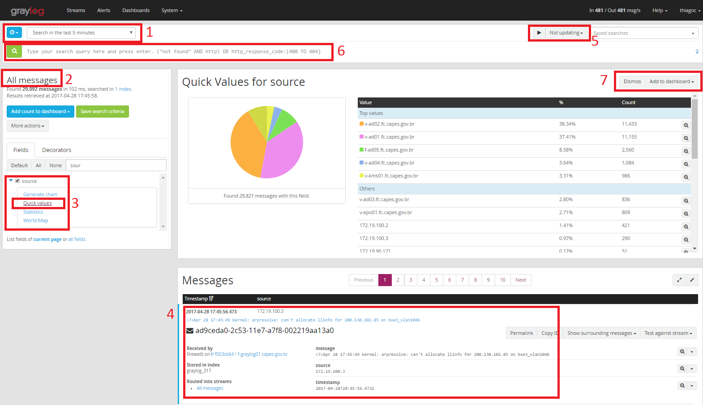
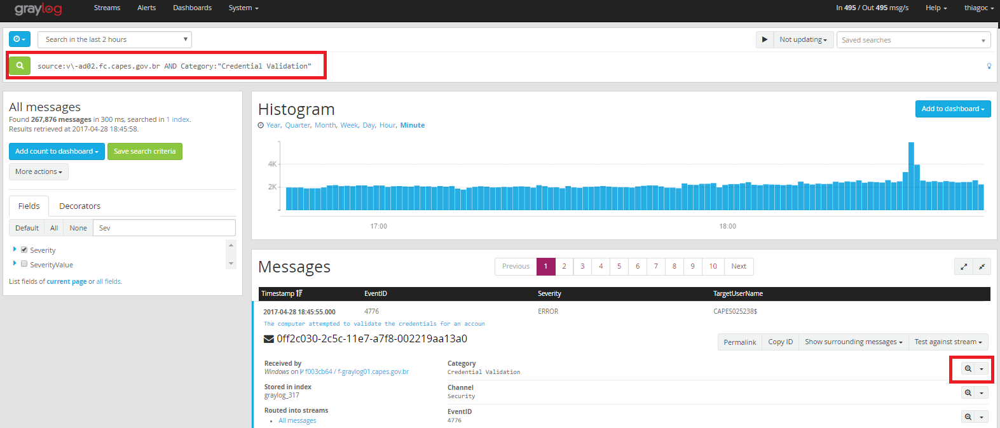

- [Visão Geral](#visão-geral)
- [Uso do SIEM](#uso-do-siem)
  - [Visão da Tela de Pesquisa](#visão-da-tela-de-pesquisa)
  - [Pesquisas Refinadas](#pesquisas-refinadas)
    - [Exemplos](#exemplos)
- [Envio de Logs](#envio-de-logs)
  - [Jboss](#jboss)
    - [JBoss 5.2.0](#jboss-520)
    - [JBoss 6.2](#jboss-62)


<br><br>

# Visão Geral

Alguns tipos de eventos dos servidores, serviços e sistemas necessitam de registro dos eventos (log). Este por sua vez, auxiliam na rastreabilidade de ações, sendo, em alguns casos, necessário a retenção por um longo período.

Para melhorar a análise de tais logs, assim como sua visualização, a DTI/CGII utiliza a ferramenta chamada [Graylog](https://www.graylog.org/), um SIEM (*Security Information and Event Management*) para coletar e centralizar os logs dos diversos ativos do ambiente.

Este guia tem duas visões:
* **Uso do SIEM** - informações sobre como usar a ferramenta.
* **Envio de Logs** - passos necessários para enviar os eventos para a ferramenta. 
  > :warning: Antes de enviar os logs, acione a equipe da CGII, pois pré-ajustes são necessários para a correta recepção dos logs.

<br><br>

# Uso do SIEM
Para acessar a ferramenta, acesse o endereço abaixo com o **login da Rede CAPES**:
* Produção - https://siem.capes.gov.br/
* Homologação - https://siem.hom.capes.gov.br/

> Permissão para Acesso: Os acessos são concedidos mediante solicitação via CATI, onde o usuário ser enquadrado no perfil da respectiva área.

## Visão da Tela de Pesquisa

1. Determina o intervalo no tempo que a pesquisa é feita
1. Mostra qual *stream* você está pesquisando
     *   *Stream* - local para o qual os logs recebidos são roteados e armazenados.
1. Opções para geração de gráficos. Quando o checkbox está marcado, uma coluna com informações daquele campo aparece no resumo da mensagem (item 4)
     * ***Genarate Chart*** - cria um histograma para o campo. Necessário que seja um valor numérico. Com ele é possível mesclar gráficos
     * ***Quick Values*** - mostra os Top valores daquele campo
     * ***Statistics*** - exibe uma tabela com dados estatísticos sobre os valores daquele campo
     * ***World Map*** - mostra, no mapa múndi, a localização do evento (origem ou destino). Necessário que o campo seja uma coordenada geográfica.
1. Exibe o conteúdo da mensagem assim como os seus campos. Exibe também em qual *stream* ela foi roteada, o índice armazenado e seu localizador único
1. Opção que permite uma atualização automática da página, útil no monitoramento de algum evento específico.
1. Campo onde são digitados filtros (veja tópico abaixo)
1. Opção para adicionar o gráfico em um Dashboard disponível ou descartar o gráfico (Opção limitada para alguns usuários).



<br><br>

## Pesquisas Refinadas

Com base na documentação do [Graylog](https://docs.graylog.org/en/latest/pages/queries.html), algumas sintaxes de pesquisas são possíveis. Por padrão, uma pesquisa feita busca no campos message ou *full_message* caso você não especifique um campo.

> OBS.: Observe uma "lupa" no canto. Ela agiliza a pesquisa, pois clicando nela, a sintaxe daquele campo é automaticamente inserida no menu de busca.



### Exemplos

*  Mensagens que tenham "error"
```
error
```

<br>

*  Mensagens com "error" ou "login"

```
error login
```

<br>

* Mensagens exatas
```
"ssh failed"
```

<br>

*  Por valor do campo. Com "servidor1", com "servidor1" ou "servidor2", com o termo exato "Credential Validation"
```
source:servidor1
```
```
source:(servidor1 servidor2)
```
```
Category:"Credential Validation"
```

<br>

* Por um campo que existe ou não existe
```
_exists_:Category
```
```
_missing_:Category
```

<br>

*  Concatenando utilizando operadores boleanos e grupos 
> :warning: `AND`, `OR` E `NOT` devem ser maiúsculos.
```
"ssh failed" AND source:servidor1
```

```
"ssh failed" AND NOT (source:servidor1 AND _exists_:Category)
```

<br>

* Caracteres coringa como "`*`" e "`?`" foram habilitados, mas podem gerar perda de performance no Graylog.

> :warning: **Escape** - Os seguintes caracteres precisam ser escapados na pesquisa: & | : \ / + - ! ( ) { } [ ] ^ " ~ * ?

```
source:v\-servidor1
```

<br><br>

# Envio de Logs
Há basicamente duas formas para injetar logs no SIEM:
* Envio pelo próprio servidor ou aplicação
* Uso de agente coletor

Além disto, diferentes protocolos podem ser utilizados como Syslog e GELF. Veja abaixo exemplos de configuração.

  > :warning: Antes de enviar os logs, acione a equipe da CGII, pois pré-ajustes são necessários para a correta recepção dos logs.

<br>

## Jboss

Para enviar os logs do Jboss, via protocolo GELF, para o Graylog (SIEM) algumas configurações são necessárias.


### JBoss 5.2.0

* **Download** - Na pasta abaixo, fazer download de bibliotecas:
```
cd /opt/jboss-5.2.0-eap/server/scbamodcluster/lib
wget https://storage.googleapis.com/google-code-archive-downloads/v2/code.google.com/json-simple/json-simple-1.1.1.jar
wget http://repo.grails.org/grails/repo/biz/paluch/logging/logstash-gelf/1.5.1/logstash-gelf-1.5.1.jar 
```

* **Configurar** - no ASYNC appender deve ser feita a configuração do GELF.
```
/opt/jboss-5.2.0-eap/server/scbamodcluster/conf/jboss-log4j.xml
```

Os parâmetros abaixo precisarão ser alterados, conforme necessidade, sendo eles:
* **Host**: poderá ser `siem.capes.gov.br` (Produção) ou `siem.hom.capes.gov.br` para (DHT).
* **Port**: o número da porta será diferente, dependendo do tipo de log. Avalie o valor juntamente com a equipe de Infraestrutura.
* **Facility** - deverá ser utilizado o nome da aplicação. Exemplo: `sucupira-des`, `sucupira-hom` ou, para produção `sucupira`.

```xml
<appender name="GELF" class="biz.paluch.logging.gelf.log4j.GelfLogAppender">
    <param name="Threshold" value="INFO" />
    <param name="Host" value="<SIEM_AMBIENTE>" />
    <param name="Port" value="<PORTA_VIDE_COM_INFRAESTRUTURA>" />
    <param name="Version" value="1.1" />
    <param name="Facility" value="<NOME_DA_APLICAÇÃO>" />
    <param name="ExtractStackTrace" value="true" />
    <param name="FilterStackTrace" value="true" />
    <param name="MdcProfiling" value="true" />
    <param name="TimestampPattern" value="yyyy-MM-dd HH:mm:ss,SSSS" />
    <param name="MaximumMessageSize" value="8192" />
 
    <!-- This are static fields -->
    <param name="AdditionalFields" value="fieldName1=fieldValue1,fieldName2=fieldValue2" />
    <!-- Optional: Specify field types -->
    <param name="AdditionalFieldTypes" value="fieldName1=String,fieldName2=Double,fieldName3=Long" />
 
    <!-- This are fields using MDC -->
    <param name="MdcFields" value="mdcField1,mdcField2" />
    <param name="DynamicMdcFields" value="mdc.*,(mdc|MDC)fields" />
    <param name="IncludeFullMdc" value="true" />
</appender>
```

No root logger configurar o ASYNC:

```xml
 <root>
      <!--
         Set the root logger priority via a system property. Note this is parsed by log4j,
         so the full JBoss system property format is not supported; e.g.
         setting a default via ${jboss.server.log.threshold:WARN} will not work.
       -->
      <priority value="${jboss.server.log.threshold}"/>
      <appender-ref ref="GELF"/>
      <appender-ref ref="ASYNC"/>
   </root>
```
<br><br><br>

### JBoss 6.2
Para essa versão do JBoss a configuração é:

* Download
```
cd /opt/jboss/modules:
wget http://search.maven.org/remotecontent?filepath=biz/paluch/logging/logstash-gelf/1.10.0/logstash-gelf-1.10.0-logging-module.zip
unzip *.zip
rm -f logstash-gelf-1.10.0-logging-module.zip
```

O módulo acima foi feito para operar no wildfly, os módulos foram atualizados, precisamos apenas voltar uma versão no arquivo de módulo para que funcione corretamente. Para isso altere o arquivo abaixo e altere a versão do módulo

```
logstash-gelf-1.10.0/biz/paluch/logging/main/module.xml
```

De ~~urn:jboss:module:1.1~~ para `urn:jboss:module:1.0` na pasta `/opt/jboss/modules`, mova a pasta de módulo para o local correto:

```
mv logstash*/* .
rm -rf logstash*
```

Com isso o módulo foi instalado corretamente na versão do jboss. Agora vamos configurar o logging para ser enviado para o servidor. Acesse o arquivo `standalone.xml` e adicione no **subsystem logging**.

Os parâmetros abaixo precisarão ser alterados, conforme necessidade, sendo eles:
* **Host**: poderá ser `siem.capes.gov.br` (Produção) ou `siem.hom.capes.gov.br` para (DHT).
* **Port**: o número da porta será diferente, dependendo do tipo de log. Avalie o valor juntamente com a equipe de Infraestrutura.
* **Facility** - deverá ser utilizado o nome da aplicação. Exemplo: `sucupira-des`, `sucupira-hom` ou, para produção `sucupira`.

```xml
 <async-handler name="AsyncGelfLogger">
    <level name="INFO"/>
    <queue-length value="512"/>
    <overflow-action value="block"/>
    <subhandlers>
        <handler name="GelfLogger"/>
    </subhandlers>
 </async-handler>
 
 <custom-handler name="GelfLogger" class="biz.paluch.logging.gelf.jboss7.JBoss7GelfLogHandler" module="biz.paluch.logging">
    <level name="INFO" />
    <properties>
        <property name="host" value="tcp:<SIEM_AMBIENTE>" />
        <property name="port" value="<PORTA_VIDE_COM_INFRAESTRUTURA>" />
        <property name="version" value="1.0" />
        <property name="facility" value="<NOME_DA_APLICAÇÃO>" />
        <property name="extractStackTrace" value="true" />
        <property name="filterStackTrace" value="true" />
        <property name="mdcProfiling" value="true" />
        <property name="timestampPattern" value="yyyy-MM-dd HH:mm:ss,SSSS" />
        <property name="maximumMessageSize" value="8192" />
        <property name="additionalFields" value="fieldName1=fieldValue1,fieldName2=fieldValue2" />
        <property name="additionalFieldTypes" value="fieldName1=String,fieldName2=Double,fieldName3=Long" />
        <property name="mdcFields" value="mdcField1,mdcField2" />
        <property name="dynamicMdcFields" value="mdc.*,(mdc|MDC)fields" />
        <property name="includeFullMdc" value="true" />
    </properties>
</custom-handler>
```

Na sessão `root-logger` adicionar o handler assíncrono gelf. Ficando parecido com o exemplo abaixo:

```xml
<root-logger>
    <level name="INFO"/>
    <handlers>
        <handler name="CONSOLE"/>
        <handler name="FILE"/>
        <handler name="AsyncGelfLogger"/>
    </handlers>
</root-logger>
```