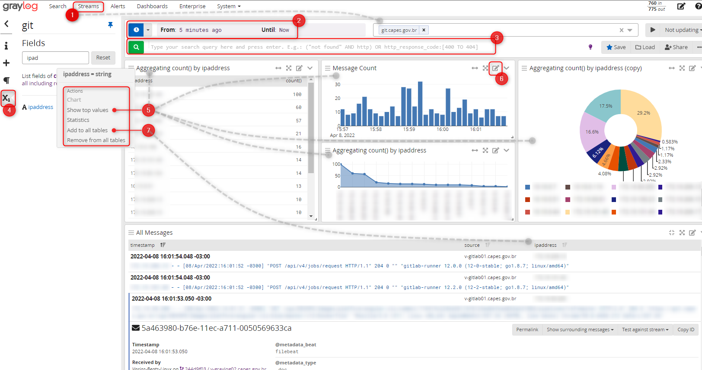

- [Visão Geral](#visão-geral)
- [Como Enviar Logs](#como-enviar-logs)
- [Conceitos](#conceitos)
- [Como Utilizar](#como-utilizar)
  - [Acessar o "Logs"](#acessar-o-logs)
  - [Fazendo uma Pesquisa](#fazendo-uma-pesquisa)
    - [Pesquisas Refinadas](#pesquisas-refinadas)


<br><br>

# Visão Geral
Em um ambiente de TIC, os diversos ativos como firewall, aplicações, switches e tantos outros, geram uma enorme quantidade de registros de eventos (*logs*) que descrevem algumas ações ocorridas no ativo e que devem ser registrados, tanto para uma rastreabilidade de ações executadas por usuários até  para investigações de problemas.

Na CAPES, uma das soluções disponibilizadas para auxiliar na análise de tais logs, assim como sua visualização é a ferramenta chamada **Graylog**, apelidada de **"Logs"**.

<br><br>

# Como Enviar Logs
Como cada ativo tem particularidades em seus logs é necessário uma análise prévia pela equipe de Infraestrutura. As solicitações deve ser feita via **CATI**. Depois disso, os logs poderão ser disponibilizados para consulta na ferramenta.

<br><br>

# Conceitos
Antes de utilizar, é necessário entender os seguintes conceitos utilizados na ferramenta.

* **Streams** - Os logs enviados são categorizados e roteados para uma ***stream***, uma espécie de "caixa postal" e nela, a mensagem poderá ser visualizada.

* **Dashboard** - São painéis gerados a partir de dados dos logs, contidos em uma *streamm*, podem conter gráficos e informações agrupadas de forma a tornar uma análise dos logs mais rápida.

* **Campos (*fields*)** - Um log contém vários dados e, dependendo da configuração, os dados podem estar separados em campos que auxiliam na pesquisa e geração de gráfico. Um exemplo seria um log que contenha o nome da conta do usuário, logo, poderia haver um campo chamado "login".

<br><br>

# Como Utilizar
## Acessar o "Logs"
Para acessar a ferramenta Graylog, acesse o endereço abaixo com o **login da Rede CAPES**:
* https://logs.capes.gov.br/

> NOTA: O acesso deve ser solicitados pelo **CATI**, informando `login` e `nome da aplicação` para que o pedido seja analisado.

<br><br>

## Fazendo uma Pesquisa
Ao entrar, a tela de pesquisa permitirá diversos refinos. Segue um resumo exemplificado das principais funcionalidades, onde os dados do **endereço IP** (`ipaddress`), foram sumarizados.

1. Ao escolher a **Stream**, os eventos serão exibidos
2. O intervalo de tempo pode ser ajustado 
3. Termos de busca podem ser usados. Vide abaixo exemplos com a sintaxe adequada para "Pesquisas Refinadas".
4. Campos específicos podem ser selecionados
5. Exibindo-se os dados sumarizados
6. Agrupados no formato desejado
7. Para a listagem dos eventos, linha a linha, pode-se adicionar o campo para uma melhor visualização



<br><br>

### Pesquisas Refinadas

Com base na documentação do [Graylog](https://docs.graylog.org/en/latest/pages/queries.html), algumas sintaxes de pesquisas são possíveis. Por padrão, uma pesquisa feita busca no campos message ou *message* caso não seja especificado um campo.


**Exemplos** do que buscar e como buscar.


> :warning: **Boleanos**: A concatenação utilizando operadores boleanos (`AND`, `OR` E `NOT`) devem ser sempre maiúsculos.

> :warning: **Escape**: Caracteres especiais (`& | : \ / + - ! ( ) { } [ ] ^ " ~ * ?`). Exemplo: `\[login\]`.


*  Mensagens que tenham o nome "error": 
```
error

# ou

"error"
```

<br><br>

*  Mensagens que tenham "error" ou "login":

```
error login

# ou

error OR login
```

<br><br>

* Mensagens exatas que contenham "erro de login":
```
"erro de login"
```

<br><br>

*  Filtrar pelo valor do campo (desde que exista) o login que contenha o nome "joao":
```
login:joao
```

<br><br>

* Filtrar pelo valor do campo, os logins "joao" e "jose":
```
login:(joao OR jose)
```

<br><br>

* Pesquisar apenas mensagens que tenham o campo "login":
```
_exists_:login
```