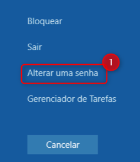
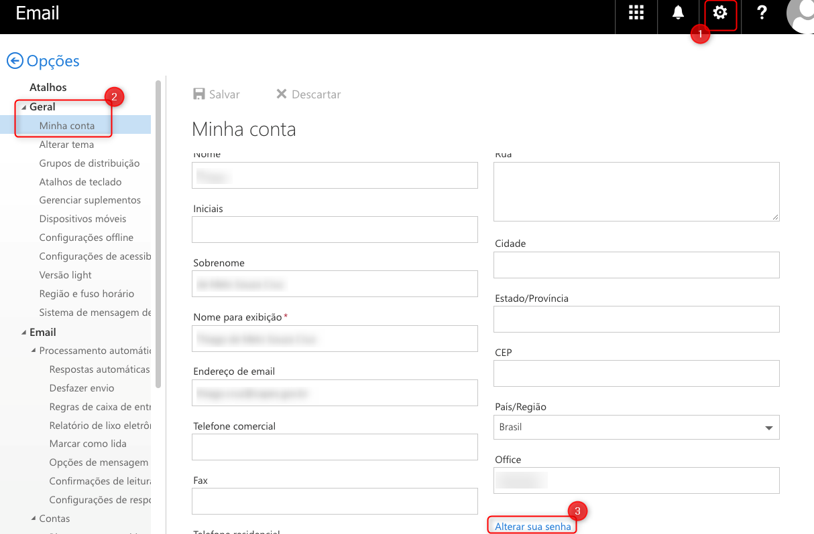

- [Política de Senhas](#política-de-senhas)
- [Trocar Senhas](#trocar-senhas)
  - [Estação de Trabalho da CAPES](#estação-de-trabalho-da-capes)
  - [Webmail](#webmail)

  

# Política de Senhas
Com a diretriz da [portaria nº 179 de 9/11/2021 no Capítulo IV - Proteção da Senhas](http://cad.capes.gov.br/ato-administrativo-detalhar?idAtoAdmElastic=7762#anchor), regras no gerenciamento das senhas foram adotadas e nesta documentação encontram-se os procedimentos utilizados para a troca da senhas das contas de usuários.

  

# Trocar Senhas 
Veja as formas utilizadas para a troca da senha utilizadas para acessar a Rede CAPES.

> **Observação**: As aplicações que usam a conta com CPF utilizam um outro sistema de gerenciamento de senha, neste caso, utilize o [**SADMIN**](https://sadmin.capes.gov.br/) para a troca da senha.

 

## Estação de Trabalho da CAPES
Para a troca da senha de um computador no domínio interno da CAPES, mesmo conectado via VPN, basta:
1. Aperta as teclas "CTRL + ALT + DEL" e **Alterar uma senha**

> **Importante**: Atualize a senha nos dispositivos móveis (correio, wi-fi) conectados para evitar o bloqueio da conta, caso utilize.

  

## Webmail

Para a troca da senha utilizando o **Webmail** (https://webmail.capes.gov.br) siga os passos abaixo:

1. No ícone de **Configurações** vá em **Opções**
2. Depois no menu **Geral > Minha Conta**
3. Clique em **Alterar sua senha**

> **Importante**: Atualize a senha nos dispositivos móveis (correio, wi-fi) conectados para evitar o bloqueio da conta, caso utilize.

  
